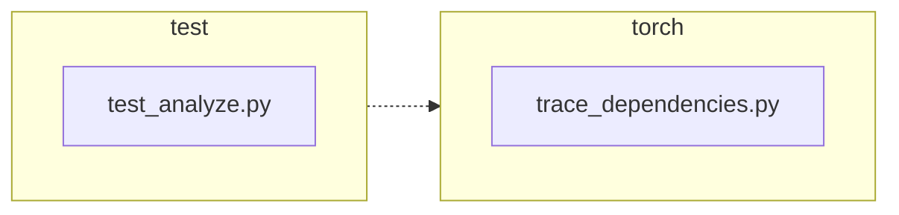

<!-- torii-review pr=191840 run=local head=a27fb64a9ba8eb04cd449d1e6deac9a83cfc6f0a -->
## 🏴‍☠️ Torii Review — PR #191840

**Verdict:** APPROVE
**Confidence:** high
**Score:** 95/100
**Review effort:** 1/5

### Summary
A minimal, correct fix for `trace_dependencies()` unconditionally nuking the caller's profiling callback via `sys.setprofile(None)`. The change captures `sys.getprofile()` before tracing and restores it in the existing `finally` block. Two well-structured regression tests cover the success and exception paths. No security surface, no API break, no BC concern.

### Walkthrough
- `torch/package/analyze/trace_dependencies.py:53` — `previous_profile = sys.getprofile()` captures the caller's profiling state before `trace_dependencies` installs its own `record_used_modules` callback.
- `torch/package/analyze/trace_dependencies.py:63` — `sys.setprofile(previous_profile)` replaces the old `sys.setprofile(None)`, restoring whatever profile (or `None`) was in place before the call.
- `test/package/test_analyze.py:21-31` — `test_trace_dependencies_restores_profile`: installs a dummy profile, calls `trace_dependencies` with a no-op callable, asserts the same profile object is restored via `assertIs`.
- `test/package/test_analyze.py:33-47` — `test_trace_dependencies_restores_profile_when_callable_raises`: same pattern but the callable raises `RuntimeError`; asserts the profile is still restored afterward.

### Architecture diagram
<!-- torii-mermaid -->

_Auto-generated from 2 changed file(s) (F57). Edges between groups are adjacency, not proven runtime dependencies._

Files in diagram

- `test/package/test_analyze.py`
- `torch/package/analyze/trace_dependencies.py`

### Blocking
None

### Key findings
None — no high-confidence defects in new code.

### Security audit
No

### Multi-lens checklist
| Lens | Status | Note |
|------|--------|------|
| correctness | ok | Fix is correct: `sys.getprofile()` → restore in `finally` preserves caller state on both success and exception paths. |
| security | n/a | Profiling callback restore — no injection, authz, secrets, or other security surface. |
| tests | ok | Two new tests cover success and exception restore; `assertIs` confirms identity, not just any callback. |
| performance | ok | One extra `sys.getprofile()` call per invocation (trivial, not on hot path). |
| api_contracts | ok | Signature and return type unchanged; behavior change is strictly a bug fix (preserving caller state). |
| concurrency | n/a | `sys.getprofile`/`sys.setprofile` are per-thread; no cross-thread surface in this module. |
| maintainability | ok | Clean three-line change; comment updated to match semantics. |

### Suggestions
None

### Code suggestions
None

### Nits
None

### Suggested test plan
| Pri | Kind | Target | Scenario |
|-----|------|--------|----------|
| P0 | smoke | `test/package/test_analyze.py` | Run the two new tests + existing `test_trace_dependencies` locally or in CI — **covered by this PR**. |
| P0 | unit | `trace_dependencies` | Regression: caller profile preserved after successful trace — **covered** by `test_trace_dependencies_restores_profile`. |
| P0 | unit | `trace_dependencies` | Regression: caller profile preserved when callable raises — **covered** by `test_trace_dependencies_restores_profile_when_callable_raises`. |
| P1 | unit | `trace_dependencies` | Compatibility: old callers (no profile set → `sys.getprofile()` returns `None` → restored to `None`) — **covered implicitly**; existing `test_trace_dependencies` passes without a pre-installed profile. |
| P2 | e2e | `trace_dependencies` | Happy-path tracing still works — **covered** by existing `test_trace_dependencies`. |

### Tests & risk
- Relevant tests added/updated: **yes** (+2 regression tests)
- Coverage: success path + exception path for profile restore; existing trace behavior unchanged
- Risk: **low** — three-line change in a `finally` block; no callers broken (restoring `None` when none was set is identical to prior behavior)
- Rollback: **easy** — revert to `sys.setprofile(None)` if needed

### What I checked
- Full diff (unified, 2 files, +32/-2)
- Production code: `torch/package/analyze/trace_dependencies.py` — entire `trace_dependencies` function body; confirmed the capture/restore pattern
- Test file: `test/package/test_analyze.py` — both new test methods + existing `test_trace_dependencies`
- Callers: `grep -rn trace_dependencies` — only exports via `__init__.py` and the test file; no other callers to audit
- Compilation: both changed files pass `py_compile` cleanly
- Confirmed the linked issue (#191839) is fully addressed: the old `sys.setprofile(None)` is replaced by restore-from-capture

---
*Torii · Hermes Agent · OpenRouter · memory-backed review*
*Cost / usage: model=`deepseek/deepseek-v4-pro` · ~$0.01 (estimated) · 85k tokens · 6 API calls*
