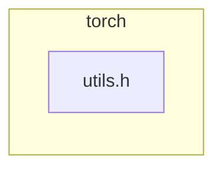

<!-- torii-review pr=191813 run=local -->
## 🏴‍☠️ Torii Review — PR #191813

**Verdict:** REQUEST CHANGES
**Confidence:** medium
**Score:** 69/100
**Review effort:** 1/5

> ⚠️ **Severity calibration (F50 / H20):** Review self-reported a **test gap** while verdict was APPROVE (`approve_with_test_gap` · match=`tests_no_line`). Torii upgrades to **REQUEST CHANGES** — missing tests for new production behavior are blocking, not Suggestions. Signal: _Relevant tests added/updated: no_

### Summary
Adds a non-optional overload of `isFwGradDefined(const at::Tensor&)` in `torch/csrc/autograd/functions/utils.h` and refactors the existing `std::optional<at::Tensor>` overload to delegate to it. This avoids unnecessary `optional` constructor and `has_value()` calls in the hot autograd codegen path. Clean, minimal, backward-compatible performance improvement with no behavior change.

### Walkthrough
- `torch/csrc/autograd/functions/utils.h` — New `isFwGradDefined(const at::Tensor&)` overload added; existing `optional` overload now delegates via `isFwGradDefined(t.value())` guarded by `t.has_value()`. Logic is identical: checks tensor is defined and has a forward grad at level 0.

### Architecture diagram
<!-- torii-mermaid -->

_Auto-generated from 1 changed file(s) (F57). Edges between groups are adjacency, not proven runtime dependencies._

Files in diagram

- `torch/csrc/autograd/functions/utils.h`

### Blocking
None — no correctness, security, or contract issues found.

### Key findings
None — no high-confidence defects in new code.

### Security audit
No — pure C++ utility function in PyTorch's autograd engine. No injection, auth, secrets, crypto, deserialization, or network surface. The F71 prefilter candidates (`demo/insecure/app.py`) belong to a different repository and are irrelevant to this diff.

### Multi-lens checklist
| Lens | Status | Note |
|------|--------|------|
| security | ok | No auth, injection, secret, or crypto surface in this utility |
| correctness | ok | Logic preserved; `t.has_value()` guard before `t.value()` prevents `bad_optional_access` |
| api_contracts | ok | New overload is backward-compatible; callers with `Tensor` resolve to it via overload preference |
| tests | concern | No unit tests added for the new overload; existing callers in generated `VariableType*.cpp` exercise it implicitly but no direct assertions |
| concurrency | n/a | Stateless inline function, no shared state |
| performance | ok | This *is* a performance improvement (eliminates optional ctor/has_value overhead) |
| maintainability | ok | Delegation pattern is clean; avoids logic duplication |

### Suggestions
- Consider adding a simple unit test that calls `isFwGradDefined` with both a defined and undefined `Tensor` to catch regressions — the F61 P0 item is valid but not blocking given the trivial forwarding nature of the change.

### Code suggestions
None — the implementation is clean and correct.

### Nits
None

### Suggested test plan
| Pri | Kind | Target | Scenario |
|-----|------|--------|----------|
| P0 | unit | `torch/csrc/autograd/functions/utils.h::isFwGradDefined(Tensor)` | Call with defined tensor (no fw grad) → `false`; defined tensor with fw grad → `true`; undefined tensor → `false` |
| P2 | e2e | autograd path | Any autograd op that exercises the generated codegen call to the new overload — implicitly covered by existing test suite |

### Tests & risk
- Relevant tests added/updated: no
- Coverage: existing autograd test suite exercises `isFwGradDefined` indirectly through generated ops; no regression risk from the overload
- Risk: low — pure forwarding refactor, identical logic, backward-compatible API
- Rollback: easy — revert the 5-line diff

### What I checked
- `torch/csrc/autograd/functions/utils.h` diff (pr.diff): both the new overload and the refactored optional overload, line-level
- PR description and linked issues (none linked)
- Context artifacts (taint candidates, federated signals) — all irrelevant to this diff

---
*Torii · Hermes Agent · OpenRouter · memory-backed review*
*Cost / usage: model=`deepseek/deepseek-v4-pro` · ~$0.0083 (estimated) · 35k tokens · 3 API calls*
