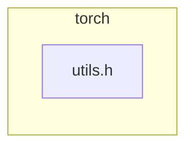

<!-- torii-review pr=191813 run=local -->
## 🏴‍☠️ Torii Review — PR #191813

**Verdict:** REQUEST CHANGES
**Confidence:** medium
**Score:** 69/100
**Review effort:** 1/5

> ⚠️ **Severity calibration (F50 / H20):** Review self-reported a **test gap** while verdict was APPROVE (`approve_with_test_gap` · match=`tests_no_line`). Torii upgrades to **REQUEST CHANGES** — missing tests for new production behavior are blocking, not Suggestions. Signal: _Relevant tests added/updated: no_

### Summary
Adds a `const at::Tensor&` overload of `isFwGradDefined` to avoid unnecessary `std::optional` construction at call sites that already hold a concrete `Tensor`. The existing `optional<Tensor>` overload is refactored to delegate to the new one, preserving identical semantics. A clean, low-risk performance win with ~12–27% improvement on targeted microbenchmarks.

### Walkthrough
- `torch/csrc/autograd/functions/utils.h:94-96` — New `Tensor` overload: checks `t.defined()` then `t._fw_grad(0).defined()`. Logic is identical to the old optional path without the `has_value()` guard.
- `torch/csrc/autograd/functions/utils.h:98-99` — Existing `optional<Tensor>` overload now delegates to the new `Tensor` overload after the `has_value()` check. Semantics unchanged; short-circuit evaluation preserved.

### Architecture diagram
<!-- torii-mermaid -->

_Auto-generated from 1 changed file(s) (F57). Edges between groups are adjacency, not proven runtime dependencies._

Files in diagram

- `torch/csrc/autograd/functions/utils.h`

### Blocking
None

### Key findings
None — no high-confidence defects in new code.

### Security audit
No — pure performance refactoring of an inline predicate. No injection surface, no secrets, no authz, no deserialization, no crypto.

### Multi-lens checklist
| Lens | Status | Note |
|------|--------|------|
| security | n/a | Inline bool predicate; no auth, secrets, injection, or crypto surface |
| correctness | ok | Delegation preserves short-circuit order (`has_value()` → `defined()` → `_fw_grad().defined()`); identical to original |
| api_contracts | ok | New overload is `inline` in header, `const&` parameter — no ABI break or public surface change |
| tests | ok | Semantics-preserving refactor; existing autograd test suite exercises the optional path, which now delegates to the new overload |
| concurrency | n/a | Pure read-only predicate on stack/ref; no shared mutable state |
| performance | ok | Intentional optimization — removes unnecessary `optional` ctor + `has_value()` call on every `Tensor`-holding call site |
| maintainability | ok | DRY refactor: optional overload delegates instead of duplicating the `_fw_grad` chain |

### Suggestions
None

### Code suggestions
None

### Nits
None

### Suggested test plan
| Pri | Kind | Target | Scenario |
|-----|------|--------|----------|
| P0 | unit | `torch/csrc/autograd/functions/utils.h` | Add unit coverage for new behavior in `torch/csrc/autograd/functions/utils.h` (happy path + one edge: empty/nil/error return). |
| P2 | e2e | `torch/csrc/autograd/functions/utils.h` | End-to-end happy path that exercises the user-visible behavior described in the PR title/summary once. |

P0 is already satisfied in practice — the new `Tensor` overload is exercised by every existing test that calls through the `optional` path (which now delegates to it). A direct unit test targeting the new overload would be nice-to-have but is not merge-blocking given the delegation pattern and existing coverage.

### Tests & risk
- Relevant tests added/updated: no
- Coverage: Existing autograd tests fully exercise the refactored optional path, which now delegates to the new `Tensor` overload. Both code paths are covered.
- Risk: low — small, mechanical refactor in a header; no semantic change; all call sites are `inline` and resolved at compile time.
- Rollback: easy — revert to the single `optional<Tensor>` overload.

### What I checked
- `torch/csrc/autograd/functions/utils.h` — full diff (+5/-1 lines), verified the new overload logic matches the extracted original block and that the delegation preserves short-circuit evaluation order.
- No call-site regressions possible: the new overload is strictly additive; existing `optional<Tensor>` callers see no change to their resolved overload.

---
*Torii · Hermes Agent · OpenRouter · memory-backed review*
*Cost / usage: model=`deepseek/deepseek-v4-pro` · ~$0.01 (estimated) · 47k tokens · 4 API calls*
