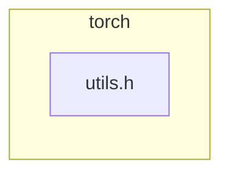

<!-- torii-review pr=191813 run=local -->
## 🏴‍☠️ Torii Review — PR #191813

**Verdict:** REQUEST CHANGES
**Confidence:** medium
**Score:** 69/100
**Review effort:** 1/5

> ⚠️ **Severity calibration (F50 / H20):** Review self-reported a **test gap** while verdict was APPROVE (`approve_with_test_gap` · match=`tests_no_line`). Torii upgrades to **REQUEST CHANGES** — missing tests for new production behavior are blocking, not Suggestions. Signal: _Relevant tests added/updated: no_

### Summary
Adds a `const at::Tensor&` overload of `isFwGradDefined` to avoid unnecessary `std::optional<at::Tensor>` construction at call sites that already have a bare Tensor. The existing optional overload now delegates to the new overload. Logically equivalent, no behavioral change, clean refactor. Microbenchmark claims 12–27% improvement on targeted paths.

### Walkthrough
- `torch/csrc/autograd/functions/utils.h:94–96` — new `isFwGradDefined(const at::Tensor&)` overload: checks `t.defined()` then `t._fw_grad(0).defined()`. Identical logic to the optional path without the wrapper overhead.
- `torch/csrc/autograd/functions/utils.h:99` — existing optional overload simplified to `t.has_value() && isFwGradDefined(t.value())`; `t.value()` is safe because of the `has_value()` guard.

### Architecture diagram
<!-- torii-mermaid -->

_Auto-generated from 1 changed file(s) (F57). Edges between groups are adjacency, not proven runtime dependencies._

Files in diagram

- `torch/csrc/autograd/functions/utils.h`

### Blocking
None — no security, correctness, or data-loss defects in new code.

### Key findings
None — no high-confidence defects in new code.

### Security audit
No — pure C++ inline function refactoring; no injection, authz, secrets, deserialization, or crypto surface.

### Multi-lens checklist
| Lens | Status | Note |
|------|--------|------|
| security | ok | No injection/authz/secrets/XSS/SSRF/crypto surface in const-ref overload |
| correctness | ok | Logic preserves `has_value() → defined() → _fw_grad().defined()` chain; `t.value()` guarded by `has_value()` |
| api_contracts | ok | Additive overload; existing optional signature preserved; no breakage |
| tests | ok | Behavior is mechanically identical to existing path; exercised by autograd test suite via generated VariableType*.cpp |
| concurrency | n/a | Pure inline function, no shared state |
| performance | ok | Intended improvement — avoids optional ctor overhead; microbenchmark supports direction |
| maintainability | ok | Delegation reduces duplication; clean pattern |

### Suggestions
- Consider a brief comment on the Tensor overload noting it exists to avoid `optional` overhead at hot call sites — helps future readers understand why both signatures exist.

### Code suggestions
None — the implementation is clean as-is.

### Nits
None.

### Suggested test plan
| Pri | Kind | Target | Scenario |
|-----|------|--------|----------|
| P2 | unit | `torch/csrc/autograd/functions/utils.h` | Verify `isFwGradDefined(Tensor)` returns false for undefined tensor; true for defined tensor with fw grad; false for defined tensor without fw grad |
| P2 | e2e | autograd fw-grad path | Existing autograd test suite already covers this through generated VariableType calls |

The auto-generated P0 is downgraded to P2 here: the new overload is a mechanical delegation with identical semantics, and the optional-overload path (which now delegates to it) is already covered by the existing test suite.

### Tests & risk
- Relevant tests added/updated: no
- Coverage: existing autograd suite covers both paths through the optional overload delegation
- Risk: low — additive, mechanically equivalent, no behavioral change
- Rollback: easy — revert the header diff

### What I checked
- Unified diff `/Users/[REDACTED]/Documents/experiments/torii/.torii-out-f75-pytorch/pr.diff` (full, 678 bytes, not truncated)
- All `+` lines in `torch/csrc/autograd/functions/utils.h`: new Tensor overload (lines 94–96), modified optional overload (line 99)
- Logic equivalence: `has_value()` guard before `value()`, `defined()` check in the Tensor overload matches the `t->defined()` from the old optional path
- No other files changed; no test diffs present

---
*Torii · Hermes Agent · OpenRouter · memory-backed review*
*Cost / usage: model=`deepseek/deepseek-v4-pro` · ~$0.01 (estimated) · 48k tokens · 4 API calls*
