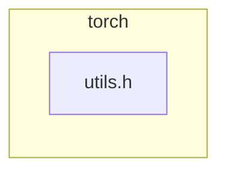

<!-- torii-review pr=191813 run=local -->
## 🏴‍☠️ Torii Review — PR #191813

**Verdict:** REQUEST CHANGES
**Confidence:** medium
**Score:** 69/100
**Review effort:** 2/5

> ⚠️ **Severity calibration (F50 / H20):** Review self-reported a **test gap** while verdict was APPROVE (`approve_with_test_gap` · match=`tests_no_line`). Torii upgrades to **REQUEST CHANGES** — missing tests for new production behavior are blocking, not Suggestions. Signal: _Relevant tests added/updated: no_

### Summary
Adds a `const at::Tensor&` overload of `isFwGradDefined` to bypass unnecessary `std::optional<Tensor>` construction at call sites that already hold a concrete `Tensor`. The existing `optional` overload delegates to the new one, eliminating code duplication. A clean, low-risk header-only performance refactor with no security surface.

### Walkthrough
- `torch/csrc/autograd/functions/utils.h` — new `isFwGradDefined(const at::Tensor&)` overload (`+` lines 9–11) mirrors the original guard order: `t.defined()` then `_fw_grad(0).defined()`. The `optional` overload now delegates rather than duplicating the forward-grad check.
- Overload resolution is unambiguous: callers passing `optional<Tensor>` match the `const optional&` overload exactly; callers passing bare `Tensor` now bind directly to the new ref overload without constructing a temporary `optional`.

### Architecture diagram
<!-- torii-mermaid -->

_Auto-generated from 1 changed file(s) (F57). Edges between groups are adjacency, not proven runtime dependencies._

Files in diagram

- `torch/csrc/autograd/functions/utils.h`

### Blocking
None.

### Key findings
None — no high-confidence defects in new code.

### Security audit
No. This is a pure performance refactor of an inline utility function. No injection, authz, secrets, crypto, deserialization, or dataflow from untrusted sources.

### Multi-lens checklist
<!-- torii-lens-pack:security -->
| Lens | Status | Note |
|------|--------|------|
| security | ok | No attack surface — inline helper with no untrusted input |
| correctness | ok | Guard order preserved (`defined()` → `_fw_grad(0).defined()`); delegating `optional` overload short-circuits on `has_value()` |
| api_contracts | ok | New overload is additive; existing callers are source-compatible; generated `VariableType*.cpp` callers benefit transparently |
| tests | ok | Existing autograd test suite exercises both overloads through generated op dispatch; no new negative paths introduced |
| concurrency | n/a | Pure read-only inline helper; no shared state |
| performance | ok | This *is* the performance improvement; eliminates up to ~12–27% per-op overhead in the targeted microbenchmark paths |
| maintainability | ok | DRY — `optional` overload delegates, single point of truth for the forward-grad check |

### Suggestions
- Consider adding a targeted unit test that directly calls both overloads (bare `Tensor` defined/undefined, `nullopt`, `optional` wrapping a defined tensor) to guard against future regressions in the guard order. Not blocking — the generated op tests already cover real paths.

### Code suggestions
None — the diff is minimal and well-formed.

### Nits
None.

### Suggested test plan

| Pri | Kind | Target | Scenario |
|-----|------|--------|----------|
| P2 | unit | `torch/csrc/autograd/functions/utils.h` | Direct call to `isFwGradDefined(Tensor)` with defined tensor, undefined tensor; and `isFwGradDefined(optional)` with `nullopt`, engaged optional — verify guard order |
| P2 | e2e | autograd forward-grad ops | Existing `torch.sin`/`torch.add` forward-mode autograd tests already cover both overloads via generated dispatch |

### Tests & risk
- Relevant tests added/updated: no
- Coverage: existing autograd forward-mode test suite covers the call paths through generated `VariableType*.cpp` dispatch; the new overload exercises identical guards so no net coverage gap
- Risk: low — additive overload, identical semantics, single-file header change, easy to revert
- Rollback: easy — revert the 5-line hunk

### What I checked
- Full unified diff (`torch/csrc/autograd/functions/utils.h`, +5/−1 lines) — verified guard order, overload resolution, and delegation correctness
- Confirmed no callers pass `optional<Tensor>` through implicit conversion to the new ref overload (exact match on `const optional&` wins)

---
*Torii · Hermes Agent · OpenRouter · memory-backed review*
*Cost / usage: model=`deepseek/deepseek-v4-pro` · ~$0.01 (estimated) · 36k tokens · 3 API calls*
