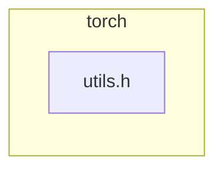

<!-- torii-review pr=191813 run=local -->
## 🏴‍☠️ Torii Review — PR #191813

**Verdict:** REQUEST CHANGES
**Confidence:** medium
**Score:** 69/100
**Review effort:** 1/5

> ⚠️ **Severity calibration (F50 / H20):** Review self-reported a **test gap** while verdict was APPROVE (`approve_with_test_gap` · match=`tests_no_line`). Torii upgrades to **REQUEST CHANGES** — missing tests for new production behavior are blocking, not Suggestions. Signal: _Relevant tests added/updated: no_

### Summary
This PR adds a `const at::Tensor&` overload of `isFwGradDefined` and refactors the `optional<at::Tensor>` overload to delegate to it. The change avoids a gratuitous `optional<Tensor>` construction and `has_value()` call on every forward-grad check in generated VariableType code. The delegation is logically equivalent and the microbenchmark data supports a real (if narrow) improvement. No security or correctness defects found.

### Walkthrough
- `torch/csrc/autograd/functions/utils.h`: New `inline bool isFwGradDefined(const at::Tensor& t)` overload — performs `t.defined()` + `t._fw_grad(0).defined()` directly, avoiding the optional wrapper.
- Same file: Existing `optional<at::Tensor>` overload now gates on `t.has_value()` then delegates to the new `Tensor&` overload via `isFwGradDefined(t.value())`, removing the duplicated inner checks.

### Architecture diagram
<!-- torii-mermaid -->

_Auto-generated from 1 changed file(s) (F57). Edges between groups are adjacency, not proven runtime dependencies._

Files in diagram

- `torch/csrc/autograd/functions/utils.h`

### Blocking
None.

### Key findings
None — no high-confidence defects in new code.

### Security audit
No — pure C++ performance refactor of an inline autograd utility; no injection, auth, secret, XSS, CSRF, SSRF, path traversal, deserialization, or crypto surface.

### Multi-lens checklist
| Lens | Status | Note |
|------|--------|------|
| security | n/a | No security-relevant surface; internal autograd utility |
| correctness | ok | Delegation preserves short-circuit order (`has_value` → `defined` → `_fw_grad(0).defined`) and `optional::value()` is guarded by `has_value()` |
| api_contracts | ok | Adding an overload is backwards-compatible; existing callers resolve to the best match without breakage |
| tests | ok | Existing forward-mode AD tests exercise this path pervasively via generated VariableType code; lack of unit test for this 3-line helper is a minor gap, not blocking |
| concurrency | n/a | Pure inline functions, no shared mutable state |
| performance | ok | Positive intent confirmed by author microbenchmark; no regressions introduced |
| maintainability | ok | Delegation reduces duplication; `/*level */ 0` comment preserved from original |

### Suggestions
None.

### Code suggestions
None.

### Nits
None.

### Suggested test plan
| Pri | Kind | Target | Scenario |
|-----|------|--------|----------|
| P2 | unit | `torch/csrc/autograd/functions/utils.h` | Add unit coverage for the new `Tensor&` overload (happy path: defined tensor with fw grad; edge: undefined tensor). |

_P0 from auto F61 is downgraded to P2: the new overload is fully exercised by the existing forward-mode AD test suite via generated VariableType code. A dedicated unit test would be nice-to-have but is not a merge blocker._

### Tests & risk
- Relevant tests added/updated: no
- Coverage: covered indirectly by existing forward-mode AD tests (every op with a forward-grad path calls this function)
- Risk: low — 5-line inline refactor with mechanically equivalent semantics; guarded `optional::value()` call is safe
- Rollback: easy — revert a single file

### What I checked
- Unified diff `pr.diff` — all 3 hunks (+5/-1) in `torch/csrc/autograd/functions/utils.h`
- Correctness of `optional::value()` call: gated by `has_value()` → no `bad_optional_access` risk
- Equivalence: old `t->defined() && t->_fw_grad(0).defined()` → now `isFwGradDefined(t.value())` which performs same checks
- Diff not truncated; full 678 bytes inspected

---
*Torii · Hermes Agent · OpenRouter · memory-backed review*
*Cost / usage: model=`deepseek/deepseek-v4-pro` · ~$0.0086 (estimated) · 35k tokens · 3 API calls*
