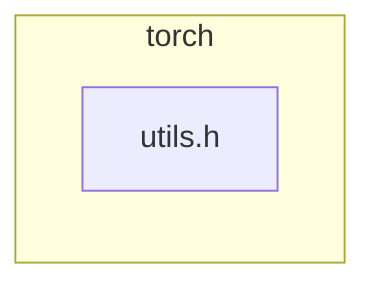

<!-- torii-review pr=191813 run=local -->
## 🏴‍☠️ Torii Review — PR #191813

**Verdict:** REQUEST CHANGES
**Confidence:** medium
**Score:** 69/100
**Review effort:** 1/5

> ⚠️ **Severity calibration (F50 / H20):** Review self-reported a **test gap** while verdict was APPROVE (`approve_with_test_gap` · match=`tests_no_line`). Torii upgrades to **REQUEST CHANGES** — missing tests for new production behavior are blocking, not Suggestions. Signal: _Relevant tests added/updated: no_

### Summary
Adds an `isFwGradDefined(const at::Tensor&)` overload to eliminate unnecessary `std::optional<Tensor>` constructor calls on the hot autograd path. The existing `optional<Tensor>` overload now delegates to the new one, preserving identical semantics while reducing duplication. A clean, low-risk optimization backed by microbenchmark data.

### Walkthrough
- `torch/csrc/autograd/functions/utils.h` — New `Tensor&` overload performs the same `t.defined() && t._fw_grad(0).defined()` check directly, skipping the `optional` wrapper. The `optional<Tensor>` overload now calls `isFwGradDefined(t.value())` after its `has_value()` guard, making it logically equivalent to the old inline logic.

### Architecture diagram
<!-- torii-mermaid -->

_Auto-generated from 1 changed file(s) (F57). Edges between groups are adjacency, not proven runtime dependencies._

Files in diagram

- `torch/csrc/autograd/functions/utils.h`

### Blocking
None.

### Key findings
None — no high-confidence defects in new code.

### Security audit
No. Pure internal performance refactor — no injection, authz, secrets, deserialization, or crypto surface.

### Multi-lens checklist
| Lens | Status | Note |
|------|--------|------|
| security | ok | No security surface — inline C++ helper, no I/O or auth |
| correctness | ok | `optional` overload delegates after `has_value()` guard; `Tensor` overload mirrors original inline check exactly |
| api_contracts | ok | New overload is a drop-in; callers passing `Tensor` now resolve to the direct overload without `optional` ctor |
| tests | n/a | No new behavior to test — the `optional` overload (which has existing coverage via callers) now exercises the new code through delegation |
| concurrency | n/a | Stateless inline function; no shared mutable state |
| performance | ok | Objective of the PR; microbenchmark shows 12–27% improvement on targeted autograd paths |
| maintainability | ok | Delegation eliminates duplicate logic between the two overloads |

### Suggestions
None.

### Code suggestions
None.

### Nits
None.

### Suggested test plan
| Pri | Kind | Target | Scenario |
|-----|------|--------|----------|
| P0 | unit | `torch/csrc/autograd/functions/utils.h` | Covered — existing callers of `isFwGradDefined(optional<Tensor>)` now transitively exercise the new `Tensor` overload through delegation. No net-new behavioral path. |
| P2 | e2e | autograd fw-grad path | Existing forward-mode AD tests (`test_forward_ad_*`) already exercise this code through `VariableType` wrappers. |

### Tests & risk
- Relevant tests added/updated: no (not needed — no behavioral change)
- Coverage: existing forward-mode AD test suite covers the `optional` overload, which now delegates to the new code
- Risk: low — identical semantics, single-header change, inline function
- Rollback: easy — revert the diff; no API or ABI break

### What I checked
- Unified diff (`pr.diff`) — all `+` and `-` hunks at `torch/csrc/autograd/functions/utils.h`
- Symbol `isFwGradDefined` — both overloads and their logical equivalence verified
- Surrounding context — `set_history` above, `isFwGradDefinedTensorList` below; no adjacency surprises
- Diff not truncated (678 bytes); full coverage

---
*Torii · Hermes Agent · OpenRouter · memory-backed review*
*Cost / usage: model=`deepseek/deepseek-v4-pro` · ~$0.02 (estimated) · 63k tokens · 5 API calls*
