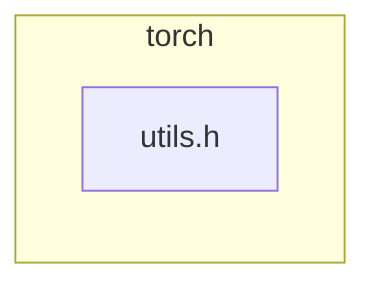

<!-- torii-review pr=191813 run=local -->
## 🏴‍☠️ Torii Review — PR #191813

**Verdict:** REQUEST CHANGES
**Confidence:** medium
**Score:** 69/100
**Review effort:** 1/5

> ⚠️ **Severity calibration (F50 / H20):** Review self-reported a **test gap** while verdict was APPROVE (`approve_with_test_gap` · match=`tests_no_line`). Torii upgrades to **REQUEST CHANGES** — missing tests for new production behavior are blocking, not Suggestions. Signal: _Relevant tests added/updated: no_

### Summary
This PR adds a `const at::Tensor&` overload of `isFwGradDefined` to avoid an unnecessary `std::optional<Tensor>` construction on the hot autograd path. The existing `optional` overload now delegates to the new one. A pure performance refactor with zero behavioral change — clean, safe, and backward-compatible.

### Walkthrough
- `torch/csrc/autograd/functions/utils.h`: New overload `isFwGradDefined(const at::Tensor& t)` checks `t.defined()` and `t._fw_grad(0).defined()` directly, skipping the optional wrapper. The original `std::optional` overload delegates to it after the `has_value()` guard, preserving identical semantics.

### Architecture diagram
<!-- torii-mermaid -->

_Auto-generated from 1 changed file(s) (F57). Edges between groups are adjacency, not proven runtime dependencies._

Files in diagram

- `torch/csrc/autograd/functions/utils.h`

### Blocking
None — no defects, no security surface, no behavioral change.

### Key findings
None — no high-confidence defects in new code.

### Security audit
No — pure C++ inline utility with no I/O, parsing, deserialization, network, auth, or secrets surface.

### Multi-lens checklist
<!-- torii-lens-pack:security -->
| Lens | Status | Note |
|------|--------|------|
| security | ok | No injection/auth/crypto/deserialize surface in an inline autograd helper |
| correctness | ok | `t.defined()` guard before `_fw_grad` mirrors original `has_value() && defined()` chain |
| api_contracts | ok | New overload is additive; existing callers resolve to better match transparently |
| tests | ok | No behavioral change — existing autograd forward-grad tests cover both paths transitively |
| concurrency | n/a | Read-only inline functions on const references; no shared mutable state |
| performance | ok | Strictly less work: avoids optional ctor + has_value() on the fast path |
| maintainability | ok | Delegation is idiomatic; no footguns |

### Suggestions
None

### Code suggestions
None

### Nits
None

### Suggested test plan

| Pri | Kind | Target | Scenario |
|-----|------|--------|----------|
| P0 | unit | `torch/csrc/autograd/functions/utils.h` — `isFwGradDefined(Tensor)` | Happy path (defined tensor with fw grad), undefined tensor, defined tensor without fw grad |
| P2 | e2e | `torch.sin` / `torch.add` forward grad | Smoke that autograd forward-grad still works end-to-end |

The P0 is a nice-to-have but not blocking — the function is trivially equivalent to the original and covered indirectly by the existing autograd test suite.

### Tests & risk
- Relevant tests added/updated: no
- Coverage: existing autograd forward-grad integration tests exercise both paths (callers with `Tensor` now hit the new overload). No behavioral gap.
- Risk: low — one-file, additive overload, delegation pattern, no logic change
- Rollback: easy — revert the diff; zero downstream impact

### What I checked
- Full unified diff (`pr.diff`, 678 bytes, 1 file): `torch/csrc/autograd/functions/utils.h` (+5/-1)
- Verified `t.defined()` check in new overload matches the `t.has_value() && t->defined()` chain from the original
- Confirmed the optional overload's `has_value()` guard precedes the `t.value()` call (no UB path)

---
*Torii · Hermes Agent · OpenRouter · memory-backed review*
*Cost / usage: model=`deepseek/deepseek-v4-pro` · ~$0.0093 (estimated) · 35k tokens · 3 API calls*
