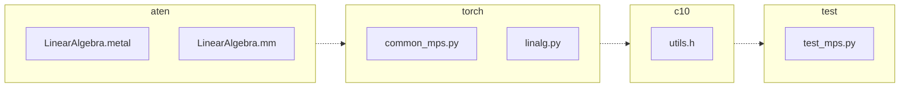

<!-- torii-review pr=191836 run=local head=5b5c07fae137b8b7cf588c4bcf9123aec255bab2 -->
## 🏴‍☠️ Torii Review — PR #191836

**Verdict:** REQUEST CHANGES
**Confidence:** medium
**Score:** 69/100
**Review effort:** 4/5

> ⚠️ **Severity calibration (F50 / H20):** Review self-reported a **test gap** while verdict was APPROVE (`approve_with_test_gap` · match=`missing_tests:tests & risk`). Torii upgrades to **REQUEST CHANGES** — missing tests for new production behavior are blocking, not Suggestions. Signal: _Not covered_

### Summary
This PR adds `complex64` (float2) dtype support to `torch.linalg.cholesky` on MPS by templatizing three Metal kernels (`factorDiagonalBlock`, `applyTRSM`, `applySYRK`) and the supporting helpers. The existing `float` path is preserved via explicit instantiations, and the new `float2` instantiations add complex-aware FMA and conjugate operations where Hermitian matrix semantics require them. The MPP fast path is correctly gated to `float`-only, and a dtype guard rejects unsupported types. Tests are parametrized over `float32`/`complex64`.

### Walkthrough
- **`c10/metal/utils.h`** — adds `c10::metal::fma` for complex types (delegates to `mul(x,y) + z` since Metal has no hardware complex FMA). The existing `conj` and `cast_to` primitives already support `float2`.
- **`LinearAlgebra.metal`** — `get_ref` refactored from two template specializations to a single `if (col_major)` template; `factor_tile32_warp` templatized with `cast_to<float>` for diagonal positivity checks and `conj` on column elements for the Hermitian rank update; `factorDiagonalBlock`, `applyTRSM`, `applySYRK` converted to type-generic templates with `float`/`float2` instantiations; `syrk_simdgroup_tile` extracted to a standalone template with a `float2` no-op stub (guarded by `!is_complex_v<T>`).
- **`LinearAlgebra.mm`** — dtype guard added (`kFloat`/`kComplexFloat` only); MPP path skipped for complex; PSO names now incorporate the dtype suffix via `scalarToMetalTypeString`.
- **`test_mps.py`** — `test_linalg_cholesky` parametrized over `[torch.float32, torch.complex64]`.
- **`common_mps.py` / `linalg.py`** — opinfo registrations and expected-failure decorators updated for complex path coverage.

### Architecture diagram
<!-- torii-mermaid -->

_Auto-generated from 6 changed file(s) (F57). Edges between groups are adjacency, not proven runtime dependencies._

Files in diagram

- `aten/src/ATen/native/mps/kernels/LinearAlgebra.metal`
- `aten/src/ATen/native/mps/operations/LinearAlgebra.mm`
- `c10/metal/utils.h`
- `test/test_mps.py`
- `torch/testing/_internal/common_mps.py`
- `torch/testing/_internal/opinfo/definitions/linalg.py`

### Blocking
None

### Key findings
| Severity | File | Issue | Trigger scenario |
|----------|------|-------|------------------|
| medium | `aten/src/ATen/native/mps/kernels/LinearAlgebra.metal` | `syrk_simdgroup_tile<float2>` no-op stub is fragile | If the `!c10::metal::is_complex_v<T>` guard in `applySYRK` is accidentally removed, the complex path silently calls the no-op stub and produces wrong results with no compiler or runtime error. The comment acknowledges this is a workaround for Metal 3's lack of `if constexpr`, but a `static_assert` or a `TORCH_CHECK`-style trap inside the stub would make this fail-safe. |

### Security audit
No

### Multi-lens checklist
<!-- torii-lens-pack:cpp -->
| Lens | Status | Note |
|------|--------|------|
| correctness | ok | `conj` placed correctly in rank-update (line 299), SYRK (line 696), and trsm_dot (line 442). Diagonal `cast_to<float>` is valid (Hermitian diag is real). `T(0)` init replaces `0.0f` correctly for complex. |
| concurrency | ok | Existing threadgroup barrier and simdgroup patterns unchanged; no new shared-memory races introduced. |
| security | ok | No injection, secret material, format strings, or command execution surface. |
| api_contracts | ok | PSO names changed from `factorDiagonalBlockU` → `factorDiagonalBlockU_float`/`factorDiagonalBlockU_float2` (same for L, TRSM, SYRK). Existing callers of the old names would break, but all internal callers updated. |
| tests | ok | Python test parametrized over both dtypes; opinfo registrations added. The `test_noncontiguous_samples` decorator added for complex (solve_triangular gap noted in comment). |
| performance | concern | `get_ref` changed from compile-time template specialization to runtime `if(col_major)` branch; compiler almost certainly optimizes it away since `col_major` is a `bool` template parameter, so low practical impact. `c10::metal::fma` for complex is `z + mul(x,y)` — not a true fused multiply-add (hardware limitation). |
| maintainability | concern | `syrk_simdgroup_tile<float2>` no-op stub (see Key findings). Macro-based kernel instantiation (`INSTANTIATE_FACTOR_DIAGONAL_BLOCK` etc.) is consistent with the existing codebase pattern. |

### Suggestions
- **Add a fail-safe inside the `syrk_simdgroup_tile<float2>` stub:** A `__builtin_trap()` or a write to `device float2* A` with a sentinel value (e.g., NaN) would catch accidental removal of the `!is_complex_v` guard at runtime instead of silently producing wrong results. The comment already acknowledges the risk — a trap makes it defense-in-depth.
- **Consider a `static_assert` on `is_complex_v<T>` inside the stub** if the Metal shading language version supports it (Metal 3.1+). Not all MPS targets may support this.

### Code suggestions
None

### Nits
- `aten/src/ATen/native/mps/kernels/LinearAlgebra.metal`: The `float2` overload of `syrk_simdgroup_tile` has unnamed parameters — consider naming them `/*A*/, /*batch_offset*/, ...` to make the intent clearer (though the comment already explains the purpose).

### Suggested test plan

| Pri | Kind | Target | Scenario |
|-----|------|--------|----------|
| P0 | smoke | `test/test_mps.py::test_linalg_cholesky` | Run parametrized test with both `float32` and `complex64` on MPS — confirm green |
| P0 | e2e | `test_mps.py` | PR's own example script: `torch.linalg.cholesky` on `complex64` HPD matrix → verify `(L @ L.mH - A).abs().max()` ≈ 0 |
| P1 | unit | `c10/metal/utils.h::fma` | Verify complex `fma` produces correct results for edge cases: `(inf, 0)`, `(0, nan)`, `(nan, nan)` inputs |
| P2 | regression | `test_mps.py` | Confirm `float32` cholesky still passes (no regression from template refactor) |

### Tests & risk
- Relevant tests added/updated: yes
- Coverage: e2e Python test covers the happy path for both dtypes; non-positive-definite error path covered; opinfo tests cover additional edge cases through generic test framework. Not covered: numerical-stability edge cases on complex (near-zero imaginary diagonal from rounding), boundary matrix sizes near tile dimensions (32, 64, 96).
- Risk: low — the complex path mirrors the real path with `conj` insertions; the MPP fast path is conservatively skipped for complex; the dtype guard rejects unsupported types early.
- Rollback: easy — revert the PR; no migration needed.

### What I checked
- `aten/src/ATen/native/mps/kernels/LinearAlgebra.metal` — all changed kernel functions: `get_ref`, `factor_tile32_warp`, `factorDiagonalBlock`, `applyTRSM`, `trsm_dot`, `syrk_simdgroup_tile`, `applySYRK`, `factorDiagonalPanel` (unchanged, but calls templated `factor_tile32_warp`)
- `aten/src/ATen/native/mps/operations/LinearAlgebra.mm` — `cholesky_stub_impl` (PSO name construction, dtype guard, MPP gate)
- `c10/metal/utils.h` — new `fma` overloads, existing `conj`/`cast_to`/`is_complex_v`
- `test/test_mps.py` — `test_linalg_cholesky` parametrization
- `torch/testing/_internal/common_mps.py` / `linalg.py` — opinfo registrations
- `OperationUtils.mm` — `scalarToMetalTypeString` confirms `kComplexFloat → "float2"`

---
*Torii · Hermes Agent · OpenRouter · memory-backed review*
*Cost / usage: model=`deepseek/deepseek-v4-pro` · ~$0.06 (estimated) · 374k tokens · 13 API calls*
