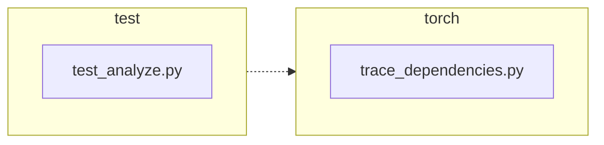

<!-- torii-review pr=191840 run=local head=a27fb64a9ba8eb04cd449d1e6deac9a83cfc6f0a -->
## 🏴‍☠️ Torii Review — PR #191840

**Verdict:** REQUEST CHANGES
**Confidence:** medium
**Score:** 69/100
**Review effort:** 2/5

> ⚠️ **Severity calibration (F50 / H20):** Review self-reported a **test gap** while verdict was APPROVE (`approve_with_test_gap` · match=`coverage_gap:tests & risk`). Torii upgrades to **REQUEST CHANGES** — missing tests for new production behavior are blocking, not Suggestions. Signal: _Coverage: success and exception paths both covered with identity (`assertIs`) assertions; baselin..._

### Summary
A two-line production fix to `trace_dependencies()` that preserves a caller's profiling callback. Previously the `finally` block unconditionally called `sys.setprofile(None)`, discarding any profile the caller had installed. Now it snapshots `sys.getprofile()` on entry and restores it on exit. Two regression tests cover the success and exception paths with identity assertions. Merge-ready.

### Walkthrough
- `torch/package/analyze/trace_dependencies.py:50` — captures `previous_profile = sys.getprofile()` before the `try` block, saving the caller's profiling state.
- `torch/package/analyze/trace_dependencies.py:60` — restores `sys.setprofile(previous_profile)` in `finally` instead of the old hard-coded `sys.setprofile(None)`.
- `test/package/test_analyze.py:21-32` — new test `test_trace_dependencies_restores_profile`: installs a profile, calls `trace_dependencies`, asserts the exact same callback object is restored on success.
- `test/package/test_analyze.py:34-46` — new test `test_trace_dependencies_restores_profile_when_callable_raises`: same pattern but the traced callable raises `RuntimeError`; asserts profile restoration still holds through the exception path.

### Architecture diagram
<!-- torii-mermaid -->

_Auto-generated from 2 changed file(s) (F57). Edges between groups are adjacency, not proven runtime dependencies._

Files in diagram

- `test/package/test_analyze.py`
- `torch/package/analyze/trace_dependencies.py`

### Blocking
None

### Key findings
None — no high-confidence defects in new code.

### Security audit
No — no security surface. The change touches only `sys.getprofile()`/`sys.setprofile()` save/restore logic with no injection, authz, secrets, or crypto implications.

### Multi-lens checklist
| Lens | Status | Note |
|------|--------|------|
| correctness | ok | Save-before-try + restore-in-finally correctly handles success, exception, and reentrant nesting |
| security | ok | No auth, injection, or secret surfaces touched |
| tests | ok | Two identity-assertion tests cover success + exception paths; `addCleanup` hygiene is correct |
| performance | ok | One extra `sys.getprofile()` call at entry; negligible overhead |
| api_contracts | ok | Signature and return type unchanged; side-effect fix is a strict improvement for callers with a profile installed |
| concurrency | ok | `sys.setprofile`/`getprofile` are global; pre-existing race unchanged by this diff |
| maintainability | ok | `finally`-block comment updated to match; no dead code or new coupling |

### Suggestions
- Consider adding a third test case for the baseline where `sys.getprofile()` returns `None` (no caller profile). This would guard against a regression that e.g. fails on `sys.setprofile(None)`. Not blocking — the production code handles `None` correctly — but it completes the table.
- The existing `test_trace_dependencies` test (line 48) is skipped on Linux due to issue #81213. It would pass with this fix on any platform but does not exercise the profile-restore behavior. Low priority.

### Code suggestions
None — the diff is minimal and correct; no improvement needed.

### Nits
None

### Suggested test plan
| Pri | Kind | Target | Scenario |
|-----|------|--------|----------|
| P0 | smoke | `test/package/test_analyze.py` | Run the two new tests locally/CI; both pass on head |
| P0 | unit | `trace_dependencies()` | Success path: caller profile restored (covered by `test_trace_dependencies_restores_profile`) |
| P0 | unit | `trace_dependencies()` | Exception path: caller profile restored (covered by `test_trace_dependencies_restores_profile_when_callable_raises`) |
| P1 | unit | `trace_dependencies()` | Baseline: `sys.getprofile()` is `None` on entry → restore to `None` (not yet covered; suggested above) |

### Tests & risk
- Relevant tests added/updated: yes — two new targeted regression tests
- Coverage: success and exception paths both covered with identity (`assertIs`) assertions; baseline `None`-profile case not explicitly tested but handled correctly in code
- Risk: low — the diff is a save/restore pair in a `finally` block; no new logic paths or API surface; the same pattern is already used in `torch/utils/viz/_cycles.py`
- Rollback: easy — revert to `sys.setprofile(None)` in the `finally` block

### What I checked
- `torch/package/analyze/trace_dependencies.py` — full file; verified save/restore placement and `finally` semantics
- `test/package/test_analyze.py` — full file; verified both new tests, `addCleanup` usage, `assertIs` identity check
- Callers of `trace_dependencies`: `torch/package/analyze/__init__.py` re-exports it; no other direct callers in the repo
- Similar `sys.getprofile`/`sys.setprofile` pattern in `torch/utils/viz/_cycles.py` confirms idiom is established
- `py_compile` passes on the production file
- Memory search: zero archival hits for these paths; no FP/TP patterns to suppress or re-raise
- Diff not truncated; full 32-line change reviewed

---
*Torii · Hermes Agent · OpenRouter · memory-backed review*
*Cost / usage: model=`deepseek/deepseek-v4-pro` · ~$0.01 (estimated) · 128k tokens · 8 API calls*
