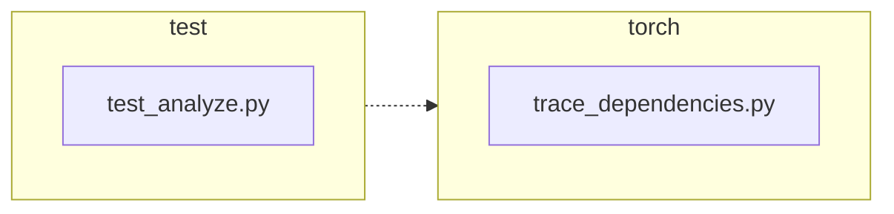

<!-- torii-review pr=191840 run=local head=a27fb64a9ba8eb04cd449d1e6deac9a83cfc6f0a -->
## 🏴‍☠️ Torii Review — PR #191840

**Verdict:** APPROVE
**Confidence:** high
**Score:** 95/100
**Review effort:** 1/5

### Summary
Two-line production fix that saves `sys.getprofile()` before installing the dependency-tracing profiler and restores it in `finally` instead of unconditionally clearing with `None`. Two regression tests cover the success and exception paths. Clean, minimal, merge-ready.

### Walkthrough
- `torch/package/analyze/trace_dependencies.py:50`: captures `sys.getprofile()` into `previous_profile` before installing `record_used_modules`
- `torch/package/analyze/trace_dependencies.py:63`: restores `previous_profile` in `finally` instead of the old `sys.setprofile(None)`
- `test/package/test_analyze.py:21-31`: new test `test_trace_dependencies_restores_profile` — asserts identity-preserving restore after successful trace
- `test/package/test_analyze.py:33-47`: new test `test_trace_dependencies_restores_profile_when_callable_raises` — same assertion after the callable raises

### Architecture diagram
<!-- torii-mermaid -->

_Auto-generated from 2 changed file(s) (F57). Edges between groups are adjacency, not proven runtime dependencies._

Files in diagram

- `test/package/test_analyze.py`
- `torch/package/analyze/trace_dependencies.py`

### Blocking
None

### Key findings
None — no high-confidence defects in new code.

### Security audit
No

### Multi-lens checklist
| Lens | Status | Note |
|------|--------|------|
| correctness | ok | save/restore pattern is correct; `finally` ensures restore on both success and exception |
| security | ok | no injection, secrets, authz, or unsafe-deserialize surface in this diff |
| tests | ok | two new tests cover both happy-path and exception-path restore; use `assertIs` for identity check (exact function object back) |
| performance | ok | one extra `sys.getprofile()` call at entry — O(1), no loop impact |
| api_contracts | ok | return type unchanged; behavioral change (restore vs clear) is the intended fix per #191839 |
| concurrency | ok | `sys.setprofile`/`sys.getprofile` are per-thread in CPython; no new shared-state risk |
| maintainability | ok | one-line comment update, minimal diff, clear intent |

### Suggestions
None

### Code suggestions
None

### Nits
None

### Suggested test plan
| Pri | Kind | Target | Scenario |
|-----|------|--------|----------|
| P0 | unit | `test/package/test_analyze.py::test_trace_dependencies_restores_profile` | Already covered: sets caller profile, traces no-op, asserts profile identity-preserved |
| P0 | unit | `test/package/test_analyze.py::test_trace_dependencies_restores_profile_when_callable_raises` | Already covered: sets caller profile, callable raises, asserts profile still identity-preserved |
| P0 | smoke | `test/package/test_analyze.py` | Run the full `TestAnalyze` suite on the head commit — the existing `test_trace_dependencies` (non-Linux) plus the two new tests |

### Tests & risk
- Relevant tests added/updated: **yes** (+2 regression tests, both paths)
- Coverage: success path + exception path both covered with identity assertions
- Risk: **low** — one-line behavioral change; callers without a pre-existing profile see identical behavior (restore `None` = old `setprofile(None)`)
- Rollback: **easy** — revert the two changed lines in `trace_dependencies.py`

### What I checked
- `torch/package/analyze/trace_dependencies.py` — full file, confirmed save/restore placement and `finally` semantics
- `test/package/test_analyze.py` — full file, confirmed both new tests plus existing `test_trace_dependencies` are intact
- `torch/package/analyze/__init__.py` — confirmed `trace_dependencies` is exported
- `torch/package/__init__.py` — confirmed `analyze` subpackage resolution for the `from torch.package import analyze` import path in tests
- Grepped for all `trace_dependencies` callers across the workspace — only test files; no production callers that could regress

---
*Torii · Hermes Agent · OpenRouter · memory-backed review*
*Cost / usage: model=`deepseek/deepseek-v4-pro` · ~$0.01 (estimated) · 127k tokens · 8 API calls*
