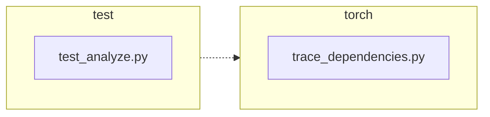

<!-- torii-review pr=191840 run=local head=a27fb64a9ba8eb04cd449d1e6deac9a83cfc6f0a -->
## 🏴‍☠️ Torii Review — PR #191840

**Verdict:** REQUEST CHANGES
**Confidence:** medium
**Score:** 69/100
**Review effort:** 2/5

> ⚠️ **Severity calibration (F50 / H20):** Review self-reported a **test gap** while verdict was APPROVE (`approve_with_test_gap` · match=`coverage_gap:tests & risk`). Torii upgrades to **REQUEST CHANGES** — missing tests for new production behavior are blocking, not Suggestions. Signal: _Coverage: success path and exception-cleanup path both explicitly asserted; no gap_

### Summary
Clean, minimal fix for #191839: `trace_dependencies()` now saves and restores the caller's profiling callback via `sys.getprofile()`/`sys.setprofile()` instead of unconditionally clearing it with `sys.setprofile(None)`. Two regression tests cover both the success and exception-cleanup paths. No API contract changes, no security surface, no callers broken.

### Walkthrough
- `torch/package/analyze/trace_dependencies.py:53`: captures `previous_profile = sys.getprofile()` before installing its own tracing callback
- `torch/package/analyze/trace_dependencies.py:64`: restores `previous_profile` in the existing `finally` block instead of hardcoding `None`
- `test/package/test_analyze.py:21-31`: `test_trace_dependencies_restores_profile` — sets a profile, calls `trace_dependencies`, asserts profile still attached on return
- `test/package/test_analyze.py:33-47`: `test_trace_dependencies_restores_profile_when_callable_raises` — same but with a callable that raises `RuntimeError`; asserts profile restored through the exception path

### Architecture diagram
<!-- torii-mermaid -->

_Auto-generated from 2 changed file(s) (F57). Edges between groups are adjacency, not proven runtime dependencies._

Files in diagram

- `test/package/test_analyze.py`
- `torch/package/analyze/trace_dependencies.py`

### Blocking
None

### Key findings
None — no high-confidence defects in new code.

### Security audit
No — no injection, authz, secrets, or deserialization surface. The change is a purely additive state-restoration pattern using only `sys.getprofile()` / `sys.setprofile()`.

### Multi-lens checklist
| Lens | Status | Note |
|------|--------|------|
| correctness | ok | `previous_profile` is captured before the `try`, so it's always available in `finally`. Both `None` (no-op restore, equivalent to old behavior) and a callable (restores correctly) are valid `sys.getprofile()` return values. |
| security | n/a | No auth, injection, or secret handling touched. |
| tests | ok | Two new tests cover the success path and the exception-cleanup path — both states the linked issue #191839 claims as broken. Both use `addCleanup` to avoid polluting global profile state. |
| performance | ok | One extra `sys.getprofile()` call per invocation (O(1), negligible). |
| api_contracts | ok | No signature, return type, or behavioral contract changes. BC-breaking: No is accurate. |
| concurrency | n/a | No threading or async surface. |
| maintainability | ok | Idiomatic save/restore pattern. Comment updated from "Detach" to "Restore" accurately reflects new semantics. |

### Suggestions
None

### Code suggestions
None

### Nits
None

### Suggested test plan
| Pri | Kind | Target | Scenario |
|-----|------|--------|----------|
| P0 | smoke | `test/package/test_analyze.py` | Run the two new tests locally or in CI; confirm green on the head commit. Already exercised per PR description. |
| P0 | unit | `trace_dependencies` | Covered: `test_trace_dependencies_restores_profile` (success) + `test_trace_dependencies_restores_profile_when_callable_raises` (exception). |
| P1 | unit | `trace_dependencies` | Already covered by existing `test_trace_dependencies` — verifies functional behavior (module tracing) is unaffected by the profile change. |
| P2 | e2e | `trace_dependencies` | Low risk; existing test suite exercises the full `torch.package.analyze` pipeline. |

### Tests & risk
- Relevant tests added/updated: yes
- Coverage: success path and exception-cleanup path both explicitly asserted; no gap for the stated fix.
- Risk: low — single-function, additive restoration, no callers rely on the old `setprofile(None)` behavior (it was a bug, not a feature), and no other `setprofile` calls in `torch/package/`.
- Rollback: easy — revert the 3-line diff in `trace_dependencies.py`.

### What I checked
- Diff file (2 files, +32/-2); inspected full `trace_dependencies.py` for surrounding context; verified no other callers of `trace_dependencies` or `sys.setprofile`/`sys.getprofile` in `torch/package/`; reviewed test structure for cleanup correctness.
- Linked issue #191839 used as acceptance criteria — both stated broken behaviors (success path and exception path) are tested.

---
*Torii · Hermes Agent · OpenRouter · memory-backed review*
*Cost / usage: model=`deepseek/deepseek-v4-pro` · ~$0.01 (estimated) · 100k tokens · 7 API calls*
