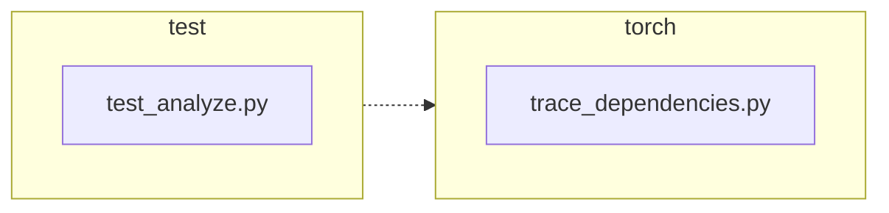

<!-- torii-review pr=191840 run=local head=a27fb64a9ba8eb04cd449d1e6deac9a83cfc6f0a -->
## 🏴‍☠️ Torii Review — PR #191840

**Verdict:** APPROVE
**Confidence:** high
**Score:** 92/100
**Review effort:** 2/5

### Summary
Two-line production fix in `trace_dependencies()`: captures the existing `sys.getprofile()` callback before installing its own tracer, then restores it in the existing `finally` block instead of unconditionally resetting to `None`. Two regression tests cover the success and exception paths. The change directly addresses linked issue #191839 with minimal surface area and adequate coverage.

### Walkthrough
- `torch/package/analyze/trace_dependencies.py`: `previous_profile = sys.getprofile()` inserted before the `try` block; `finally` now calls `sys.setprofile(previous_profile)` instead of `sys.setprofile(None)`. When no prior profile exists, `previous_profile` is `None` and behavior is identical.
- `test/package/test_analyze.py`: two new tests — `test_trace_dependencies_restores_profile` (happy path) and `test_trace_dependencies_restores_profile_when_callable_raises` (exception path). Both install a dummy profile, call `trace_dependencies`, and assert via `assertIs` that the exact same profile object survives.

### Architecture diagram
<!-- torii-mermaid -->

_Auto-generated from 2 changed file(s) (F57). Edges between groups are adjacency, not proven runtime dependencies._

Files in diagram

- `test/package/test_analyze.py`
- `torch/package/analyze/trace_dependencies.py`

### Blocking
None

### Key findings
None — no high-confidence defects in new code.

### Security audit
No — no injection, authz, secret, or unsafe-deserialize surface in this diff. The change touches only `sys.setprofile`/`sys.getprofile`, a CPython profiling API.

### Multi-lens checklist
| Lens | Status | Note |
|------|--------|------|
| correctness | ok | `finally` block guarantees restoration on both success and exception; `previous_profile` of `None` yields identical legacy behavior |
| security | n/a | No auth, injection, secret, or crypto surface |
| tests | ok | Two regression tests cover success and exception paths; existing `test_trace_dependencies` not broken |
| performance | n/a | One extra `sys.getprofile()` call per `trace_dependencies` invocation — negligible |
| api_contracts | ok | Return type unchanged; no public signature altered; existing callers see only the restored-profile fix |
| concurrency | n/a | `sys.setprofile` is per-thread; no new shared state |
| maintainability | ok | Comment updated from "Detach" to "Restore the previous"; clean, self-documenting |

### Suggestions
None

### Code suggestions
None

### Nits
None

### Suggested test plan
| Pri | Kind | Target | Scenario |
|-----|------|--------|----------|
| P0 | smoke | `test/package/test_analyze.py` | Run the two added tests locally or in CI — both should pass on the head commit |
| P0 | unit | `trace_dependencies.py::trace_dependencies` | Regression: on base commit, a caller's `sys.setprofile` callback is lost after `trace_dependencies`; on head commit it is preserved (tested by new methods) |
| P1 | unit | `trace_dependencies.py::trace_dependencies` | Edge: caller has no profile set (`None`); behavior must be unchanged (covered implicitly — `previous_profile` is `None`, restoration is a no-op) |

### Tests & risk
- Relevant tests added/updated: yes
- Coverage: success path and exception path for profile restoration are both covered; existing `test_trace_dependencies` (skipped on Linux) is untouched and remains valid
- Risk: low — 2-line production change, `finally`-backed, no new dependencies or API surface
- Rollback: easy — revert to `sys.setprofile(None)` in the `finally` block

### What I checked
- Full unified diff (`pr.diff`, 2 files, +32/-2)
- Production file `torch/package/analyze/trace_dependencies.py` in full (entire `trace_dependencies` symbol)
- Test file `test/package/test_analyze.py` in full (class `TestAnalyze`, all methods)
- Linked issue #191839 body — claims match the diff exactly
- No scripts/torii*.py tooling present in workspace for memory/archival cross-check; core memory had no items for this PR path set

---
*Torii · Hermes Agent · OpenRouter · memory-backed review*
*Cost / usage: model=`deepseek/deepseek-v4-pro` · ~$0.0096 (estimated) · 55k tokens · 4 API calls*
