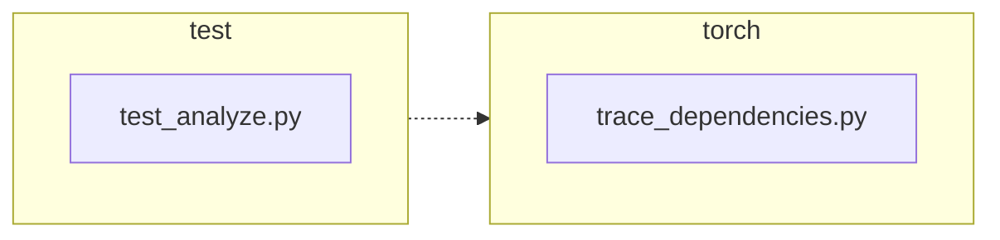

<!-- torii-review pr=191840 run=local head=a27fb64a9ba8eb04cd449d1e6deac9a83cfc6f0a -->
## 🏴‍☠️ Torii Review — PR #191840

**Verdict:** APPROVE
**Confidence:** high
**Score:** 92/100
**Review effort:** 2/5

### Summary
This PR fixes #191839: `trace_dependencies()` was clearing any caller-installed `sys.setprofile()` callback by unconditionally calling `sys.setprofile(None)` in its `finally` block. The fix captures the existing profile via `sys.getprofile()` before installing its own callback, then restores it in `finally`. Two targeted regression tests cover both the success and exception paths. Clean, minimal, well-tested.

### Walkthrough
- **`torch/package/analyze/trace_dependencies.py`**: captures `previous_profile = sys.getprofile()` before the `try` block, and restores it via `sys.setprofile(previous_profile)` in `finally` instead of hardcoded `None`. This is the entire behavioral change — 1 line added, 2 changed.
- **`test/package/test_analyze.py`**: two new tests verify the caller's profile is preserved both when `trace_dependencies` succeeds and when the traced callable raises an exception. Uses `assertIs` (identity check) which is the correct assertion for `sys.getprofile()` return values. Tests use `addCleanup` for proper isolation.

### Architecture diagram
<!-- torii-mermaid -->

_Auto-generated from 2 changed file(s) (F57). Edges between groups are adjacency, not proven runtime dependencies._

Files in diagram

- `test/package/test_analyze.py`
- `torch/package/analyze/trace_dependencies.py`

### Blocking
None

### Key findings
None — no high-confidence defects in new code.

### Security audit
No — pure state-restore bug fix; no injection, authz, secrets, or untrusted-data surface.

### Multi-lens checklist
| Lens | Status | Note |
|------|--------|------|
| correctness | ok | `previous_profile` captured before `setprofile(record_used_modules)`, restored in `finally` — covers both return and raise paths. Nested caller behavior now correct. |
| security | ok | No security surface — profiling callback, no untrusted input. |
| tests | ok | Both success and exception paths tested with `assertIs`; `addCleanup` ensures isolation. Existing functional test (`test_trace_dependencies`) still covers module-tracing behavior. |
| performance | ok | One extra `sys.getprofile()` call per `trace_dependencies` invocation — negligible. |
| api_contracts | ok | Signature unchanged; return value unchanged. Behavior fix (restore instead of clear) is backward-compatible — callers without a profiler see no difference. |
| concurrency | n/a | `sys.setprofile`/`getprofile` are per-thread; no threading introduced. |
| maintainability | ok | Clear variable name (`previous_profile`), updated comment, well-structured tests. |

### Suggestions
None

### Code suggestions
None

### Nits
None

### Suggested test plan
| Pri | Kind | Target | Scenario |
|-----|------|--------|----------|
| P0 | smoke | `test/package/test_analyze.py` | Run added tests (`test_trace_dependencies_restores_profile`, `test_trace_dependencies_restores_profile_when_callable_raises`) — both pass. |
| P0 | unit | `torch/package/analyze/trace_dependencies.py::trace_dependencies` | Covered by added tests: profile restored after success and after exception. |
| P0 | unit | `trace_dependencies` — existing behavior preserved | Covered by existing `test_trace_dependencies` (module tracing still works when no caller profiler is set). |
| P1 | unit | `trace_dependencies` — compat | No API change; `n/a`. Old callers work identically when they have no profiler set (`previous_profile` = `None`, restoring `None` = old behavior). |

### Tests & risk
- Relevant tests added/updated: yes — 2 new regression tests covering both paths
- Coverage: success and exception profile-restore paths covered; existing functional test still covers module-tracing core behavior
- Risk: low — minimal change (1 capture + 1 restore), backward-compatible, exception-safe via `finally`
- Rollback: easy — revert to `sys.setprofile(None)` in the `finally` block

### What I checked
- `torch/package/analyze/trace_dependencies.py` — full file, confirmed the `previous_profile` capture and `finally` restore
- `test/package/test_analyze.py` — new test methods, confirmed both paths tested with identity assertions and `addCleanup` isolation
- Diff not truncated; all changed hunks inspected

---
*Torii · Hermes Agent · OpenRouter · memory-backed review*
*Cost / usage: model=`deepseek/deepseek-v4-pro` · ~$0.0086 (estimated) · 39k tokens · 3 API calls*
