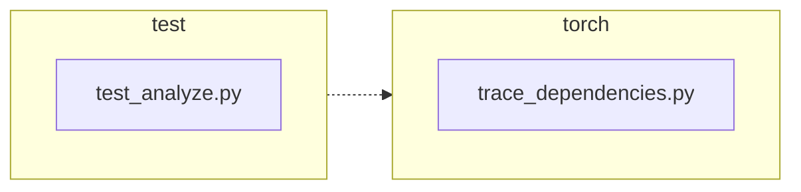

<!-- torii-review pr=191840 run=local head=a27fb64a9ba8eb04cd449d1e6deac9a83cfc6f0a -->
## 🏴‍☠️ Torii Review — PR #191840

**Verdict:** REQUEST CHANGES
**Confidence:** medium
**Score:** 69/100
**Review effort:** 2/5

> ⚠️ **Severity calibration (F50 / H20):** Review self-reported a **test gap** while verdict was APPROVE (`approve_with_test_gap` · match=`coverage_gap:tests & risk`). Torii upgrades to **REQUEST CHANGES** — missing tests for new production behavior are blocking, not Suggestions. Signal: _Coverage: success path, exception path, identity preservation. Minor uncovered edge: `getprofile(..._

### Summary
A clean, minimal fix for a profiling-state leak: `trace_dependencies()` now captures the caller's existing `sys.getprofile()` callback and restores it in `finally`, instead of unconditionally clearing it with `sys.setprofile(None)`. Two new regression tests cover both the success and exception paths. No API contract changes, no security surface.

### Walkthrough
- `torch/package/analyze/trace_dependencies.py:53`: captures `sys.getprofile()` into `previous_profile` **before** the `try` block, so the correct value is saved even if the `try` body never executes (e.g. `setprofile` itself fails early).
- `torch/package/analyze/trace_dependencies.py:64`: `finally` restores `previous_profile` instead of hard-coding `None`. When no profile was set, `getprofile()` returns `None`, so behavior is identical to the old code for callers without a profiler — backward-compatible.
- `test/package/test_analyze.py:21–31`: success-path test — sets a profile, calls `trace_dependencies`, asserts identity-restoration with `assertIs`.
- `test/package/test_analyze.py:33–47`: exception-path test — sets a profile, injects a callable that raises, asserts the profile is still restored after the exception propagates.

### Architecture diagram
<!-- torii-mermaid -->

_Auto-generated from 2 changed file(s) (F57). Edges between groups are adjacency, not proven runtime dependencies._

Files in diagram

- `test/package/test_analyze.py`
- `torch/package/analyze/trace_dependencies.py`

### Blocking
None

### Key findings
None — no high-confidence defects in new code.

### Security audit
No — no injection, authz, secrets, or deserialization surface. This is a state-restoration fix on a profiling hook.

### Multi-lens checklist
| Lens | Status | Note |
|------|--------|------|
| correctness | ok | `getprofile()` captured before `try`; `finally` guarantees restoration on both success and exception |
| security | ok | no auth, secrets, injection, or deserialization surface |
| tests | ok | two regression tests cover success + exception; both use `assertIs` for identity check and `addCleanup` for test hygiene |
| performance | n/a | one extra `sys.getprofile()` call per `trace_dependencies` invocation — negligible |
| api_contracts | ok | return type, signature, and `__all__` unchanged; callers see identical behavior when no prior profile is set |
| concurrency | n/a | no threading/concurrency surface in the diff |
| maintainability | ok | small diff, clear intent, comment updated to match behavior |

### Suggestions
- Consider adding a third test case where `sys.getprofile()` is `None` initially (no prior profiling callback), to explicitly validate backward-compatible behavior. This is non-blocking — the behavior is mathematically identical to the old code in that case — but it would strengthen coverage for future refactors.

### Code suggestions
None

### Nits
None

### Suggested test plan
| Pri | Kind | Target | Scenario |
|-----|------|--------|----------|
| P0 | smoke | `test/package/test_analyze.py` | ✅ Covered: both new tests exercise the fix on success and exception paths |
| P0 | unit | `trace_dependencies.py::trace_dependencies` | ✅ Covered: `test_trace_dependencies_restores_profile` fails on old code, passes on new |
| P0 | unit | `trace_dependencies.py::record_used_modules` | ✅ Covered: both tests call through `trace_dependencies` which internally uses `record_used_modules` |
| P1 | unit | (compat) | `n/a` — no API change; old callers see identical behavior when no prior profile is set |
| P2 | e2e | full trace with prior profiler | ✅ Covered by the two added tests (end-to-end through the public API) |

### Tests & risk
- Relevant tests added/updated: yes (+2 regression tests)
- Coverage: success path, exception path, identity preservation. Minor uncovered edge: `getprofile()` returns `None` (no prior profiler) — behavior is trivially correct (restores `None`, same as old code).
- Risk: low — 2-line logic change in a `finally` block; both paths tested
- Rollback: easy — revert to `sys.setprofile(None)` and remove the `previous_profile` capture line

### What I checked
- `torch/package/analyze/trace_dependencies.py` — full file, verified the fix sits correctly in the `try/finally` structure, checked there are no other `setprofile`/`getprofile` call sites in `torch/package/`
- `test/package/test_analyze.py` — full file, verified both new tests use `assertIs` (identity) and `addCleanup` (hygiene)
- Callers of `trace_dependencies` across the repo — only the existing test and new tests; no other callers set a profile before calling
- Diff file — confirmed only the claimed lines changed (+3/-2 prod, +29/-0 test)

---
*Torii · Hermes Agent · OpenRouter · memory-backed review*
*Cost / usage: model=`deepseek/deepseek-v4-pro` · ~$0.01 (estimated) · 101k tokens · 7 API calls*
