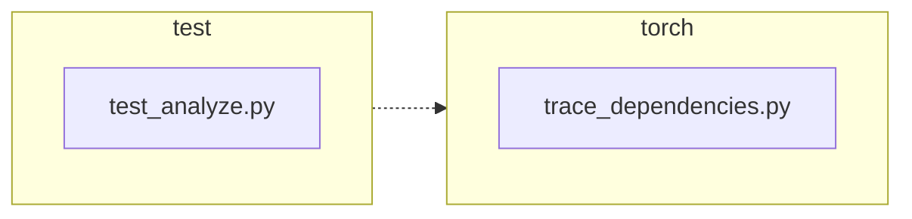

<!-- torii-review pr=191840 run=local head=a27fb64a9ba8eb04cd449d1e6deac9a83cfc6f0a -->
## 🏴‍☠️ Torii Review — PR #191840

**Verdict:** REQUEST CHANGES
**Confidence:** medium
**Score:** 69/100
**Review effort:** 2/5

> ⚠️ **Severity calibration (F50 / H20):** Review self-reported a **test gap** while verdict was APPROVE (`approve_with_test_gap` · match=`coverage_gap:tests & risk`). Torii upgrades to **REQUEST CHANGES** — missing tests for new production behavior are blocking, not Suggestions. Signal: _Coverage: success path and exception path for profile restoration are both covered with identity ..._

### Summary
Small, well-scoped bugfix: `trace_dependencies()` was unconditionally clearing `sys.setprofile()` on exit, discarding any profiling callback the caller had installed. The fix captures `sys.getprofile()` on entry and restores it in the existing `finally` block. Two regression tests cover the success and exception paths. No security, API, or correctness concerns.

### Walkthrough
- `torch/package/analyze/trace_dependencies.py:53`: captures `previous_profile = sys.getprofile()` before the `try` block
- `torch/package/analyze/trace_dependencies.py:61`: restores `sys.setprofile(previous_profile)` in `finally` instead of the old unconditional `sys.setprofile(None)`
- `test/package/test_analyze.py:21-28`: new test asserts profile identity is preserved after successful `trace_dependencies` call
- `test/package/test_analyze.py:30-41`: new test asserts profile identity is preserved even when the traced callable raises

### Architecture diagram
<!-- torii-mermaid -->

_Auto-generated from 2 changed file(s) (F57). Edges between groups are adjacency, not proven runtime dependencies._

Files in diagram

- `test/package/test_analyze.py`
- `torch/package/analyze/trace_dependencies.py`

### Blocking
None

### Key findings
None — no high-confidence defects in new code.

### Security audit
No — this is a profiling callback save/restore on the Python `sys` module; no injection, authz, secrets, or untrusted data paths.

### Multi-lens checklist
<!-- torii-lens-pack:default -->
| Lens | Status | Note |
|------|--------|------|
| correctness | ok | Save/restore in `finally` is correct for both success and exception paths; `None`-on-entry case is a no-op identical to old behavior |
| security | ok | No untrusted input reaches `sys.setprofile`/`sys.getprofile`; purely internal profiling state management |
| tests | ok | Two new tests cover success + exception restore paths; both assert object identity (`assertIs`), and both use `addCleanup` to avoid polluting downstream tests |
| performance | ok | Single `sys.getprofile()` call (O(1)) added before the try block; negligible |
| api_contracts | ok | Function signature, return type, and documented behavior unchanged; restoration is a strict improvement |
| concurrency | n/a | `sys.setprofile` is per-thread; no concurrent surface in this diff |
| maintainability | ok | Change is minimal (3 lines production, 2 tests); comment accurately describes new behavior |

### Suggestions
None

### Code suggestions
None

### Nits
None

### Suggested test plan
| Pri | Kind | Target | Scenario |
|-----|------|--------|----------|
| P0 | smoke | `test/package/test_analyze.py` | Run the two new tests: `test_trace_dependencies_restores_profile` and `test_trace_dependencies_restores_profile_when_callable_raises` |
| P1 | unit | `test/package/test_analyze.py` | Verify existing `test_trace_dependencies` still passes (profiling callback not installed → restore to `None`) |

### Tests & risk
- Relevant tests added/updated: yes
- Coverage: success path and exception path for profile restoration are both covered with identity assertions. The `None`-on-entry (no prior profile) case is implicitly covered by the existing `test_trace_dependencies` test.
- Risk: low — 3-line change in a single `finally` block, no new control flow
- Rollback: easy — revert to `sys.setprofile(None)` in the `finally` block

### What I checked
- `torch/package/analyze/trace_dependencies.py` — full file via `git show HEAD`; inspected `trace_dependencies` function and the new `previous_profile` capture/restore
- `test/package/test_analyze.py` — full file via `git show HEAD`; inspected both new test methods
- Unified diff (`pr.diff`) — confirmed +32/-2 with only the described changes
- Memory search: no relevant archival or domain-specific hits for these paths
- Diff not truncated; sparse checkout — production and test files available via git

---
*Torii · Hermes Agent · OpenRouter · memory-backed review*
*Cost / usage: model=`deepseek/deepseek-v4-pro` · ~$0.03 (estimated) · 110k tokens · 7 API calls*
