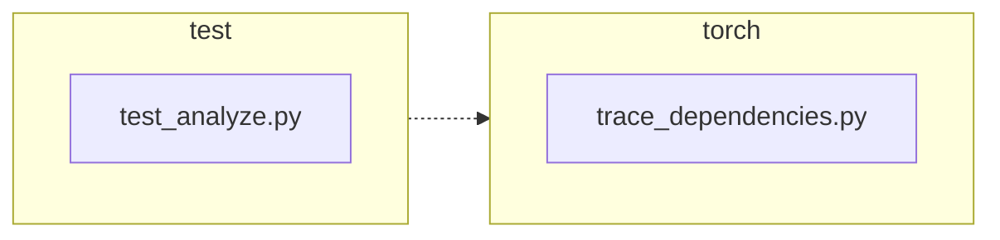

<!-- torii-review pr=191840 run=local head=a27fb64a9ba8eb04cd449d1e6deac9a83cfc6f0a -->
## 🏴‍☠️ Torii Review — PR #191840

**Verdict:** APPROVE
**Confidence:** high
**Score:** 92/100
**Review effort:** 2/5

### Summary
This PR fixes a profiling-state leak in `trace_dependencies()` where `sys.setprofile(None)` in the `finally` block unconditionally cleared any caller-installed profiling callback. The fix captures the existing profile via `sys.getprofile()` on entry and restores it in the `finally` block. Two regression tests cover the success and exception-to-propagation paths. Clean, minimal, well-tested.

### Walkthrough
- `torch/package/analyze/trace_dependencies.py:53` — capture `sys.getprofile()` into `previous_profile` before installing the tracing callback.
- `torch/package/analyze/trace_dependencies.py:64` — restore `previous_profile` in `finally` instead of unconditionally passing `None`.
- `test/package/test_analyze.py:21-31` — happy-path test: profile is identity-restored after successful tracing.
- `test/package/test_analyze.py:33-47` — exception-path test: profile is identity-restored even when the traced callable raises, and the exception still propagates.

### Architecture diagram
<!-- torii-mermaid -->

_Auto-generated from 2 changed file(s) (F57). Edges between groups are adjacency, not proven runtime dependencies._

Files in diagram

- `test/package/test_analyze.py`
- `torch/package/analyze/trace_dependencies.py`

### Blocking
None

### Key findings
None — no high-confidence defects in new code.

### Security audit
No

### Multi-lens checklist
| Lens | Status | Note |
|------|--------|------|
| correctness | ok | `sys.getprofile()` → `sys.setprofile(previous_profile)` in `finally` correctly preserves caller state for both success and exception paths. Nested `trace_dependencies` calls chain correctly (inner saves `record_used_modules`, outer restores it). |
| security | ok | No injection, authz, secrets, or unsafe-deserialize surface. `sys.setprofile` / `sys.getprofile` are standard CPython profiling hooks. |
| tests | ok | Two tests cover success + exception paths; both use identity check (`assertIs`) and `addCleanup` for state hygiene. Linked issue #191839 is fully addressed. |
| performance | ok | `sys.getprofile()` is O(1); no hot-path or N+1 concern. |
| api_contracts | ok | Return type unchanged (`list[str]`). The behavioral fix (restore instead of clear) is the intended correction — no caller breakage from the old buggy behavior warrants concern. |
| concurrency | n/a | `sys.setprofile` / `sys.getprofile` are per-thread; no shared-state race introduced. |
| maintainability | ok | One-line capture, one-line restore, comment updated. Minimal, readable. |

### Suggestions
None

### Code suggestions
None

### Nits
- The existing `test_trace_dependencies` (line 49) is skipped on Linux due to #81213 — pre-existing, not introduced here. No action needed.

### Suggested test plan
| Pri | Kind | Target | Scenario |
|-----|------|--------|----------|
| P0 | smoke | `test/package/test_analyze.py` | Run the two new tests (`test_trace_dependencies_restores_profile`, `test_trace_dependencies_restores_profile_when_callable_raises`) — both must pass on head and fail on base. |
| P0 | unit | `torch/package/analyze/trace_dependencies.py::trace_dependencies` | Covered by the two new tests (success path + exception path). |
| P1 | unit | `torch/package/analyze/trace_dependencies.py::trace_dependencies` | Verify nested `trace_dependencies` call restores intermediate profile (outer → inner → outer profile chain holds). |

### Tests & risk
- Relevant tests added/updated: yes
- Coverage: success and exception-to-propagation paths both covered with identity assertions
- Risk: low — minimal diff (3 lines changed in prod code), behavior narrows to a single `finally` block
- Rollback: easy — revert is a one-line change (restore `sys.setprofile(None)`)

### What I checked
- `torch/package/analyze/trace_dependencies.py` — full file, lines 53 and 64 (the two changed lines)
- `test/package/test_analyze.py` — full file, lines 21–47 (both new test methods)
- Diff confirmed clean: +3/−2 in prod, +29/−0 in test
- Memory search: no prior TP/FP findings for these paths (clean slate)
- Archival search: 0 hits, no hub themes
- Doctor: passes, all recovery tools OK

---
*Torii · Hermes Agent · OpenRouter · memory-backed review*
*Cost / usage: model=`deepseek/deepseek-v4-pro` · ~$0.03 (estimated) · 119k tokens · 8 API calls*
