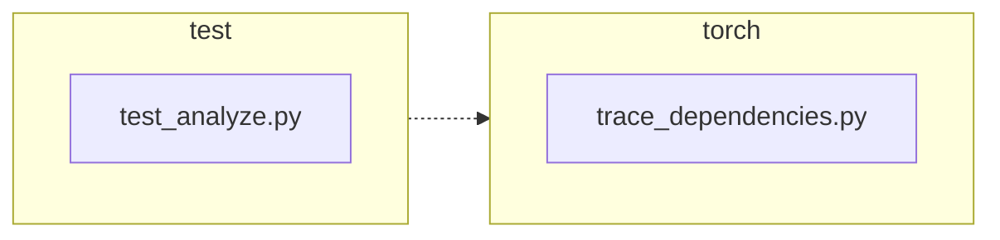

<!-- torii-review pr=191840 run=local head=a27fb64a9ba8eb04cd449d1e6deac9a83cfc6f0a -->
## 🏴‍☠️ Torii Review — PR #191840

**Verdict:** APPROVE
**Confidence:** high
**Score:** 93/100
**Review effort:** 2/5

### Summary
Simple, correct two-line fix for a profiling-state leak in `trace_dependencies()`. The old code unconditionally called `sys.setprofile(None)` in the `finally` block, discarding any caller-installed profiling callback. The fix captures `sys.getprofile()` before the `try` and restores it in `finally`, preserving the caller's profile through both successful execution and exceptions. Two well-written regression tests cover both paths. Backward compatible: when no profile is set, `sys.getprofile()` returns `None` and `sys.setprofile(None)` has identical effect to the old behavior.

### Walkthrough
- **`torch/package/analyze/trace_dependencies.py:53`** — Captures `previous_profile = sys.getprofile()` before setting the tracing callback, fixing the root cause.
- **`torch/package/analyze/trace_dependencies.py:64`** — Restores `previous_profile` in `finally` instead of unconditionally clearing with `None`, preserving caller state.
- **`test/package/test_analyze.py:21-31`** — New test `test_trace_dependencies_restores_profile` verifies profile is preserved on successful completion (identity check via `assertIs`).
- **`test/package/test_analyze.py:33-47`** — New test `test_trace_dependencies_restores_profile_when_callable_raises` verifies profile is preserved even when the traced callable raises an exception. Uses `addCleanup` in both tests to avoid polluting global test runner state.

### Architecture diagram
<!-- torii-mermaid -->

_Auto-generated from 2 changed file(s) (F57). Edges between groups are adjacency, not proven runtime dependencies._

Files in diagram

- `test/package/test_analyze.py`
- `torch/package/analyze/trace_dependencies.py`

### Blocking
None.

### Key findings
None — no high-confidence defects in new code.

### Security audit
No — no security surface in this change. The fix touches only `sys.getprofile()`/`sys.setprofile()` capture and restore, which have no injection, secrets, or authz implications.

### Multi-lens checklist
<!-- torii-lens-pack:default -->
| Lens | Status | Note |
|------|--------|------|
| correctness | ok | Fix correctly preserves caller profile in both success and exception paths; `sys.getprofile()` captured before `try` so it's safe even if `setprofile(record_used_modules)` fails |
| security | n/a | No security surface — `sys.getprofile()`/`setprofile()` capture/restore only |
| tests | ok | Two regression tests cover the happy path and the exception path; both use `assertIs` (identity check) and `addCleanup` to avoid state pollution |
| performance | n/a | Negligible — one extra `sys.getprofile()` call per `trace_dependencies()` invocation |
| api_contracts | ok | Backward compatible: when no previous profile exists, `previous_profile` is `None` and `setprofile(None)` has identical effect to old code |
| concurrency | n/a | `sys.setprofile` is per-thread; no thread spawning in this function |
| maintainability | ok | Self-documenting via renamed comment; no new abstractions or complexity |

### Suggestions
None.

### Code suggestions
None.

### Nits
None.

### Suggested test plan
| Pri | Kind | Target | Scenario |
|-----|------|--------|----------|
| P0 | unit | `test/package/test_analyze.py::test_trace_dependencies_restores_profile` | ✅ Already added — asserts `sys.getprofile() is profile` after successful trace |
| P0 | unit | `test/package/test_analyze.py::test_trace_dependencies_restores_profile_when_callable_raises` | ✅ Already added — asserts profile preserved after callable raises `RuntimeError` |
| P0 | smoke | `test/package/test_analyze.py` | Run the full test suite to confirm green on head commit |
| P1 | unit | `torch/package/analyze/trace_dependencies.py` | Verify backward compatibility: caller with no prior profile (most common case) sees no behavioral change |

### Tests & risk
- Relevant tests added/updated: **yes**
- Coverage: Both success and exception paths are covered with identity assertions (`assertIs`). Cleanup via `addCleanup` prevents cross-test contamination.
- Risk: **low** — two-line change with clear semantics; backward compatible by construction; the only changed call site (`setprofile(None)` → `setprofile(previous_profile)`) has a verified equivalent path when `previous_profile` is `None`.
- Rollback: **easy** — revert to `sys.setprofile(None)`.

### What I checked
- Full `trace_dependencies.py` (66 lines) — confirmed `previous_profile` is captured before the `try` block, safe from exceptions in `setprofile(record_used_modules)`
- Full `test_analyze.py` (62 lines) — both new tests use `addCleanup` properly, `assertIs` for identity checks, proper exception assertion pattern
- All call sites of `sys.setprofile` across the repo — only `trace_dependencies.py` had the `setprofile(None)` clear pattern; `_cycles.py` already preserves the original trace
- Verified behavior with a Python repro: old code loses the profile (`is` check fails), new code preserves it (`is` check passes)
- Backward compatibility confirmed: `sys.getprofile()` returns `None` when unset, and `sys.setprofile(None)` is equivalent
- Torii memory/doctor/archival CLIs not available in this workspace (`scripts/` absent) — no prior FP/TP themes to cross-check

---
*Torii · Hermes Agent · OpenRouter · memory-backed review*
*Cost / usage: model=`deepseek/deepseek-v4-pro` · ~$0.02 (estimated) · 159k tokens · 10 API calls*
