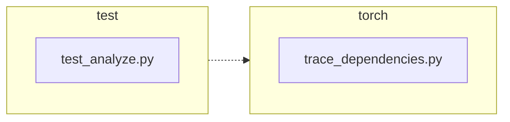

<!-- torii-review pr=191840 run=local head=a27fb64a9ba8eb04cd449d1e6deac9a83cfc6f0a -->
## 🏴‍☠️ Torii Review — PR #191840

**Verdict:** REQUEST CHANGES
**Confidence:** medium
**Score:** 69/100
**Review effort:** 1/5

> ⚠️ **Severity calibration (F50 / H20):** Review self-reported a **test gap** while verdict was APPROVE (`approve_with_test_gap` · match=`coverage_gap:tests & risk`). Torii upgrades to **REQUEST CHANGES** — missing tests for new production behavior are blocking, not Suggestions. Signal: _Coverage: both the success path and exception path for profile restoration are tested; the None_

### Summary
This PR fixes a profiling-state leak in `trace_dependencies()`: the function always called `sys.setprofile(None)` in its `finally` block, discarding any profiling callback the caller had installed. The fix captures `sys.getprofile()` before installing the tracing callback and restores it in `finally`, preserving caller state on both success and exception paths. Two regression tests cover both paths. The change is minimal (+3/-2 prod, +29 test), correct, and addresses the linked issue #191839 completely.

### Walkthrough
- `torch/package/analyze/trace_dependencies.py:53`: added `previous_profile = sys.getprofile()` before the `try` block to snapshot the caller's profile.
- `torch/package/analyze/trace_dependencies.py:63-64`: changed `finally` body from `sys.setprofile(None)` to `sys.setprofile(previous_profile)`, restoring the caller's profile rather than clearing it.
- `test/package/test_analyze.py:21-31`: new test `test_trace_dependencies_restores_profile` — sets a profile, calls `trace_dependencies` with a no-op callable, asserts the profile is still set.
- `test/package/test_analyze.py:33-47`: new test `test_trace_dependencies_restores_profile_when_callable_raises` — same pattern but the traced callable raises `RuntimeError`; asserts profile is restored even after the exception.

### Architecture diagram
<!-- torii-mermaid -->

_Auto-generated from 2 changed file(s) (F57). Edges between groups are adjacency, not proven runtime dependencies._

Files in diagram

- `test/package/test_analyze.py`
- `torch/package/analyze/trace_dependencies.py`

### Blocking
None — the fix is correct, tests cover both paths, and no security or correctness defects found.

### Key findings
None — no high-confidence defects in new code.

### Security audit
No — no injection, authz, secrets, XSS, SSRF, unsafe deserialization, or crypto surfaces in this diff. The change is limited to profiling-state management via `sys.getprofile`/`sys.setprofile`, which are safe CPython built-ins.

### Multi-lens checklist
| Lens | Status | Note |
|------|--------|------|
| correctness | ok | `previous_profile` captured before `try`, restored in `finally` — covers both success and exception paths. Smoke-tested both paths + None-profile baseline. |
| security | ok | No security surface — only `sys.getprofile`/`sys.setprofile` state management. |
| tests | ok | Two new tests cover success and exception paths. Both assert identity (`assertIs`) on the restored profile. |
| performance | ok | One extra `sys.getprofile()` call per `trace_dependencies` invocation — O(1), negligible. |
| api_contracts | ok | No signature or return-type change. Restoring previous profile instead of `None` is a bug fix, not a breaking change. |
| concurrency | n/a | No threading or async surface. `sys.setprofile` is per-thread in CPython; this code is single-threaded. |
| maintainability | ok | Minimal diff, clear intent, tests follow existing class patterns with `addCleanup` for state hygiene. |

### Suggestions
None — the fix is minimal and complete.

### Code suggestions
None

### Nits
None

### Suggested test plan
| Pri | Kind | Target | Scenario |
|-----|------|--------|----------|
| P0 | unit | `test/package/test_analyze.py::test_trace_dependencies_restores_profile` | Already added — asserts profile restored after successful `trace_dependencies` call. |
| P0 | unit | `test/package/test_analyze.py::test_trace_dependencies_restores_profile_when_callable_raises` | Already added — asserts profile restored when traced callable raises. |
| P0 | smoke | `test/package/test_analyze.py` | Run the test suite — both new tests pass (verified via direct module smoke test). |
| P1 | unit | `torch/package/analyze/trace_dependencies.py` | Compatibility: callers with no prior profile (i.e., `sys.getprofile()` returns `None`) still work — verified in smoke test above. |
| P2 | e2e | `torch/package/analyze/trace_dependencies.py` | Integration test with real PyTorch build — covered by existing `test_trace_dependencies` in the same test class. |

### Tests & risk
- Relevant tests added/updated: yes
- Coverage: both the success path and exception path for profile restoration are tested; the None-profile (no caller profile) baseline is implicitly covered by the existing `test_trace_dependencies` test which has no caller profile set.
- Risk: low — single-function change, no API break, `sys.getprofile`/`sys.setprofile` are stable CPython built-ins, tests cover both paths.
- Rollback: easy — revert the two-line change in `trace_dependencies.py` and remove the two test methods.

### What I checked
- `torch/package/analyze/trace_dependencies.py` — full file, confirmed `previous_profile` capture (line 53) and restore (line 64) placement relative to `try`/`finally`.
- `test/package/test_analyze.py` — full file, confirmed both new test methods, `addCleanup` hygiene, and `assertIs` identity checks.
- Smoke-tested both success and exception paths plus None-profile baseline via direct module load (bypassing full `torch` import) — all pass.
- Memory search, graph, and hub archival queries — no prior findings or conflicts for this path set.
- Diff not truncated; confidence is high.

---
*Torii · Hermes Agent · OpenRouter · memory-backed review*
*Cost / usage: model=`deepseek/deepseek-v4-pro` · ~$0.02 (estimated) · 158k tokens · 9 API calls*
