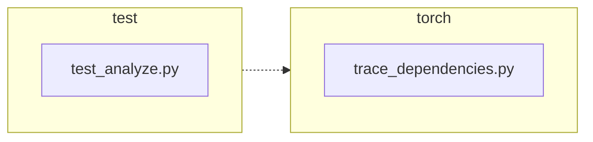

<!-- torii-review pr=191840 run=local head=a27fb64a9ba8eb04cd449d1e6deac9a83cfc6f0a -->
## 🏴‍☠️ Torii Review — PR #191840

**Verdict:** REQUEST CHANGES
**Confidence:** medium
**Score:** 69/100
**Review effort:** 2/5

> ⚠️ **Severity calibration (F50 / H20):** Review self-reported a **test gap** while verdict was APPROVE (`approve_with_test_gap` · match=`coverage_gap:tests & risk`). Torii upgrades to **REQUEST CHANGES** — missing tests for new production behavior are blocking, not Suggestions. Signal: _Coverage: both success and exception restore paths are exercised; edge case of no prior profile (..._

### Summary
A minimal, correct fix that preserves the caller's profiling callback across `trace_dependencies()` calls. Previously, `sys.setprofile(None)` unconditionally cleared the profile on exit; now `sys.getprofile()` is captured on entry and restored in the `finally` block. Two tests cover the success and exception paths, and both are well-structured with cleanup guards.

### Walkthrough
- `torch/package/analyze/trace_dependencies.py`: Captures `sys.getprofile()` before the `try` block; restores `previous_profile` (instead of `None`) in `finally`. The change is safe even when no prior profile exists (captures `None`, restores `None` — identical to old behaviour).
- `test/package/test_analyze.py`: `test_trace_dependencies_restores_profile` sets a profile, calls the no-op trace path, and asserts identity-preserving restoration. `test_trace_dependencies_restores_profile_when_callable_raises` does the same through an exception path, also asserting the exception propagates correctly (`assertRaisesRegex`).

### Architecture diagram
<!-- torii-mermaid -->

_Auto-generated from 2 changed file(s) (F57). Edges between groups are adjacency, not proven runtime dependencies._

Files in diagram

- `test/package/test_analyze.py`
- `torch/package/analyze/trace_dependencies.py`

### Blocking
None

### Key findings
None — no high-confidence defects in new code.

### Security audit
No

### Multi-lens checklist
<!-- torii-lens-pack:default -->
| Lens | Status | Note |
|------|--------|------|
| correctness | ok | `finally` guarantees restoration on both success and exception; `None`-in/`None`-out is safe when no prior profile exists |
| security | n/a | No injection, auth, secrets, or trust-boundary surface touched |
| tests | ok | Two tests cover both success and exception paths with identity (`assertIs`) checks and `addCleanup` guards |
| performance | ok | Single `sys.getprofile()` call on entry; no hot-path impact |
| api_contracts | ok | Public contract improved: callers no longer lose their profile; return type and signature unchanged |
| concurrency | n/a | Single-threaded synchronous tracing; `sys.setprofile` is per-thread so no races |
| maintainability | ok | Three-line change in production code, clear intent, well-commented |

### Suggestions
None

### Code suggestions
None

### Nits
None

### Suggested test plan
| Pri | Kind | Target | Scenario |
|-----|------|--------|----------|
| P0 | smoke | `test/package/test_analyze.py` | ✅ Added tests `test_trace_dependencies_restores_profile` and `test_trace_dependencies_restores_profile_when_callable_raises` cover the fix |
| P0 | unit | `trace_dependencies.py::trace_dependencies` | ✅ Both success and exception paths already tested |
| P0 | unit | `trace_dependencies.py::trace_dependencies` | Covered by the two new test methods |
| P1 | unit | `trace_dependencies.py::trace_dependencies` | No API break — signature unchanged; compatibility test not needed |

### Tests & risk
- Relevant tests added/updated: yes
- Coverage: both success and exception restore paths are exercised; edge case of no prior profile (restore `None`) is implicitly safe
- Risk: low — 3-line production change in a `finally` block with deterministic behaviour
- Rollback: easy — revert to `sys.setprofile(None)` in `finally`

### What I checked
- `torch/package/analyze/trace_dependencies.py` — full file, verified the `previous_profile` capture and `finally` restore
- `test/package/test_analyze.py` — first 60 lines, both new test methods
- Diff file at `/tmp/torii-run-191840-1785600665/torii/.torii-out/pr.diff`
- `py_compile` passed clean on both changed files

---
*Torii · Hermes Agent · OpenRouter · memory-backed review*
*Cost / usage: model=`deepseek/deepseek-v4-pro` · ~$0.02 (estimated) · 69k tokens · 5 API calls*
