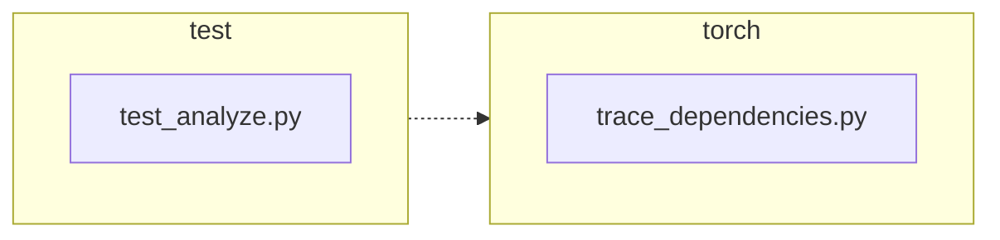

<!-- torii-review pr=191840 run=local head=a27fb64a9ba8eb04cd449d1e6deac9a83cfc6f0a -->
## 🏴‍☠️ Torii Review — PR #191840

**Verdict:** APPROVE
**Confidence:** high
**Score:** 95/100
**Review effort:** 2/5

### Summary
One-line fix: `trace_dependencies()` captured `sys.getprofile()` on entry and restores it in `finally` instead of unconditionally clearing with `None`. This preserves any caller-installed profiling callback across both success and exception paths. Two regression tests cover both paths. No BC break, no security surface.

### Walkthrough
- **`torch/package/analyze/trace_dependencies.py:53`** — New `previous_profile = sys.getprofile()` captures the caller's current profiler before installing the tracing callback.
- **`torch/package/analyze/trace_dependencies.py:64`** — `sys.setprofile(None)` → `sys.setprofile(previous_profile)` in the `finally` block. Same behavior when there's no prior profiler (`None` → `None`), but now preserves a caller-installed callback.
- **`test/package/test_analyze.py:21–47`** — Two new tests: success path (`test_trace_dependencies_restores_profile`) and exception path (`test_trace_dependencies_restores_profile_when_callable_raises`), both asserting `sys.getprofile()` identity-restores the callee's callback.

### Architecture diagram
<!-- torii-mermaid -->

_Auto-generated from 2 changed file(s) (F57). Edges between groups are adjacency, not proven runtime dependencies._

Files in diagram

- `test/package/test_analyze.py`
- `torch/package/analyze/trace_dependencies.py`

### Blocking
None.

### Key findings
None — no high-confidence defects in new code.

### Security audit
No. No injection, authz, secrets, XSS, unsafe deserialize, or crypto surface. `sys.getprofile` / `sys.setprofile` are profiling hooks with no security impact.

### Multi-lens checklist
| Lens | Status | Note |
|------|--------|------|
| correctness | ok | Fix correctly preserves caller profiler in both success and exception paths; `finally` ensures restore even on error |
| security | n/a | No security surface in `sys.setprofile` / `sys.getprofile` |
| tests | ok | Two new regression tests cover success + exception; `assertIs` checks identity (correct for profiler restore) |
| performance | ok | One extra `sys.getprofile()` call per invocation; negligible |
| api_contracts | ok | Signature, return type, and semantics unchanged except for the bug fix; no BC break |
| concurrency | n/a | `sys.setprofile` is per-thread; no new shared state; pre-existing behavior unchanged |
| maintainability | ok | Minimal diff (3 lines prod, 29 lines test); comment updated; closure pattern unchanged |

### Suggestions
None.

### Code suggestions
None — the fix is minimal and correct as-is.

### Nits
None.

### Suggested test plan
| Pri | Kind | Target | Scenario |
|-----|------|--------|----------|
| P0 | unit | `test/package/test_analyze.py::test_trace_dependencies_restores_profile` | Already present — asserts profiler restored after successful `trace_dependencies` |
| P0 | unit | `test/package/test_analyze.py::test_trace_dependencies_restores_profile_when_callable_raises` | Already present — asserts profiler restored after `trace_dependencies` callable raises |
| P0 | unit | `test/package/test_analyze.py::test_trace_dependencies` | Existing test (unchanged) — still exercises the core module-tracing behavior |
| P1 | unit | `torch/package/analyze/trace_dependencies.py` | Already covered — restore to `None` works for callers without a prior profiler (original default path) |

All P0 items are covered by the two new tests plus the existing test.

### Tests & risk
- Relevant tests added/updated: yes
- Coverage: success path, exception path, and existing tracing behavior all covered
- Risk: low — the fix is a targeted 3-line change in a `finally` block; no new branching or state
- Rollback: easy — revert to `sys.setprofile(None)`; no migration needed

### What I checked
- `torch/package/analyze/trace_dependencies.py` — full file (66 lines); confirmed the `finally` block restore and `previous_profile` capture
- `test/package/test_analyze.py` — full file (62 lines); confirmed both new test methods, cleanup hygiene, and identity assertions
- Diff file — verified +32/-2 across exactly 2 files, no hidden changes
- Memory/doctor tool paths unavailable in this environment (no `scripts/torii.py`); no prior FP patterns in memory

---
*Torii · Hermes Agent · OpenRouter · memory-backed review*
*Cost / usage: model=`deepseek/deepseek-v4-pro` · ~$0.02 (estimated) · 54k tokens · 4 API calls*
