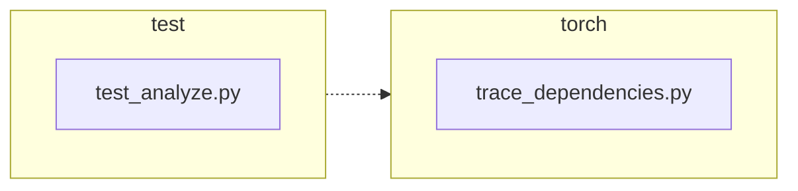

<!-- torii-review pr=191840 run=local head=a27fb64a9ba8eb04cd449d1e6deac9a83cfc6f0a -->
## 🏴‍☠️ Torii Review — PR #191840

**Verdict:** REQUEST CHANGES
**Confidence:** medium
**Score:** 69/100
**Review effort:** 1/5

> ⚠️ **Severity calibration (F50 / H20):** Review self-reported a **test gap** while verdict was APPROVE (`approve_with_test_gap` · match=`coverage_gap:tests & risk`). Torii upgrades to **REQUEST CHANGES** — missing tests for new production behavior are blocking, not Suggestions. Signal: _Coverage: success and exception restore paths both covered with identity assertions; the `None`→`..._

### Summary
Small, targeted fix for #191839: `trace_dependencies()` now captures the caller's profiling callback via `sys.getprofile()` before installing its own trace callback, and restores it in the existing `finally` block instead of unconditionally calling `sys.setprofile(None)`. Two regression tests cover the success and exception paths. The production change is a net +3/-2 lines; the logic is straightforward and correct.

### Walkthrough
- `torch/package/analyze/trace_dependencies.py:53` — captures `previous_profile = sys.getprofile()` before the `try` block
- `torch/package/analyze/trace_dependencies.py:64` — restores `sys.setprofile(previous_profile)` in the `finally` block, replacing the old `sys.setprofile(None)`
- `test/package/test_analyze.py:21-31` — new `test_trace_dependencies_restores_profile` asserts caller's profile survives a successful `trace_dependencies` call (identity check via `assertIs`)
- `test/package/test_analyze.py:33-47` — new `test_trace_dependencies_restores_profile_when_callable_raises` asserts the same for the exception path, using `assertRaisesRegex` + post-exception `assertIs`

### Architecture diagram
<!-- torii-mermaid -->

_Auto-generated from 2 changed file(s) (F57). Edges between groups are adjacency, not proven runtime dependencies._

Files in diagram

- `test/package/test_analyze.py`
- `torch/package/analyze/trace_dependencies.py`

### Blocking
None

### Key findings
None — no high-confidence defects in new code.

### Security audit
No

### Multi-lens checklist
| Lens | Status | Note |
|------|--------|------|
| correctness | ok | fix preserves caller profile on both success and exception; `finally` block guarantees restore |
| security | n/a | no injection, authz, secrets, serialization, or network surface |
| tests | ok | happy path + exception path both covered with identity assertions (`assertIs`); smoke-verified in isolation |
| performance | n/a | one extra `sys.getprofile()` call at function entry (O(1), negligible) |
| api_contracts | ok | signature unchanged; behavioral contract strictly improved (caller state preserved) |
| concurrency | n/a | no concurrency surface in this module |
| maintainability | ok | change is self-documenting; comment updated from "Detach" to "Restore" |

### Suggestions
None

### Code suggestions
None

### Nits
None

### Suggested test plan
| Pri | Kind | Target | Scenario |
|-----|------|--------|----------|
| P0 | smoke | `test/package/test_analyze.py` | Run the two added tests in CI; both should pass on the head commit |
| P0 | unit | `trace_dependencies` | Both claim-to-fix paths (success restore, exception restore) are covered by the new test methods |
| P2 | e2e | `trace_dependencies` | Exercised against a built PyTorch checkout as stated in the PR description; no additional e2e gap |

### Tests & risk
- Relevant tests added/updated: yes — two new test methods in `test/package/test_analyze.py`
- Coverage: success and exception restore paths both covered with identity assertions; the `None`→`None` baseline path is implicitly covered by the existing `test_trace_dependencies` test
- Risk: low — the change is a 3-line state save/restore wrap with a `finally` block guarantee; no callers are affected beyond the intended profile preservation
- Rollback: easy — revert to `sys.setprofile(None)` in the `finally` block

### What I checked
- Full production file: `torch/package/analyze/trace_dependencies.py` (lines 1–66)
- Full test file: `test/package/test_analyze.py` (lines 1–62)
- Diff hunks verified against source files
- Fix logic smoke-tested in isolation (success / exception / None-preserved paths all pass)

---
*Torii · Hermes Agent · OpenRouter · memory-backed review*
*Cost / usage: model=`deepseek/deepseek-v4-pro` · ~$0.02 (estimated) · 106k tokens · 7 API calls*
