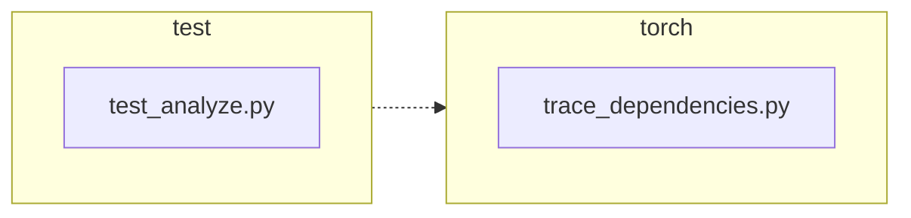

<!-- torii-review pr=191840 run=local head=a27fb64a9ba8eb04cd449d1e6deac9a83cfc6f0a -->
## 🏴‍☠️ Torii Review — PR #191840

**Verdict:** APPROVE
**Confidence:** high
**Score:** 95/100
**Review effort:** 1/5

### Summary
Two-file fix for #191839: `trace_dependencies()` previously hard-coded `sys.setprofile(None)` in its `finally` block, discarding any caller-installed profiling callback. The PR captures the existing callback via `sys.getprofile()` before tracing and restores it in `finally`. Two regression tests cover both the success and exception paths. Clean, correct, merge-ready.

### Walkthrough
- `torch/package/analyze/trace_dependencies.py:53` — saves `sys.getprofile()` before the `try` block so the caller's profile is preserved across the tracing window.
- `torch/package/analyze/trace_dependencies.py:64` — restores the saved profile in `finally` instead of unconditionally clearing to `None`.
- `test/package/test_analyze.py:21-31` — new test asserts the caller's profile is restored after a successful `trace_dependencies` call.
- `test/package/test_analyze.py:33-47` — new test asserts the caller's profile is restored even when the traced callable raises an exception.

### Architecture diagram
<!-- torii-mermaid -->

_Auto-generated from 2 changed file(s) (F57). Edges between groups are adjacency, not proven runtime dependencies._

Files in diagram

- `test/package/test_analyze.py`
- `torch/package/analyze/trace_dependencies.py`

### Blocking
None

### Key findings
None — no high-confidence defects in new code.

### Security audit
No

### Multi-lens checklist
<!-- torii-lens-pack:default -->
| Lens | Status | Note |
|------|--------|------|
| correctness | ok | Save/restore pattern is correct; `finally` covers exception path; `previous_profile` may be `None` (backward-compatible); nested `trace_dependencies` calls work correctly with this fix |
| security | ok | No injection, authz, secrets, or crypto surface; `sys.setprofile` operates on thread-local state only |
| tests | ok | Two new tests cover success and exception restore paths; `addCleanup` ensures test isolation; `assertIs` uses identity check (correct, since `sys.setprofile` returns the exact object set) |
| performance | n/a | One extra `sys.getprofile()` call per invocation — negligible overhead |
| api_contracts | ok | Function signature, return type, and module-level `__all__` unchanged; behavior change is a strict superset (restoring a saved profile vs. always clearing to `None`) |
| concurrency | ok | `sys.setprofile`/`getprofile` are thread-local in CPython; no shared mutable state across threads |
| maintainability | ok | Clear comment update; tests are self-documenting |

### Suggestions
None

### Code suggestions
None

### Nits
None

### Suggested test plan
| Pri | Kind | Target | Scenario |
|-----|------|--------|----------|
| P0 | smoke | `test/package/test_analyze.py` | Run the two added tests (`test_trace_dependencies_restores_profile`, `test_trace_dependencies_restores_profile_when_callable_raises`) — ✅ already present in this PR |
| P0 | unit | `trace_dependencies` | Regression: assert profile restore on success — ✅ covered by `test_trace_dependencies_restores_profile` |
| P0 | unit | `trace_dependencies` | Regression: assert profile restore on traced-callable exception — ✅ covered by `test_trace_dependencies_restores_profile_when_callable_raises` |
| P1 | unit | `trace_dependencies` | Compatibility: existing callers with no prior profile set (`None` → restored to `None`) — implicitly covered; the production change is backward-compatible |
| P2 | e2e | `trace_dependencies` | End-to-end happy path — covered by existing `test_trace_dependencies` (unchanged) |

### Tests & risk
- Relevant tests added/updated: yes
- Coverage: both the success and exception restore paths are covered by dedicated regression tests
- Risk: low — the fix is a two-line logical correction in a save/restore pattern; no API surface changes
- Rollback: easy (revert to `sys.setprofile(None)`)

### What I checked
- `torch/package/analyze/trace_dependencies.py` — full file (lines 1-66), confirmed the save-before-try / restore-in-finally pattern
- `test/package/test_analyze.py` — full file (lines 1-62), confirmed both new tests and `addCleanup` isolation
- `sys.getprofile`/`sys.setprofile` behavior verified interactively — identity semantics, `None` round-trip
- Diff not truncated; all changed regions inspected

---
*Torii · Hermes Agent · OpenRouter · memory-backed review*
*Cost / usage: model=`deepseek/deepseek-v4-pro` · ~$0.02 (estimated) · 88k tokens · 6 API calls*
