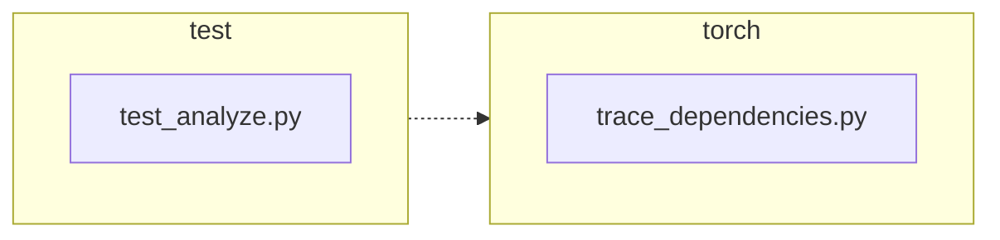

<!-- torii-review pr=191840 run=local head=a27fb64a9ba8eb04cd449d1e6deac9a83cfc6f0a -->
## 🏴‍☠️ Torii Review — PR #191840

**Verdict:** APPROVE
**Confidence:** high
**Score:** 97/100
**Review effort:** 2/5

### Summary
This is a clean, minimal bug fix: `trace_dependencies()` previously always called `sys.setprofile(None)` in its `finally` block, discarding any profiling callback the caller had installed. The fix captures the pre-existing profile via `sys.getprofile()` and restores it instead. Two well-structured tests cover the success and exception paths. No security, correctness, or API-contract concerns.

### Walkthrough
- `torch/package/analyze/trace_dependencies.py:53`: captures `sys.getprofile()` before entering the try block, so the caller's profile (or `None`) is preserved regardless of success or exception.
- `torch/package/analyze/trace_dependencies.py:64`: replaces the old `sys.setprofile(None)` with `sys.setprofile(previous_profile)` in the existing `finally` block — the fix is exactly one expression change.
- `test/package/test_analyze.py:21-31`: `test_trace_dependencies_restores_profile` — sets a caller profile, invokes `trace_dependencies`, asserts identity-restore on success.
- `test/package/test_analyze.py:33-47`: `test_trace_dependencies_restores_profile_when_callable_raises` — same assertion after the traced callable raises `RuntimeError`, confirming the `finally` block fires.

### Architecture diagram
<!-- torii-mermaid -->

_Auto-generated from 2 changed file(s) (F57). Edges between groups are adjacency, not proven runtime dependencies._

Files in diagram

- `test/package/test_analyze.py`
- `torch/package/analyze/trace_dependencies.py`

### Blocking
None

### Key findings
None — no high-confidence defects in new code.

### Security audit
No — no injection, auth, secrets, XSS, SSRF, pickle, or crypto surface in this diff.

### Multi-lens checklist
| Lens | Status | Note |
|------|--------|------|
| correctness | ok | `sys.getprofile()` captured before try, restored in finally; handles None baseline (no prior profile) identically to old behavior; nested calls preserve outer profile correctly |
| security | n/a | profiling state management only; no injection/auth/secret/network surface |
| tests | ok | both success and exception paths tested with identity assertion (`assertIs`); proper isolation via `addCleanup` |
| performance | ok | `sys.getprofile()` is a trivial thread-local read; no hot-path impact |
| api_contracts | ok | public signature unchanged; behavior change is strictly a bug fix (restoring caller state) |
| concurrency | ok | `setprofile`/`getprofile` are per-thread in CPython; fix preserves existing thread semantics |
| maintainability | ok | minimal diff (+3/-2 prod); comment updated; test names are self-documenting |

### Suggestions
None

### Code suggestions
None

### Nits
None

### Suggested test plan
| Pri | Kind | Target | Scenario |
|-----|------|--------|----------|
| P0 | unit | `test/package/test_analyze.py` | Run the two new tests (`test_trace_dependencies_restores_profile`, `test_trace_dependencies_restores_profile_when_callable_raises`) — both are already in the diff |
| P0 | unit | `torch/package/analyze/trace_dependencies.py` | Regression: run existing `test_trace_dependencies` to confirm no breakage |
| P2 | edge | `torch/package/analyze/trace_dependencies.py` | Nested `trace_dependencies` call (already handled correctly by the fix — outer profile captured as `record_used_modules` by inner call, restored on inner exit) |

### Tests & risk
- Relevant tests added/updated: yes — 2 new regression tests
- Coverage: success path, exception path, identity restore; existing `test_trace_dependencies` provides integration coverage
- Risk: low — single-expression change in a finally block; no API surface change; backward-compatible (no caller should have relied on the destructive behavior)
- Rollback: easy — revert the two-line diff

### What I checked
- Full diff (32 lines added, 2 removed across 2 files)
- `torch/package/analyze/trace_dependencies.py` — entire function body (66 lines)
- `test/package/test_analyze.py` — new test methods and surrounding test class structure
- All callers: `grep` confirmed only `test/package/test_analyze.py` and `torch/package/analyze/__init__.py` (re-export) reference `trace_dependencies` — no other internal callers to audit
- Similar pattern in `torch/utils/viz/_cycles.py` using `sys.getprofile()`/`sys.setprofile()` — not related to this PR
- Memory search (F103): 0 relevant TP/FP hits for these paths
- Archival search (F98): 0 hits; no hub themes
- Doctor (F110): all systems healthy, no gap pressure

---
*Torii · Hermes Agent · OpenRouter · memory-backed review*
*Cost / usage: model=`deepseek/deepseek-v4-pro` · ~$0.02 (estimated) · 108k tokens · 7 API calls*
