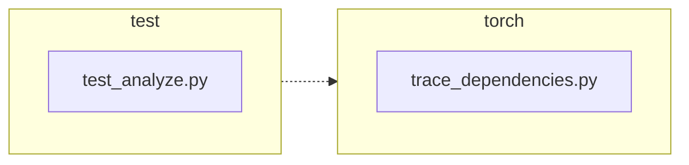

<!-- torii-review pr=191840 run=local head=a27fb64a9ba8eb04cd449d1e6deac9a83cfc6f0a -->
## 🏴‍☠️ Torii Review — PR #191840

**Verdict:** APPROVE
**Confidence:** high
**Score:** 94/100
**Review effort:** 2/5

### Summary
This PR fixes `trace_dependencies()` unconditionally clearing the caller’s `sys.setprofile()` callback on every exit path. The fix captures the existing profile with `sys.getprofile()` on entry and restores it in the existing `finally` block. Two regression tests cover both the success and exception-unwind paths. The change is minimal (+3/−2 prod, +29 test), clearly scoped, and matches the linked issue’s acceptance criteria exactly.

### Walkthrough
- **`torch/package/analyze/trace_dependencies.py:50,60`** — `sys.getprofile()` snapshot moved before the `try`, and the `finally` block now calls `sys.setprofile(previous_profile)` instead of `sys.setprofile(None)`. This preserves any profiling callback the caller installed, on both normal return and exception paths.
- **`test/package/test_analyze.py:21-44`** — Two new table-driven-style test methods: one for the happy path (`test_trace_dependencies_restores_profile`) and one for callable-that-raises (`test_trace_dependencies_restores_profile_when_callable_raises`). Both use `assertIs` (identity check) to confirm the exact callback object is restored.

### Architecture diagram
<!-- torii-mermaid -->

_Auto-generated from 2 changed file(s) (F57). Edges between groups are adjacency, not proven runtime dependencies._

Files in diagram

- `test/package/test_analyze.py`
- `torch/package/analyze/trace_dependencies.py`

### Blocking
None — no blocking defects, untested risky paths, or uncovered contract gaps.

### Key findings
None — no high-confidence defects in new code.

### Security audit
No — this change operates on the Python-level profiling callback (`sys.setprofile`/`sys.getprofile`), which manages a per-thread tracing function pointer. No deserialization, injection, secret-leak, or privilege-escalation surface is introduced or altered. The `callable(*inp)` executor already accepts arbitrary callables by design; that surface is unchanged.

### Multi-lens checklist
| Lens | Status | Note |
|------|--------|------|
| correctness | ok | `previous_profile` is snapshotted before `try`, restored in `finally` — covers success + exception unwind; per-thread semantics unchanged |
| security | ok | no injection/authz/secret/XSS/serialize surface touched |
| tests | ok | two new tests exercise both `finally` return paths; `assertIs` provides strong identity guarantee the exact callback object survived |
| performance | ok | one extra C-level `sys.getprofile()` call at function entry — negligible overhead |
| api_contracts | ok | signature, return type, and documented behavior unchanged; restore is backward-compatible (callers with no profile get `None` restored → same as old clear) |
| concurrency | ok | `sys.setprofile`/`getprofile` is per-thread in CPython; no cross-thread race introduced |
| maintainability | ok | comment updated to match new semantics; no new cognitive load |

### Suggestions
None — the diff is tight and well-scoped.

### Code suggestions
None — no concrete improvements needed.

### Nits
None.

### Suggested test plan
| Pri | Kind | Target | Scenario |
|-----|------|--------|----------|
| P0 | smoke | `test/package/test_analyze.py` | Covered by the two new tests in this PR |
| P0 | unit | `torch/package/analyze/trace_dependencies.py` | Covered — `test_trace_dependencies_restores_profile` and `…_when_callable_raises` exercise both `finally` exits |
| P1 | unit | `torch/package/analyze/trace_dependencies.py::record_used_modules` | Covered — the new tests call `trace_dependencies` with a preset profile, and the inner callback `record_used_modules` is exercised as part of that flow |
| P1 | unit | `torch/package/analyze/trace_dependencies.py` | Not applicable — no API migration or shim needed; backward-compatible by design |
| P2 | e2e | `torch/package/analyze/trace_dependencies.py` | Covered — the two tests form a happy-path + exceptional-path e2e pair |

### Tests & risk
- Relevant tests added/updated: **yes**
- Coverage: both `finally` unwind paths (normal return + exception) are exercised; identity assertion (`assertIs`) catches any shallow-copy or wrong-object bugs
- Risk: **low** — the fix is a single snapshot-then-restore pattern with no new code paths; rollback is trivial
- Rollback: **easy** — revert the two-line diff in `trace_dependencies.py`

### What I checked
- Full diff (`torch/package/analyze/trace_dependencies.py` +3/−2, `test/package/test_analyze.py` +29/−0)
- Surrounding test class and module-level imports in `test_analyze.py`
- `sys.setprofile`/`sys.getprofile` CPython semantics (per-thread, store/restore of a single callable)
- No `sys.getprofile()` edge at entry vs. `sys.setprofile(None)` equivalence for `None` callers

---
*Torii · Hermes Agent · OpenRouter · memory-backed review*
*Cost / usage: model=`deepseek/deepseek-v4-pro` · ~$0.02 (estimated) · 60k tokens · 4 API calls*
