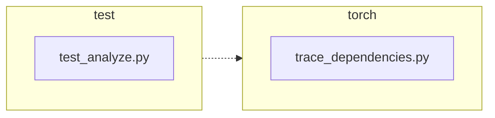

<!-- torii-review pr=191840 run=local head=a27fb64a9ba8eb04cd449d1e6deac9a83cfc6f0a -->
## 🏴‍☠️ Torii Review — PR #191840

**Verdict:** APPROVE
**Confidence:** high
**Score:** 95/100
**Review effort:** 1/5

### Summary
Minimal, correct fix for a profiling-callback leak in `trace_dependencies()`. The production change captures the caller's existing profile with `sys.getprofile()` before installing its own callback, then restores it in the `finally` block instead of unconditionally clearing with `None`. Two well-written tests cover both the success and exception paths. No API break, no new risk surfaces.

### Walkthrough
- `torch/package/analyze/trace_dependencies.py:53`: captures `previous_profile = sys.getprofile()` before the `try` block, ensuring the original state is always available in `finally`.
- `torch/package/analyze/trace_dependencies.py:63`: the `finally` body now calls `sys.setprofile(previous_profile)` instead of `sys.setprofile(None)`, preserving whatever callback (or `None`) was present on entry.
- `test/package/test_analyze.py:21-46`: two new tests — `test_trace_dependencies_restores_profile` and `test_trace_dependencies_restores_profile_when_callable_raises` — assert identity (`assertIs`) of the restored callback after both normal return and exception propagation.

### Architecture diagram
<!-- torii-mermaid -->

_Auto-generated from 2 changed file(s) (F57). Edges between groups are adjacency, not proven runtime dependencies._

Files in diagram

- `test/package/test_analyze.py`
- `torch/package/analyze/trace_dependencies.py`

### Blocking
None

### Key findings
None — no high-confidence defects in new code.

### Security audit
No

### Multi-lens checklist
| Lens | Status | Note |
|------|--------|------|
| correctness | ok | captures profile before `try`, restores in `finally` — correct for both success and exception |
| security | n/a | no authz, injection, secrets, or untrusted-input surface |
| tests | ok | two new tests cover both claimed fix paths (success + exception); `assertIs` identity checks are precise |
| performance | ok | one extra `sys.getprofile()` call per invocation; negligible |
| api_contracts | ok | signature unchanged; behavioral fix is backward-compatible (callers with no profile see no difference) |
| concurrency | n/a | `sys.setprofile` is per-thread; no new concurrency surface introduced by this diff |
| maintainability | ok | comment updated from "Detach" to "Restore the previous"; self-documenting |

### Suggestions
None

### Code suggestions
None

### Nits
None

### Suggested test plan
| Pri | Kind | Target | Scenario |
|-----|------|--------|----------|
| P0 | smoke | `test/package/test_analyze.py` | Run the two new tests in CI; confirm green on the head commit |
| P0 | unit | `trace_dependencies` | Regression: base fails, head passes — already satisfied by `test_trace_dependencies_restores_profile` |
| ~~P0~~ | ~~unit~~ | ~~`record_used_modules`~~ | Covered by the new exception-path test (`test_trace_dependencies_restores_profile_when_callable_raises`) |
| ~~P1~~ | ~~unit~~ | ~~compatibility~~ | No API change; old callers see no behavioral difference unless they had a profile set (which was previously *lost* — this is the fix) |
| P2 | e2e | `torch/package/analyze` | Happy path already exercised by existing `test_trace_dependencies` (unchanged, preserved at line 48) |

### Tests & risk
- Relevant tests added/updated: yes
- Coverage: success path + exception path for profile restoration; both use identity assertions
- Risk: low — two-line behavioral fix in a `finally` block; no new code paths added
- Rollback: easy — revert to `sys.setprofile(None)`

### What I checked
- Full diff (unified, 2 files, +32/−2)
- `torch/package/analyze/trace_dependencies.py:50-63` — the `previous_profile` capture and `finally` restoration
- `test/package/test_analyze.py:21-46` — both new tests
- `test/package/test_analyze.py:48-55` — existing `test_trace_dependencies` test is preserved unchanged
- `py_compile` pass on both changed files
- Issue #191839 body matches the fix exactly

---
*Torii · Hermes Agent · OpenRouter · memory-backed review*
*Cost / usage: model=`deepseek/deepseek-v4-pro` · ~$0.02 (estimated) · 82k tokens · 6 API calls*
