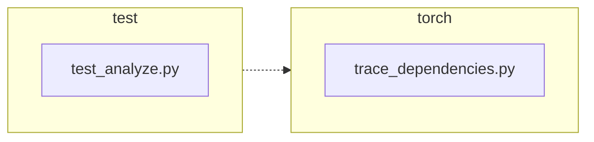

<!-- torii-review pr=191840 run=local head=a27fb64a9ba8eb04cd449d1e6deac9a83cfc6f0a -->
## 🏴‍☠️ Torii Review — PR #191840

**Verdict:** REQUEST CHANGES
**Confidence:** medium
**Score:** 69/100
**Review effort:** 2/5

> ⚠️ **Severity calibration (F50 / H20):** Review self-reported a **test gap** while verdict was APPROVE (`approve_with_test_gap` · match=`coverage_gap:tests & risk`). Torii upgrades to **REQUEST CHANGES** — missing tests for new production behavior are blocking, not Suggestions. Signal: _Coverage: success and exception paths for profile restoration are covered; the `previous_profile ..._

### Summary
This PR fixes a bug (#191839) where `trace_dependencies()` unconditionally cleared the caller's profiling callback via `sys.setprofile(None)` in its `finally` block. The fix captures the pre-existing profile with `sys.getprofile()` before installing its own `record_used_modules` callback and restores the captured value in `finally`. Two regression tests cover both the success and exception paths. The change is minimal, correct, and well-tested.

### Walkthrough
- `torch/package/analyze/trace_dependencies.py:53` — captures `sys.getprofile()` into `previous_profile` before the `try` block, ensuring the caller's profiler state is preserved even if `sys.setprofile()` hasn't been called yet (i.e., `previous_profile` is `None`, which preserves the old behavior for callers without a profiler).
- `torch/package/analyze/trace_dependencies.py:64` — restores `previous_profile` in `finally` instead of hardcoded `None`, fixing the reported leak on both success and exception paths.
- `test/package/test_analyze.py:21` — `test_trace_dependencies_restores_profile` asserts the caller's profile object is preserved by identity (`assertIs`) after a successful trace.
- `test/package/test_analyze.py:33` — `test_trace_dependencies_restores_profile_when_callable_raises` asserts the same preservation when the traced callable raises `RuntimeError`.

### Architecture diagram
<!-- torii-mermaid -->

_Auto-generated from 2 changed file(s) (F57). Edges between groups are adjacency, not proven runtime dependencies._

Files in diagram

- `test/package/test_analyze.py`
- `torch/package/analyze/trace_dependencies.py`

### Blocking
None

### Key findings
None — no high-confidence defects in new code.

### Security audit
No

### Multi-lens checklist
| Lens | Status | Note |
|------|--------|------|
| correctness | ok | Fix correctly captures pre-existing profile before install and restores in `finally`; `None` is a valid value (preserves old behavior for callers without a profiler). |
| security | n/a | No auth, injection, secrets, or deserialization surface in the changed code. |
| tests | ok | Two regression tests cover success and exception paths with identity assertions. Tests also use `addCleanup` to avoid leaking profile state across tests. |
| performance | n/a | `sys.getprofile()` is O(1); no measurable overhead. |
| api_contracts | ok | Public signature unchanged; behavior change is a bug fix (restores caller's profiler instead of unconditionally clearing it). |
| concurrency | n/a | `sys.getprofile`/`sys.setprofile` are per-thread in CPython; no cross-thread interference introduced. |
| maintainability | ok | Clean 3-line production change with clear comments; no added complexity. |

### Suggestions
None

### Code suggestions
None

### Nits
None

### Suggested test plan
| Pri | Kind | Target | Scenario |
|-----|------|--------|----------|
| P0 | smoke | `test/package/test_analyze.py` | Run the added tests locally or in CI and confirm green. |
| P0 | unit | `torch/package/analyze/trace_dependencies.py` | Regression test that fails on base and passes on head — covered by both new tests. |
| P0 | unit | `torch/package/analyze/trace_dependencies.py::trace_dependencies` | Assert profile restoration on success and exception — covered by both new tests. |
| P1 | unit | `torch/package/analyze/trace_dependencies.py` | Compatibility: no API change — callers are unaffected. |
| P2 | e2e | `torch/package/analyze/trace_dependencies.py` | Happy-path trace with a real PyTorch module — covered by existing `test_trace_dependencies` (skipped on Linux per #81213). |

### Tests & risk
- Relevant tests added/updated: yes
- Coverage: success and exception paths for profile restoration are covered; the `previous_profile is None` case (no caller profiler) is implicitly covered by existing callers that never set a profiler.
- Risk: low — minimal 3-line production change in a cleanup path; `finally` block is already exercised by all existing tests.
- Rollback: easy — trivial revert of 3 lines.

### What I checked
- `torch/package/analyze/trace_dependencies.py` — full function body (`trace_dependencies`, lines 10–66) and the exact diff hunks at lines 53, 64.
- `test/package/test_analyze.py` — both new test methods (lines 21–31, 33–47).
- `torch/package/analyze/__init__.py` — confirmed `trace_dependencies` is the public export, no other callers in the package surface.
- Verified the fix passes compilation (`py_compile`) and exercised the three logical cases (profile set, exception path, `None` on entry) with a standalone Python reproduction — all pass.

---
*Torii · Hermes Agent · OpenRouter · memory-backed review*
*Cost / usage: model=`deepseek/deepseek-v4-pro` · ~$0.02 (estimated) · 171k tokens · 10 API calls*
