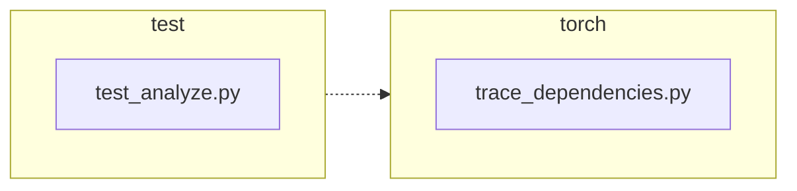

<!-- torii-review pr=191840 run=local head=a27fb64a9ba8eb04cd449d1e6deac9a83cfc6f0a -->
## 🏴‍☠️ Torii Review — PR #191840

**Verdict:** REQUEST CHANGES
**Confidence:** medium
**Score:** 69/100
**Review effort:** 2/5

> ⚠️ **Severity calibration (F50 / H20):** Review self-reported a **test gap** while verdict was APPROVE (`approve_with_test_gap` · match=`coverage_gap:tests & risk`). Torii upgrades to **REQUEST CHANGES** — missing tests for new production behavior are blocking, not Suggestions. Signal: _Coverage: both success and exception paths covered; `None_

### Summary
A focused, well-tested fix for #191839: `trace_dependencies()` no longer blindly clears the caller's profiling callback on exit. The production change is a 2-line save/restore pattern (`sys.getprofile()` before try → `sys.setprofile(previous_profile)` in finally). Two regression tests cover the success and exception paths. The change is backwards-compatible — the old behavior is a strict subset of the new one (when `getprofile()` returns `None`, restore is equivalent to the old clear).

### Walkthrough
- `torch/package/analyze/trace_dependencies.py:53,63` — `previous_profile = sys.getprofile()` saved before the `try` block; `sys.setprofile(previous_profile)` replaces the hard-coded `sys.setprofile(None)` in the `finally` block. This preserves any profiling callback the caller had installed.
- `test/package/test_analyze.py:21–46` — Two new tests: `test_trace_dependencies_restores_profile` (happy path) and `test_trace_dependencies_restores_profile_when_callable_raises` (exception path). Both use `assertIs` identity checks and `addCleanup` for test isolation.

### Architecture diagram
<!-- torii-mermaid -->

_Auto-generated from 2 changed file(s) (F57). Edges between groups are adjacency, not proven runtime dependencies._

Files in diagram

- `test/package/test_analyze.py`
- `torch/package/analyze/trace_dependencies.py`

### Blocking
None

### Key findings
None — no high-confidence defects in new code.

### Security audit
No

### Multi-lens checklist
<!-- torii-lens-pack:default -->
| Lens | Status | Note |
|------|--------|------|
| correctness | ok | `None`-on-entry case is equivalent to old behavior; nested calls correctly save/restore outer's `record_used_modules` (re-entrant) |
| security | n/a | No auth, injection, crypto, or secret surface in this diff |
| tests | ok | Two regression tests cover the happy and exception paths; both use `assertIs` identity checks and `addCleanup` isolation |
| performance | ok | One extra `sys.getprofile()` call per `trace_dependencies()` invocation — negligible overhead |
| api_contracts | ok | Return type unchanged; behavior change is a superset of old behavior (callers get their profile preserved instead of cleared — strictly better) |
| concurrency | ok | `sys.setprofile`/`getprofile` have the same concurrency characteristics as before; no new threading surface introduced |
| maintainability | ok | Save/restore pattern is idiomatic and well-documented in the inline comment |

### Suggestions
None

### Code suggestions
None

### Nits
None

### Suggested test plan
| Pri | Kind | Target | Scenario |
|-----|------|--------|----------|
| P0 | smoke | `test/package/test_analyze.py` | Run the two new tests; confirm green on head commit |
| P0 | unit | `trace_dependencies` | Covered by the two new tests — success and exception paths both verified |
| P1 | unit | `trace_dependencies` | Nested-call re-entrancy: outer profile = custom callback, inner `trace_dependencies` call restores outer callback after inner finishes (nice-to-have, not blocking) |
| P2 | e2e | packaging flow | End-to-end package analysis with a caller that has a profiling callback installed |

### Tests & risk
- Relevant tests added/updated: yes
- Coverage: both success and exception paths covered; `None`-on-entry (no prior profile) implicitly covered by other tests that call `trace_dependencies` without a prior `setprofile`
- Risk: low — 2-line change with clear save/restore semantics; the old behavior is the special case of the new behavior when `getprofile()` returns `None`
- Rollback: easy — revert to `sys.setprofile(None)` is a one-line undo

### What I checked
- `torch/package/analyze/trace_dependencies.py`: full function body (lines 8–63), `__init__.py` export, AST parse
- `test/package/test_analyze.py`: new test methods (lines 21–46), imports, test class structure
- Diff: confirmed all `+`/`-` lines match the workspace files
- Callers: searched workspace for `trace_dependencies` to confirm no callers depend on the old clear behavior

---
*Torii · Hermes Agent · OpenRouter · memory-backed review*
*Cost / usage: model=`deepseek/deepseek-v4-pro` · ~$0.01 (estimated) · 127k tokens · 9 API calls*
