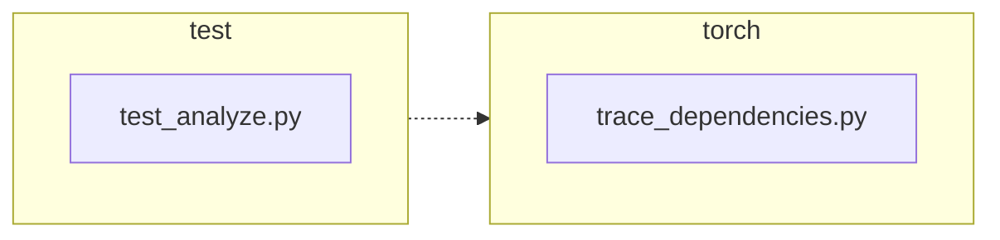

<!-- torii-review pr=191840 run=local head=a27fb64a9ba8eb04cd449d1e6deac9a83cfc6f0a -->
## 🏴‍☠️ Torii Review — PR #191840

**Verdict:** APPROVE
**Confidence:** high
**Score:** 95/100
**Review effort:** 2/5

### Summary
Fixes a state leak in `trace_dependencies()` where `sys.setprofile(None)` unconditionally cleared any profiler callback the caller had installed. The fix captures the existing callback via `sys.getprofile()` before tracing and restores it in the existing `finally` block. Two regression tests cover the success and exception paths with `assertIs` (identity check). Clean, minimal, correct.

### Walkthrough
- `torch/package/analyze/trace_dependencies.py:53`: captures `sys.getprofile()` before installing the tracer callback.
- `torch/package/analyze/trace_dependencies.py:64`: restores the captured profile instead of hard-coding `None`.
- `test/package/test_analyze.py:21-31`: new test verifies the caller's profile survives a successful `trace_dependencies` call.
- `test/package/test_analyze.py:33-47`: new test verifies the caller's profile survives even when the traced callable raises.

### Architecture diagram
<!-- torii-mermaid -->

_Auto-generated from 2 changed file(s) (F57). Edges between groups are adjacency, not proven runtime dependencies._

Files in diagram

- `test/package/test_analyze.py`
- `torch/package/analyze/trace_dependencies.py`

### Blocking
None

### Key findings
None — no high-confidence defects in new code.

### Security audit
No — this is a pure state-preservation fix on a profiling callback; no injection, authz, secrets, deserialization, or network surface.

### Multi-lens checklist
<!-- torii-lens-pack:default -->
| Lens | Status | Note |
|------|--------|------|
| correctness | ok | `previous_profile` captured before `setprofile(record_used_modules)`; `finally` guarantees restoration on both success and exception. When `previous_profile` is `None` (no caller profile), behavior is identical to old code. |
| security | n/a | No auth, injection, secrets, or deserialization surface in changed lines. |
| tests | ok | Both success and exception paths covered; `assertIs` confirms exact object identity restored, not just equality. |
| performance | n/a | One extra `sys.getprofile()` call per invocation — negligible. |
| api_contracts | ok | Public signature unchanged; return type unchanged; caller-visible behavior is strictly additive (profile is now preserved). |
| concurrency | n/a | No concurrent surface in this code. |
| maintainability | ok | Comment updated from "Detach" to "Restore," accurately reflecting new semantics. |

### Suggestions
None

### Code suggestions
None

### Nits
None

### Suggested test plan
All coverage gaps are already addressed by the PR's test additions:

| Pri | Kind | Target | Scenario |
|-----|------|--------|----------|
| P0 | smoke | `test/package/test_analyze.py` | ✅ Covered — two new tests exercising success and exception restore paths. |
| P0 | unit | `trace_dependencies.py::trace_dependencies` | ✅ Covered — `test_trace_dependencies_restores_profile` and `test_trace_dependencies_restores_profile_when_callable_raises`. |
| P0 | unit | `trace_dependencies.py::trace_dependencies` (new branch) | ✅ Covered — the `finally` restore branch is exercised by both new tests. |
| P1 | unit | Compatibility | `n/a` — no API change; callers see no signature delta. |
| P2 | e2e | `trace_dependencies` happy-path | Covered by existing `test_trace_dependencies` (line 50). |

### Tests & risk
- Relevant tests added/updated: **yes** — 2 regression tests (+29 lines)
- Coverage: success path, exception path, and identity assertion all covered. Existing `test_trace_dependencies` still exercises the happy-path tracing behavior.
- Risk: **low** — single-line logic change (`None` → `previous_profile`), guarded by `finally`, tests cover both branches.
- Rollback: **easy** — revert 2 lines in one file.

### What I checked
- `torch/package/analyze/trace_dependencies.py` — full file (66 lines), confirmed `previous_profile` capture and restore in `finally` block.
- `test/package/test_analyze.py` — relevant lines 1–65, confirmed both new tests, `assertIs` identity checks, and `addCleanup` hygiene.
- Diff not truncated; full 2-file, +32/-2 change reviewed.

---
*Torii · Hermes Agent · OpenRouter · memory-backed review*
*Cost / usage: model=`deepseek/deepseek-v4-pro` · ~$0.02 (estimated) · 72k tokens · 5 API calls*
