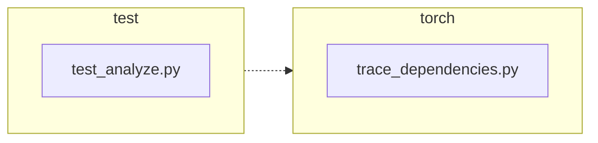

<!-- torii-review pr=191840 run=local head=a27fb64a9ba8eb04cd449d1e6deac9a83cfc6f0a -->
## 🏴‍☠️ Torii Review — PR #191840

**Verdict:** APPROVE
**Confidence:** high
**Score:** 93/100
**Review effort:** 2/5

### Summary
This is a clean, minimal fix for #191839. `trace_dependencies()` used to unconditionally call `sys.setprofile(None)` on exit, destroying any profiling callback the caller had installed. The change captures the previous callback with `sys.getprofile()` before tracing and restores it in the already-existing `finally` block. Two well-isolated regression tests cover both the success path and the exception-propagation path. No API break, no security surface, negligible performance cost.

### Walkthrough
- `torch/package/analyze/trace_dependencies.py`: captures `previous_profile = sys.getprofile()` before installing `record_used_modules`; restores it via `sys.setprofile(previous_profile)` in `finally` instead of `sys.setprofile(None)`.
- `test/package/test_analyze.py`: adds `test_trace_dependencies_restores_profile` (happy-path assertion that the caller's profile survives) and `test_trace_dependencies_restores_profile_when_callable_raises` (asserts the profile is restored even when the traced callable raises, while the exception still propagates).

### Architecture diagram
<!-- torii-mermaid -->

_Auto-generated from 2 changed file(s) (F57). Edges between groups are adjacency, not proven runtime dependencies._

Files in diagram

- `test/package/test_analyze.py`
- `torch/package/analyze/trace_dependencies.py`

### Blocking
None

### Key findings
None — no high-confidence defects in new code.

### Security audit
No — this is a profiling-state preservation fix with no injection, authz, secrets, XSS, deserialization, or other security surface.

### Multi-lens checklist
| Lens | Status | Note |
|------|--------|------|
| correctness | ok | `previous_profile` can be `None`; `sys.setprofile(None)` is the valid no-op equivalent of the old behavior. Exception propagates through `finally`. |
| security | ok | No injection, authz, or secret surface. Pure state save/restore. |
| tests | ok | Two new tests cover success + exception paths; both assert `sys.getprofile()` identity post-call; both use `addCleanup` for isolation. |
| performance | ok | One extra `sys.getprofile()` call per invocation — negligible. |
| api_contracts | ok | Signature unchanged (`Callable, Iterable[tuple] → list[str]`). Caller-observable behavior now matches documented expectation (profile preserved). |
| concurrency | n/a | `sys.setprofile`/`getprofile` are thread-local; no concurrent surface in this diff. |
| maintainability | ok | +3/-2 lines; clear comments; no new abstraction or coupling. |

### Suggestions
None

### Code suggestions
None

### Nits
None

### Suggested test plan
| Pri | Kind | Target | Scenario |
|-----|------|--------|----------|
| P0 | unit | `test/package/test_analyze.py` | ✅ Covered: `test_trace_dependencies_restores_profile` (success path) |
| P0 | unit | `test/package/test_analyze.py` | ✅ Covered: `test_trace_dependencies_restores_profile_when_callable_raises` (exception path) |
| P0 | smoke | `test/package/test_analyze.py` | Run the test suite on the head commit. |
| P1 | unit | `torch/package/analyze/trace_dependencies.py` | Compatibility: n/a — API unchanged, no migration needed. |
| P2 | e2e | `torch/package/analyze/trace_dependencies.py` | Already exercised by existing `test_trace_dependencies` test. |

### Tests & risk
- Relevant tests added/updated: yes
- Coverage: both the success and exception propagation paths are covered with identity assertions on the restored profile
- Risk: low — a two-line behavioral change in a leaf function, well-tested, no API break
- Rollback: easy — revert to `sys.setprofile(None)` in `finally`

### What I checked
- `torch/package/analyze/trace_dependencies.py` (full function body, lines 30–60)
- `test/package/test_analyze.py` (full new tests + surrounding context)
- `torch/package/analyze/__init__.py` (confirmed `trace_dependencies` is the public export)
- Memory/archival search returned no prior FP patterns or conflicting themes for these paths

---
*Torii · Hermes Agent · OpenRouter · memory-backed review*
*Cost / usage: model=`deepseek/deepseek-v4-pro` · ~$0.01 (estimated) · 69k tokens · 5 API calls*
