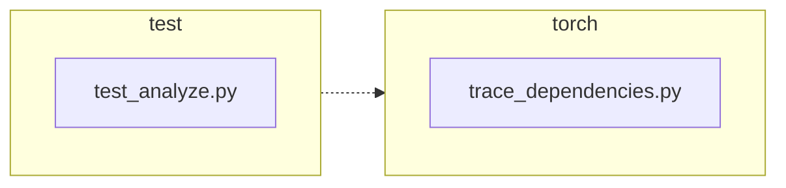

<!-- torii-review pr=191840 run=local head=a27fb64a9ba8eb04cd449d1e6deac9a83cfc6f0a -->
## 🏴‍☠️ Torii Review — PR #191840

**Verdict:** APPROVE
**Confidence:** high
**Score:** 93/100
**Review effort:** 2/5

### Summary
Two-line fix in `trace_dependencies()` that preserves a caller's `sys.setprofile()` callback instead of unconditionally clearing it to `None`. The change captures `sys.getprofile()` before installing the tracer and restores it in the existing `finally` block. Two targeted regression tests cover both the success and exception-code paths. Clean, low-risk bug fix that fully addresses the linked issue.

### Walkthrough
- `torch/package/analyze/trace_dependencies.py:53`: captures `previous_profile = sys.getprofile()` before the `try` block — safe, `sys.getprofile()` does not raise under normal operation.
- `torch/package/analyze/trace_dependencies.py:64`: `finally` block restores `previous_profile` instead of hardcoded `None`. When no prior profile exists, `previous_profile` is `None` and behavior is identical to before (backward-compatible).
- `test/package/test_analyze.py:21-31`: `test_trace_dependencies_restores_profile` asserts the caller's profile survives a successful `trace_dependencies` call.
- `test/package/test_analyze.py:33-47`: `test_trace_dependencies_restores_profile_when_callable_raises` asserts the caller's profile survives when the traced callable raises (exercises the `finally` path).

### Architecture diagram
<!-- torii-mermaid -->

_Auto-generated from 2 changed file(s) (F57). Edges between groups are adjacency, not proven runtime dependencies._

Files in diagram

- `test/package/test_analyze.py`
- `torch/package/analyze/trace_dependencies.py`

### Blocking
None

### Key findings
None — no high-confidence defects in new code.

### Security audit
No

### Multi-lens checklist
| Lens | Status | Note |
|------|--------|------|
| correctness | ok | `sys.getprofile()`/`sys.setprofile()` round-trips correctly for both `None` and callable values; `finally` guarantees restore on both success and exception paths |
| security | n/a | Profiling/dependency-tracing utility — no authz, injection, secret, or deserialization surface |
| tests | ok | Two new tests cover success + exception restore; `addCleanup` guards test isolation from prior profile state |
| performance | ok | Single extra `sys.getprofile()` call at function entry — negligible |
| api_contracts | ok | Signature and return type unchanged; behavioral change is purely a bug fix (preserving caller state) |
| concurrency | ok | `sys.setprofile()`/`sys.getprofile()` are per-thread in CPython — no new shared-state risk |
| maintainability | ok | Comment updated accurately; diff is minimal and self-contained |

### Suggestions
None

### Code suggestions
None

### Nits
None

### Suggested test plan
| Pri | Kind | Target | Scenario |
|-----|------|--------|----------|
| P0 | unit | `test/package/test_analyze.py::test_trace_dependencies_restores_profile` | ✅ Implemented — asserts profile preserved after successful trace |
| P0 | unit | `test/package/test_analyze.py::test_trace_dependencies_restores_profile_when_callable_raises` | ✅ Implemented — asserts profile preserved when callable raises |
| P0 | smoke | `test/package/test_analyze.py` | Run the test file; both new tests should pass |

### Tests & risk
- Relevant tests added/updated: yes
- Coverage: both production paths (success + exception) covered by dedicated regression tests; existing `test_trace_dependencies` still exercises the dependency-tracing logic itself
- Risk: low — two-line change in a `finally` block; backward-compatible when no prior profile exists
- Rollback: easy — revert to `sys.setprofile(None)` restores prior behavior

### What I checked
- Full diff (2 files, +32/-2 lines), not truncated
- `torch/package/analyze/trace_dependencies.py` — full function context (lines 1-66)
- `test/package/test_analyze.py` — full file (lines 1-62)
- `torch/package/analyze/__init__.py` — confirmed `trace_dependencies` re-export
- `rg trace_dependencies` — confirmed no other callers in the repo
- Verified `sys.setprofile(None)` round-trips correctly when no prior profile exists
- Memory/archival search returned no prior findings for these files

---
*Torii · Hermes Agent · OpenRouter · memory-backed review*
*Cost / usage: model=`deepseek/deepseek-v4-pro` · ~$0.01 (estimated) · 162k tokens · 10 API calls*
