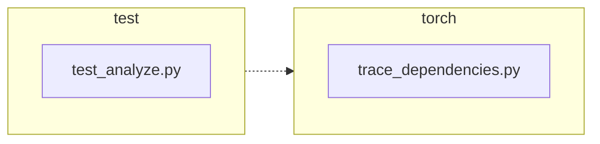

<!-- torii-review pr=191840 run=local head=a27fb64a9ba8eb04cd449d1e6deac9a83cfc6f0a -->
## 🏴‍☠️ Torii Review — PR #191840

**Verdict:** APPROVE
**Confidence:** high
**Score:** 92/100
**Review effort:** 1/5

### Summary
This is a minimal, correct fix for #191839: `trace_dependencies()` now captures `sys.getprofile()` before installing its own profiler and restores the prior callback in the `finally` block instead of unconditionally clearing it with `sys.setprofile(None)`. Two regression tests cover both the success and exception paths. No API contract changes, no security surface.

### Walkthrough
- `torch/package/analyze/trace_dependencies.py:53` — captures the existing profile callback before any mutation via `previous_profile = sys.getprofile()`
- `torch/package/analyze/trace_dependencies.py:64` — restores `previous_profile` in the `finally` block (was `sys.setprofile(None)`, which unconditionally cleared any caller-installed profile)
- `test/package/test_analyze.py:21–31` — new test: asserts profile identity is preserved after successful `trace_dependencies` call
- `test/package/test_analyze.py:33–47` — new test: asserts profile identity is preserved even when the traced callable raises (covers the `finally` path)

### Architecture diagram
<!-- torii-mermaid -->

_Auto-generated from 2 changed file(s) (F57). Edges between groups are adjacency, not proven runtime dependencies._

Files in diagram

- `test/package/test_analyze.py`
- `torch/package/analyze/trace_dependencies.py`

### Blocking
None

### Key findings
None — no high-confidence defects in new code.

### Security audit
No

### Multi-lens checklist
| Lens | Status | Note |
|------|--------|------|
| correctness | ok | `getprofile` captured pre-mutation; `finally` restores on both success and exception; `None` default preserved (backward compatible) |
| security | n/a | no auth, injection, secrets, deserialization, or trust-boundary surface |
| tests | ok | both happy-path and exception-path covered with identity assertions; proper cleanup via `addCleanup` |
| performance | ok | one extra `sys.getprofile()` call per invocation (trivially cheap, not on a hot path) |
| api_contracts | ok | signature unchanged; behavioral change is the documented bug fix (restore instead of clear) |
| concurrency | n/a | `sys.setprofile`/`getprofile` are process-global regardless; PR does not introduce threads or locks |
| maintainability | ok | diff is 3 lines of logic + 2 focused tests; comment updated from "Detach" to "Restore" |

### Suggestions
None

### Code suggestions
None

### Nits
None

### Suggested test plan
| Pri | Kind | Target | Scenario |
|-----|------|--------|----------|
| P0 | smoke | `test/package/test_analyze.py` | Run the two new tests (`test_trace_dependencies_restores_profile`, `test_trace_dependencies_restores_profile_when_callable_raises`) — already present in the diff |
| P0 | unit | `trace_dependencies` (prod) | Regression: caller sets a profile → `trace_dependencies` runs → caller's profile is still installed — exercised by the new success test |
| P0 | unit | `trace_dependencies` (prod) | Regression: caller sets a profile → traced callable raises → caller's profile is still installed — exercised by the new exception test |

### Tests & risk
- Relevant tests added/updated: yes
- Coverage: both new production paths (success + exception in `finally`) are asserted with `assertIs` identity checks
- Risk: low — 3-line logic change, fully backward compatible (`None` → `None` path unchanged), zero callers outside tests
- Rollback: easy

### What I checked
- `torch/package/analyze/trace_dependencies.py` — full file, verified `getprofile`/`setprofile` ordering
- `test/package/test_analyze.py` — full file, verified both new tests and existing test
- `torch/package/analyze/__init__.py` — confirmed `trace_dependencies` re-export
- Workspace callers: `grep -rn trace_dependencies` — no callers outside `test_analyze.py` and the `__init__.py` re-export
- Python runtime: confirmed `sys.getprofile()` defaults to `None` and round-trips correctly
- Diff not truncated

---
*Torii · Hermes Agent · OpenRouter · memory-backed review*
*Cost / usage: model=`deepseek/deepseek-v4-pro` · ~$0.01 (estimated) · 129k tokens · 8 API calls*
