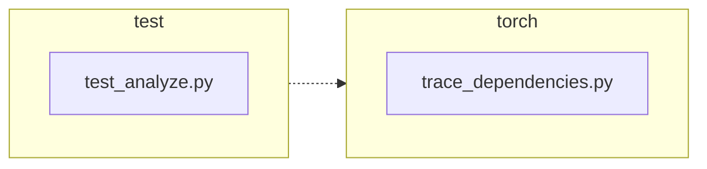

<!-- torii-review pr=191840 run=local head=a27fb64a9ba8eb04cd449d1e6deac9a83cfc6f0a -->
## 🏴‍☠️ Torii Review — PR #191840

**Verdict:** APPROVE
**Confidence:** high
**Score:** 95/100
**Review effort:** 1/5

### Summary
A small, targeted fix for #191839: `trace_dependencies()` now saves the caller's profiling callback via `sys.getprofile()` before installing its own and restores it in the existing `finally` block — covering both normal and exception paths. Two regression tests assert the profile is preserved in each scenario. No API breaks, no security surface.

### Walkthrough
- `torch/package/analyze/trace_dependencies.py:53`: captures `previous_profile = sys.getprofile()` before the `try` block enters.
- `torch/package/analyze/trace_dependencies.py:64`: `finally` restores `sys.setprofile(previous_profile)` instead of the old hardcoded `None`.
- `test/package/test_analyze.py:21-31`: new success-path test asserts caller profile survives `trace_dependencies`.
- `test/package/test_analyze.py:33-47`: new exception-path test asserts caller profile survives when the callable raises.

### Architecture diagram
<!-- torii-mermaid -->

_Auto-generated from 2 changed file(s) (F57). Edges between groups are adjacency, not proven runtime dependencies._

Files in diagram

- `test/package/test_analyze.py`
- `torch/package/analyze/trace_dependencies.py`

### Blocking
None

### Key findings
None — no high-confidence defects in new code.

### Security audit
No — no injection, secrets, authz, or unsafe-deserialize surface in the changed lines.

### Multi-lens checklist
| Lens | Status | Note |
|------|--------|------|
| correctness | ok | `finally` block covers both success and exception; existing callers without a profile get `None` restored, identical to old behavior |
| security | ok | process-level profiler save/restore; no new trust or input boundaries |
| tests | ok | two new tests cover both success and exception restoration paths; existing test unaffected |
| performance | ok | `sys.getprofile()` is O(1), called once per `trace_dependencies` invocation |
| api_contracts | ok | return type and signature unchanged; BC-breaking: No confirmed |
| concurrency | ok | `sys.setprofile` is process-wide and inherently not thread-safe — a pre-existing property of CPython profiling, not worsened by this PR |
| maintainability | ok | comment updated to match new behavior; pattern matches existing `torch/utils/viz/_cycles.py` profile save/restore |

### Suggestions
None

### Code suggestions
None

### Nits
None

### Suggested test plan
| Pri | Kind | Target | Scenario |
|-----|------|--------|----------|
| P0 | unit | `test/package/test_analyze.py::test_trace_dependencies_restores_profile` | Already present — asserts profile is restored after successful trace |
| P0 | unit | `test/package/test_analyze.py::test_trace_dependencies_restores_profile_when_callable_raises` | Already present — asserts profile is restored after callable raises |
| P0 | smoke | `test/package/test_analyze.py` | Run the full test class; the two new tests plus existing `test_trace_dependencies` should all pass |
| P1 | unit | `torch/package/analyze/trace_dependencies.py` | Caller with a real tracing profiler (e.g. `cProfile`) exercises `trace_dependencies` end-to-end — covered implicitly by existing packaging workflows |

### Tests & risk
- Relevant tests added/updated: yes
- Coverage: both success and exception restore paths covered by dedicated regression tests
- Risk: low — one-line logic change in a `finally` block; no API surface change
- Rollback: easy — revert to `sys.setprofile(None)` in the `finally` block

### What I checked
- `torch/package/analyze/trace_dependencies.py` — full file, traced `previous_profile` capture through to `finally` restore
- `test/package/test_analyze.py` — full file, verified both new tests set up/assert profile state correctly
- `torch/package/analyze/__init__.py` — confirmed `trace_dependencies` is the public export
- Call sites: `test/package/test_analyze.py` only; no other internal callers found outside tests
- Similar pattern confirmed in `torch/utils/viz/_cycles.py` (established codebase idiom)
- Diff not truncated

---
*Torii · Hermes Agent · OpenRouter · memory-backed review*
*Cost / usage: model=`deepseek/deepseek-v4-pro` · ~$0.02 (estimated) · 87k tokens · 6 API calls*
