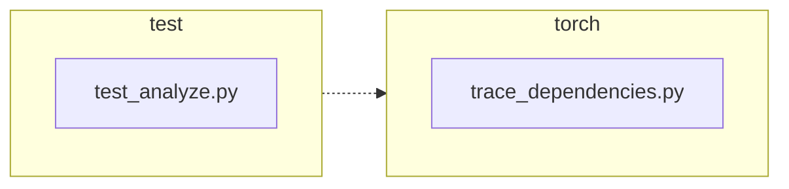

<!-- torii-review pr=191840 run=local head=a27fb64a9ba8eb04cd449d1e6deac9a83cfc6f0a -->
## 🏴‍☠️ Torii Review — PR #191840

**Verdict:** APPROVE
**Confidence:** high
**Score:** 93/100
**Review effort:** 2/5

### Summary
This is a clean, minimal fix for the reported profiler-state leak. `trace_dependencies()` now saves the caller's profiler via `sys.getprofile()` before installing its own callback and restores it in the existing `finally` block — fixing both the success and exception paths. Two new regression tests cover both scenarios with identity assertions (`assertIs`). No API or behavioral change for callers without a pre-existing profiler.

### Walkthrough
- `torch/package/analyze/trace_dependencies.py:53,64` — saves `sys.getprofile()` into `previous_profile` before the `try` and restores it (instead of hardcoded `None`) in `finally`. Correctly preserves any caller-installed callback.
- `test/package/test_analyze.py:21-28` — `test_trace_dependencies_restores_profile`: sets a dummy profile, calls `trace_dependencies` with a no-op callable, asserts profile identity is preserved on success.
- `test/package/test_analyze.py:30-43` — `test_trace_dependencies_restores_profile_when_callable_raises`: same setup but callable raises `RuntimeError`; asserts profile identity is preserved despite the exception.

### Architecture diagram
<!-- torii-mermaid -->

_Auto-generated from 2 changed file(s) (F57). Edges between groups are adjacency, not proven runtime dependencies._

Files in diagram

- `test/package/test_analyze.py`
- `torch/package/analyze/trace_dependencies.py`

### Blocking
None

### Key findings
None — no high-confidence defects in new code.

### Security audit
No

### Multi-lens checklist
| Lens | Status | Note |
|------|--------|------|
| correctness | ok | Save-before/restore-in-finally pattern is correct for both success and exception paths; both tested with identity assertions |
| security | n/a | No auth, injection, secret, or serialization surface |
| tests | ok | Two new tests cover success + exception restore; identity check (`assertIs`) is the right assertion |
| performance | n/a | One extra `sys.getprofile()` call on entry; negligible |
| api_contracts | ok | No signature change; return type unchanged; `None`-restore for callers without a profiler is behavior-preserving |
| concurrency | ok | `sys.setprofile`/`getprofile` are per-thread; no shared mutable state across threads |
| maintainability | ok | Minimal diff (3 lines prod, 29 lines test); comment accurately updated from "Detach" to "Restore" |

### Suggestions
- `test/package/test_analyze.py:21-43` — The new tests verify pre/post profile identity but don't assert the tracing callback was actually installed during execution. Consider adding a flag in the dummy `profile` callback (e.g. `nonlocal called; called = True`) to confirm `trace_dependencies` did install its own profiler, making the test more robust against a future regression that accidentally skips `sys.setprofile(record_used_modules)`. Non-blocking.

### Code suggestions
None

### Nits
None

### Suggested test plan
| Pri | Kind | Target | Scenario |
|-----|------|--------|----------|
| P0 | unit | `test/package/test_analyze.py::test_trace_dependencies_restores_profile` | Set caller profile, call `trace_dependencies` successfully, assert profile identity restored — **covered by this PR** |
| P0 | unit | `test/package/test_analyze.py::test_trace_dependencies_restores_profile_when_callable_raises` | Set caller profile, callable raises RuntimeError, assert profile identity restored from finally — **covered by this PR** |
| P1 | unit | `test/package/test_analyze.py::test_trace_dependencies` | Existing test (skipped on Linux) still passes with the new code; no pre-existing profile → restores `None` — unchanged behavior |

### Tests & risk
- Relevant tests added/updated: yes
- Coverage: both success and exception restore paths are tested with `assertIs`; the existing happy-path test (`test_trace_dependencies`) exercises the `None`→`None` restore case implicitly
- Risk: low — the change is a 3-line diff in a single function; the old behavior for callers without a profiler (`None`→`None`) is unchanged
- Rollback: easy — revert the two changed lines in `trace_dependencies.py` to `sys.setprofile(None)`

### What I checked
- Diff hunks in `torch/package/analyze/trace_dependencies.py` (lines 53, 64) and `test/package/test_analyze.py` (lines 21-43)
- Full source of both files (verified surrounding context, imports, existing test `test_trace_dependencies`)
- Syntax compilation of both changed files (`py_compile` passed)
- Diff is not truncated; all +32/-2 lines inspected

---
*Torii · Hermes Agent · OpenRouter · memory-backed review*
*Cost / usage: model=`deepseek/deepseek-v4-pro` · ~$0.01 (estimated) · 71k tokens · 5 API calls*
