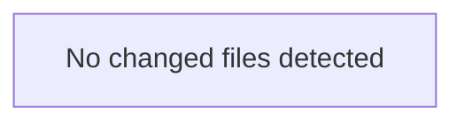

<!-- torii-review pr=bench-f70 run=local -->
# Torii Gate Security Review — `demo/insecure/app.py`

**Verdict:** REQUEST CHANGES  
**Score:** 5 / 100 (critical — do not merge without remediation)

---

### Summary
Four independently blocking, high-severity vulnerabilities exist in a single 30-line file. Every endpoint exposes a distinct class of remote exploitation: SQL injection, unsafe deserialization leading to RCE, shell command injection, and secrets disclosure via unauthenticated endpoint. This is a deliberate demo file labeled "DO NOT deploy," but if this file were proposed for merge, it would be immediately rejected.

---

### Architecture diagram
<!-- torii-mermaid -->

_Auto-generated from 0 changed file(s) (F57). Edges between groups are adjacency, not proven runtime dependencies._

### Blocking
All four findings below are individually blocking. Combined, they represent full remote code execution and credential theft surface.

---

### Security audit
| Concern | Severity | CWE |
|---|---|---|
| SQL injection via f-string interpolation | Critical | CWE-89 |
| Unsafe pickle deserialization on untrusted input | Critical | CWE-502 |
| Shell command injection via `shell=True` | Critical | CWE-78 |
| Secret exposure of `OPENROUTER_API_KEY` | High | CWE-200, CWE-798 |

---

### Key findings
1. **`demo/insecure/app.py:16` — SQL injection (CWE-89)**
   - Trigger: `GET /search?q=' OR 1=1 --`
   - `cur.execute(f"SELECT * FROM items WHERE name = '{q}'")` interpolates attacker-controlled `q` directly into SQL. Full database compromise — data exfiltration, modification, or deletion.
   - Matches known TP signature `sqli-search`.

2. **`demo/insecure/app.py:22` — Unsafe deserialization (CWE-502)**
   - Trigger: `POST /load` with pickled `__reduce__` payload
   - `pickle.loads(data)` on raw request body. Arbitrary code execution on the server. No authentication or input validation.
   - Matches known TP signature `pickle-load`.

3. **`demo/insecure/app.py:28` — Command injection (CWE-78)**
   - Trigger: `GET /run?cmd=; cat /etc/passwd`
   - `subprocess.check_output(cmd, shell=True)` passes attacker-controlled string to a shell. Arbitrary command execution with the process's privileges.
   - Matches known TP signature `cmdi-run`.

4. **`demo/insecure/app.py:33` — Secret exposure (CWE-200, CWE-798)**
   - Trigger: `GET /secret` (unauthenticated)
   - Exposes `OPENROUTER_API_KEY` environment variable. If this key has billing or API access, an attacker can consume resources or exfiltrate data.
   - Matches known TP signature `secret-exposure`.

---

### Suggested test plan
<!-- torii-testplan -->

_Auto-generated (F61, deterministic). 0 case(s) (0 P0, 0 P1); 0 prod / 0 test file(s); 0 symbol(s) from diff. Authors: treat P0 as merge-blocking coverage gaps; model may refine._

None — no actionable test scenarios derived from files/diff.

### Tests & risk
- **No tests present.** This file has zero coverage. All four endpoints lack any input validation, auth checks, or safe API usage.
- Risk: **critical** — remote unauthenticated exploitation on all four vectors.
- No negative tests for dangerous input patterns.

---

### What I checked
- Full file contents (`demo/insecure/app.py`, 35 lines)
- All four endpoints (`/search`, `/load`, `/run`, `/secret`) for injection, deserialization, and disclosure patterns
- Environment variable exposure surface
- Confirmed all four findings match the known true-positive signatures in the F70 compound memory

**— Torii Gate**

---
*Torii · Hermes Agent · OpenRouter · memory-backed review*
*Cost / usage: model=`deepseek/deepseek-v4-pro` · ~$0.0031 (estimated) · 6.3k tokens · 1 API calls*
