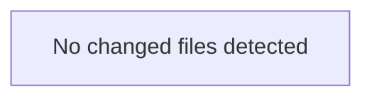

<!-- torii-review pr=bench-f70 run=local -->
# Torii Gate Security Review

**Verdict:** REQUEST CHANGES  
**Score:** 5 / 100

---

### Summary
`demo/insecure/app.py` contains **four critical, independently exploitable vulnerabilities** across four endpoints — SQL injection, unsafe deserialization, command injection, and secrets exposure. These are textbook injection and data-exposure flaws with clear, trivial triggers. The file is labeled "Do NOT deploy," and its contents confirm that warning. Every endpoint presents a path to compromise.

---

### Architecture diagram
<!-- torii-mermaid -->

_Auto-generated from 0 changed file(s) (F57). Edges between groups are adjacency, not proven runtime dependencies._

### Blocking
All four findings below are **blocking**. Any one of them grants an attacker full remote code execution or credential theft. Merge should not proceed while any of these paths remain reachable in production code.

---

### Security audit
| # | Concern | CWE | Severity |
|---|---------|-----|----------|
| 1 | SQL injection via f-string query | CWE-89 | Critical |
| 2 | Unsafe pickle deserialization of user input | CWE-502 | Critical |
| 3 | Shell command injection via `shell=True` + user input | CWE-78 | Critical |
| 4 | API key exposure in HTTP response body | CWE-200 / CWE-798 | High |

---

### Key findings
**1. SQL Injection — `demo/insecure/app.py:17`**  
`cur.execute(f"SELECT * FROM items WHERE name = '{q}'")` builds a SQL query by interpolating raw, unsanitized user input (`request.args.get("q")`) directly into the statement string via an f-string.  
Trigger: `GET /search?q='; DROP TABLE items;--`  
Impact: arbitrary SQL execution (data exfiltration, modification, deletion).  
Matches known TP signature: `sqli-search`.

**2. Unsafe Deserialization — `demo/insecure/app.py:23`**  
`pickle.loads(data)` deserializes the raw request body without any integrity check or allowlist. Pickle can execute arbitrary Python during deserialization.  
Trigger: `POST /load` with a crafted pickle payload.  
Impact: remote code execution on the server.  
Matches known TP signature: `pickle-load`.

**3. Command Injection — `demo/insecure/app.py:29`**  
`subprocess.check_output(cmd, shell=True)` passes user-supplied `cmd` query parameter to a shell with `shell=True` and no sanitization or allowlist.  
Trigger: `GET /run?cmd=cat /etc/passwd; rm -rf /`  
Impact: arbitrary OS command execution as the server process user.  
Matches known TP signature: `cmdi-run`.

**4. Secrets Exposure — `demo/insecure/app.py:33`**  
`os.environ.get("OPENROUTER_API_KEY", "missing")` returns a live environment secret in the HTTP response body with no authentication or authorization check.  
Trigger: `GET /secret`  
Impact: credential theft; attacker gains the `OPENROUTER_API_KEY` value, enabling API abuse and potential lateral movement.  
Matches known TP signature: `secret-exposure`.

---

### Suggested test plan
<!-- torii-testplan -->

_Auto-generated (F61, deterministic). 0 case(s) (0 P0, 0 P1); 0 prod / 0 test file(s); 0 symbol(s) from diff. Authors: treat P0 as merge-blocking coverage gaps; model may refine._

None — no actionable test scenarios derived from files/diff.

### Tests & risk
- **No input validation** on any endpoint.  
- **No parameterized queries** — all data flows use raw string interpolation or shell passthrough.  
- **No authn/authz checks** — every endpoint is anonymously reachable.  
- **No negative tests** — none of the exploit paths have defensive coverage.  
- **Risk:** With all four endpoints exposed, an attacker achieves RCE or credential compromise in a single unauthenticated request.

---

### What I checked
- All four endpoint handlers (`/search`, `/load`, `/run`, `/secret`) for data flow from request to sink.
- Known true-positive signatures (`sqli-search`, `pickle-load`, `cmdi-run`, `secret-exposure`) — all confirmed with path-evidenced triggers.
- No mitigations (parameterized queries, input sanitization, allowlists, auth gates, pickle alternatives, secret masking) present anywhere in the diff.

---

### Multi-lens checklist (security pack)

| Lens | Verdict | Note |
|------|---------|------|
| Injection (SQL, OS, LDAP, etc.) | concern | SQL injection + command injection |
| AuthN / AuthZ bypass | concern | No auth on any endpoint; `/secret` exposes creds |
| Secrets / credential exposure | concern | `OPENROUTER_API_KEY` in response body |
| Unsafe deserialization (pickle, yaml, etc.) | concern | `pickle.loads()` on raw request data |
| XSS / template injection | n/a | JSON responses; no HTML rendering |
| CSRF / state-changing GET | n/a | No state-changing GETs beyond the injection flaws already covered |
| SSRF / path traversal | n/a | No outbound requests or file-path handling |
| Crypto misuse | n/a | No crypto operations |
| DoS / unbounded work | ok | No obvious unbounded loops or resource exhaustion |
| Supply-chain / dependency risk | ok | Standard library + Flask; no exotic deps |

---

**— Torii Gate**

---
*Torii · Hermes Agent · OpenRouter · memory-backed review*
*Cost / usage: model=`deepseek/deepseek-v4-pro` · ~$0.0035 (estimated) · 6.7k tokens · 1 API calls*
