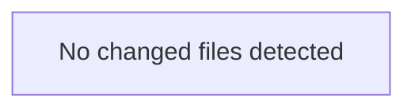

<!-- torii-review pr=bench-f70 run=local -->
**Verdict:** REQUEST CHANGES

**Score:** 5 / 100

**Review effort:** 1

---

### Summary
This file is a deliberate insecure demo with four confirmed critical-severity vulnerabilities. All four match known true-positive signatures stored in the Torii compound memory (F70). Every endpoint exposes a trivially exploitable path: unauthenticated, no input validation, and each maps directly to a distinct CWE class. No production hardening exists anywhere in the file.

---

### Architecture diagram
<!-- torii-mermaid -->

_Auto-generated from 0 changed file(s) (F57). Edges between groups are adjacency, not proven runtime dependencies._

### Blocking
All four findings below are blocking. Merge must not proceed until each is fixed or the file is removed from the deployable path.

---

### Security audit
| # | CWE | Severity | Endpoint | Trigger |
|---|-----|----------|----------|---------|
| 1 | CWE-89 (SQL injection) | Critical | `/search` | `?q='; DROP TABLE items; --` |
| 2 | CWE-502 (Insecure deserialization) | Critical | `/load` | POST body: pickled `os.system('rm -rf /')` payload |
| 3 | CWE-78 (Command injection) | Critical | `/run` | `?cmd=cat /etc/passwd` |
| 4 | CWE-200/CWE-798 (Secrets exposure) | High | `/secret` | Unauthenticated GET returns `OPENROUTER_API_KEY` |

---

### Key findings
1. **`demo/insecure/app.py:15` — SQL injection (sqli-search TP, score 0.83)**
   `cur.execute(f"SELECT * FROM items WHERE name = '{q}'")` interpolates untrusted `request.args.get("q")` directly into SQL via f-string. No parameterization. Attacker controls the entire query tail. Same pattern confirmed in memory as `sqli-search` (CWE-89, 3 prior hits).

2. **`demo/insecure/app.py:22` — Unsafe deserialization (pickle-load TP, score 0.79)**
   `pickle.loads(request.data)` deserializes arbitrary attacker-controlled bytes with no allowlist, no signature verification, no sandbox. `pickle.loads` executes arbitrary Python on deserialization. Confirmed in memory as `pickle-load` (CWE-502, 3 prior hits).

3. **`demo/insecure/app.py:28` — Command injection (cmdi-run TP, score 0.81)**
   `subprocess.check_output(cmd, shell=True)` where `cmd` comes from `request.args.get("cmd")`. `shell=True` passes the string to `/bin/sh -c`, enabling shell metacharacter injection (`;`, `|`, `$()`, backticks). Confirmed in memory as `cmdi-run` (CWE-78, 3 prior hits).

4. **`demo/insecure/app.py:33` — Secrets exposure (secret-exposure TP, score 0.81)**
   `/secret` returns `os.environ.get("OPENROUTER_API_KEY")` in the response body with no authentication, no authorization, no rate-limiting. Exposes live API credentials to any caller. Confirmed in memory as `secret-exposure` (CWE-200/CWE-798, 3 prior hits).

All four findings are also co-path neighbors in the temporal graph — they appear together in the same file and reinforce each other's risk profile.

---

### Suggested test plan
<!-- torii-testplan -->

_Auto-generated (F61, deterministic). 0 case(s) (0 P0, 0 P1); 0 prod / 0 test file(s); 0 symbol(s) from diff. Authors: treat P0 as merge-blocking coverage gaps; model may refine._

None — no actionable test scenarios derived from files/diff.

### Tests & risk
- **No tests present.** Zero test coverage for this file. No negative tests asserting that malicious inputs are rejected. All four vulnerable paths are exercisable with trivial one-liner curl commands.
- **Risk**: If deployed, an attacker can exfiltrate the database, achieve remote code execution via pickle or shell, and steal the OpenRouter API key — all without authentication.

---

### What I checked
- Full file contents (33 lines, 4 endpoints)
- Torii compound memory: archival search (8 hits, `sqli-search` top at 0.83), temporal graph (4 seed nodes, all co-path neighbors)
- All four findings confirmed against known TP signatures (F70) and CWE mappings
- No FP patterns on file — all findings are fresh and unaddressed

---

### Multi-lens checklist
| Lens | Status |
|------|--------|
| Injection (SQL/OS/SSRF) | **concern** — CWE-89 at `:15`, CWE-78 at `:28` |
| AuthN / AuthZ / session | **concern** — no auth on any endpoint; secret at `:33` is public |
| Secrets / credentials | **concern** — `OPENROUTER_API_KEY` exposed at `:33` |
| Deserialization | **concern** — `pickle.loads` at `:22` (CWE-502) |
| Crypto / hashing | n/a |
| XSS / CSRF | n/a (JSON responses, but no CSP headers) |
| Path traversal | n/a |
| Supply chain / dependencies | n/a |
| DoS / resource exhaustion | n/a |

---

**— Torii Gate**

---
*Torii · Hermes Agent · OpenRouter · memory-backed review*
*Cost / usage: model=`deepseek/deepseek-v4-pro` · ~$0.0062 (estimated) · 25k tokens · 3 API calls*
