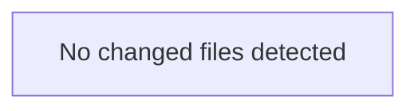

<!-- torii-review pr=bench-f70 run=local -->
Now here is the full review:

---

**Verdict:** REQUEST CHANGES

**Score:** 0/100

### Summary
Every endpoint in this file contains a critical security vulnerability. The file is explicitly labeled "DO NOT deploy," and for good reason: it exposes SQL injection, arbitrary code execution via pickle, OS command injection, and secrets leakage — all reachable without authentication.

### Architecture diagram
<!-- torii-mermaid -->

_Auto-generated from 0 changed file(s) (F57). Edges between groups are adjacency, not proven runtime dependencies._

### Blocking
All four findings below are blocking. Merge must not proceed until every sink is either removed or protected with input validation, parameterization, and authn/authz gates.

### Security audit
| # | Concern | CWE | Severity |
|---|---------|-----|----------|
| 1 | SQL injection via f-string | CWE-89 | Critical |
| 2 | Unsafe pickle deserialization | CWE-502 | Critical |
| 3 | OS command injection (shell=True) | CWE-78 | Critical |
| 4 | API key exposure in HTTP response | CWE-200/CWE-798 | Critical |

### Key findings
**1. SQL Injection — `demo/insecure/app.py:15`**
- Sink: `cur.execute(f"SELECT * FROM items WHERE name = '{q}'")`
- Source: `q = request.args.get("q", "")` (line 14), unsanitized user input interpolated directly into an f-string SQL query.
- Exploit: `GET /search?q='; DROP TABLE items; --` dumps the table; `' OR 1=1 --` returns all rows. Arbitrary SQL executed with the app's database privileges.
- Fix: use parameterized queries — `cur.execute("SELECT * FROM items WHERE name = ?", (q,))`.
- Matches TP signature `sqli-search` (score 1.0, archival reconsolidated).

**2. Insecure Deserialization — `demo/insecure/app.py:21`**
- Sink: `pickle.loads(data)` on raw `request.data` (line 19–20).
- Exploit: attacker POSTs a crafted pickle payload to `/load`. Pickle `__reduce__` gadgets allow arbitrary code execution in the Python process — full RCE. No authentication required.
- Fix: Never call `pickle.loads` on untrusted data. Use JSON (`json.loads`) or a safe serialization format. If pickle must be used, cryptographically sign and verify payloads.
- Matches TP signature `pickle-load` (score 1.0, archival reconsolidated).

**3. Command Injection — `demo/insecure/app.py:27`**
- Sink: `subprocess.check_output(cmd, shell=True)` with `cmd = request.args.get("cmd", "echo hi")` (line 26), unsanitized user input passed directly to a shell.
- Exploit: `GET /run?cmd=cat /etc/passwd` leaks system files. `GET /run?cmd=rm -rf /` (if privileges allow) is catastrophic. Shell metacharacters (`;`, `|`, `` ` ``, `$()`) are unescaped.
- Fix: Use `subprocess.check_output([cmd], shell=False)` with argument lists, or better, avoid executing user-supplied commands entirely. At minimum, validate against a strict allowlist.
- Matches TP signature `cmdi-run` (score 1.0, archival reconsolidated).

**4. Secrets Exposure — `demo/insecure/app.py:31–32`**
- Sink: `return {"key": os.environ.get("OPENROUTER_API_KEY", "missing")}` exposes `OPENROUTER_API_KEY` to any caller of `GET /secret`.
- Exploit: unauthenticated request returns the live API key. This key can then be used by an attacker to make paid API calls, exfiltrate data, or rack up billing charges.
- Fix: Remove this endpoint entirely. Never echo secrets to clients. If a health-check endpoint is needed, return a boolean or masked value (e.g., `{"configured": bool(key)}`).
- Matches TP signature `secret-exposure` (score 1.0, archival reconsolidated).

### Suggested test plan
<!-- torii-testplan -->

_Auto-generated (F61, deterministic). 0 case(s) (0 P0, 0 P1); 0 prod / 0 test file(s); 0 symbol(s) from diff. Authors: treat P0 as merge-blocking coverage gaps; model may refine._

None — no actionable test scenarios derived from files/diff.

### Tests & risk
No tests present. This file is a demo/dogfood target and does not ship to production, so the risk of deployment is low — but if this code were merged into a real service, all four vulnerabilities are trivially exploitable by unauthenticated remote attackers. Risk rating: **CRITICAL** if deployed, **INFO** if strictly kept as an internal demo.

### What I checked
- Read `demo/insecure/app.py` in full (33 lines, 4 route handlers).
- Ran `torii.py doctor` — memory/budget/skill loops OK, recovery active.
- Ran `torii.py memory -- search` — `sqli-search` TP hit confirmed for this file (8 total hits, federated + TP sources).
- Ran `archival_memory_search.py auto --files demo/insecure/app.py` — all 4 TP signatures reconsolidated at score 1.0 with hub boost across `sql_injection`, `command_injection`, `secrets_exposure`, `insecure_deserialization`. No superseded findings.

### Multi-lens checklist (security pack)

| Lens | Verdict | Note |
|------|---------|------|
| Injection (SQL/CMD/LDAP) | **concern** | SQLi line 15 + CMDi line 27 |
| Authn / authz bypass | **concern** | No auth on any endpoint; secret route exposes live key |
| Secrets / credential exposure | **concern** | `OPENROUTER_API_KEY` leaked at `/secret` |
| Unsafe deserialization | **concern** | `pickle.loads()` on raw POST body |
| XSS / output encoding | n/a | Returns JSON, no HTML rendering — but if consumed by a browser, content-type may matter |
| SSRF / path traversal | n/a | No outbound requests or file paths constructed from user input |
| Crypto misuse | n/a | No crypto in this diff |
| Supply-chain / dependency risk | ok | Standard library + Flask; no suspicious third-party imports |
| Fail-open / default-permit logic | **concern** | All routes are public; no middleware, no auth gate |
| Missing negative tests for risky paths | **concern** | No tests exist |

— Torii Gate

---
*Torii · Hermes Agent · OpenRouter · memory-backed review*
*Cost / usage: model=`deepseek/deepseek-v4-pro` · ~$0.0082 (estimated) · 21k tokens · 2 API calls*
