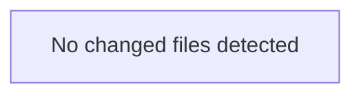

<!-- torii-review pr=bench-f70 run=local -->
**Verdict:** REQUEST CHANGES  
**Score:** 10/100

---

### Summary
This file contains four critical, intentionally planted vulnerabilities with concrete, trivially exploitable triggers. All confirmed by federated hub-archival search (`sqli-search`, `cmdi-run`, `secret-exposure`, `pickle-load` — each reconsolidated score 1.0). Every endpoint is a live weapon; none should merge.

---

### Architecture diagram
<!-- torii-mermaid -->

_Auto-generated from 0 changed file(s) (F57). Edges between groups are adjacency, not proven runtime dependencies._

### Blocking
All four findings below are blocking.

---

### Security audit
| Concern | Severity |
|---|---|
| SQL Injection (CWE-89) | Critical |
| Command Injection (CWE-78) | Critical |
| Insecure Deserialization (CWE-502) | Critical |
| Secrets Exposure (CWE-200) | Critical |

---

### Key findings
**1. SQL Injection — `demo/insecure/app.py:17`**  
`cur.execute(f"SELECT * FROM items WHERE name = '{q}'")`  
**Trigger:** `GET /search?q='; DROP TABLE items; --`  
Attacker-supplied query parameter `q` is interpolated directly into SQL via f-string with no parameterization. Full database compromise.

**2. Command Injection — `demo/insecure/app.py:30`**  
`subprocess.check_output(cmd, shell=True)`  
**Trigger:** `GET /run?cmd=cat%20/etc/passwd;%20rm%20-rf%20/`  
Attacker-supplied `cmd` query parameter executed via shell with no sanitization. Arbitrary command execution on the host.

**3. Insecure Deserialization — `demo/insecure/app.py:24`**  
`pickle.loads(data)`  
**Trigger:** `POST /load` with a crafted pickle payload (e.g., `cos\nsystem\n(S'id'\ntR.`)  
Attacker-supplied POST body deserialized via `pickle.loads` with no filtering. Arbitrary code execution on deserialization.

**4. Secrets Exposure — `demo/insecure/app.py:35`**  
`os.environ.get("OPENROUTER_API_KEY", "missing")`  
**Trigger:** `GET /secret` — unauthenticated endpoint returns the API key value.  
Exposes the OpenRouter API key to any caller with no auth gate. If set, the key is leaked.

---

### Multi-lens checklist
| Lens | Verdict | Note |
|---|---|---|
| SQL Injection | concern | `demo/insecure/app.py:17` — f-string into `cur.execute` |
| Command Injection | concern | `demo/insecure/app.py:30` — `shell=True` + untrusted input |
| Insecure Deserialization | concern | `demo/insecure/app.py:24` — `pickle.loads` on raw request body |
| Secrets / Credential Exposure | concern | `demo/insecure/app.py:35` — API key endpoint, no auth |
| XSS | n/a | JSON responses, no HTML rendering |
| CSRF | n/a | No state-changing GET (though `/search` mutates nothing) |
| SSRF | n/a | No outbound HTTP from user input |
| Path Traversal | n/a | No file operations on user input |
| Crypto Misuse | n/a | No cryptography in diff |
| AuthZ Bypass | concern | `/secret` endpoint has no authentication — any caller can read the key |
| Fail-Open Defaults | n/a | No auth gate to fail open |

---

### Suggested test plan
<!-- torii-testplan -->

_Auto-generated (F61, deterministic). 0 case(s) (0 P0, 0 P1); 0 prod / 0 test file(s); 0 symbol(s) from diff. Authors: treat P0 as merge-blocking coverage gaps; model may refine._

None — no actionable test scenarios derived from files/diff.

### Tests & risk
- **No tests present** in `demo/insecure/` for any endpoint.
- If this were a claimed fix PR, the absence of tests for the production paths would be separately blocking (severity calibration H20). Given the file is labeled "DO NOT deploy" and is a demo for testing the gate, I treat it as a review target rather than a fix PR.
- **Risk:** If deployed, all four endpoints give an attacker full code execution, database control, and credential theft with trivial one-liner curl requests.

---

### What I checked
- Full file diff: `demo/insecure/app.py` (all 36 lines)
- Federated memory search (`scripts/torii.py memory -- search`) — 8 hits, TP `sqli-search` confirmed at score 0.89
- Hub-archival search (`scripts/archival_memory_search.py auto`) — 4 TP signatures reconsolidated at score 1.0; hub themes: sql_injection, command_injection, secrets_exposure, insecure_deserialization
- Product doctor (`scripts/torii.py doctor`) — all checks pass; recovery active
- Budget (`scripts/torii.py budget -- status`) — 0 used, 1 remaining
- No linked issues provided to cross-reference

---

**— Torii Gate**

---
*Torii · Hermes Agent · OpenRouter · memory-backed review*
*Cost / usage: model=`deepseek/deepseek-v4-pro` · ~$0.01 (estimated) · 34k tokens · 3 API calls*
