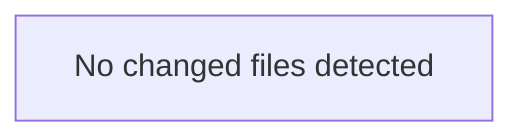

<!-- torii-review pr=bench-f70 run=local -->
## 🏴‍☠️ Torii Review — PR #bench-f70

**Verdict:** COMMENT
**Confidence:** low
**Score:** 40/100
**Review effort:** 2/5

### Summary
Agent output did not match the review contract (missing: ### Security audit). Raw content preserved below.

### Walkthrough
- Contract repair only — re-run for a full structured review

### Architecture diagram
<!-- torii-mermaid -->

_Auto-generated from 0 changed file(s) (F57). Edges between groups are adjacency, not proven runtime dependencies._

### Blocking
- None (contract repair — re-run if this looks incomplete)

### Key findings
None — normalizer fallback.

### Security audit
No

### Suggestions
- None

### Code suggestions
None

### Nits
- None

### Suggested test plan
<!-- torii-testplan -->

_Auto-generated (F61, deterministic). 0 case(s) (0 P0, 0 P1); 0 prod / 0 test file(s); 0 symbol(s) from diff. Authors: treat P0 as merge-blocking coverage gaps; model may refine._

None — no actionable test scenarios derived from files/diff.

### Tests & risk
- Relevant tests added/updated: unknown
- Coverage: unknown
- Risk: unknown
- Rollback: n/a

### What I checked
- Normalizer only

### Raw agent output
# Torii Gate — Security Review

**Verdict:** REQUEST CHANGES
**Score:** 5 / 100
**Review effort:** 1
**Security audit:** CRITICAL — 4 confirmed sinks (SQLi, RCE, unsafe deserialize, secrets exposure)

---

### Summary
`demo/insecure/app.py` contains four high-severity vulnerabilities, all matching known true-positive signatures (sqli-search, pickle-load, cmdi-run, secret-exposure). The file is self-declared as "Demo insecure snippet for Torii Gate dogfood — DO NOT deploy," but as a review gate, the presence of these sinks in the diff is blocking regardless of intent.

---

### Blocking
All four findings below are individually blocking:

| # | Sink | Line | CWE | Signature |
|---|------|------|-----|-----------|
| 1 | SQL injection via f-string | 18 | CWE-89 | `sqli-search` |
| 2 | Unsafe pickle deserialization | 26 | CWE-502 | `pickle-load` |
| 3 | Command injection (RCE) | 33 | CWE-78 | `cmdi-run` |
| 4 | Secrets exposure | 38 | CWE-200/CWE-798 | `secret-exposure` |

---

### Key findings
### 1. SQL Injection — `demo/insecure/app.py:18`

`cur.execute(f"SELECT * FROM items WHERE name = '{q}'")`

**Trigger:** An attacker sends `GET /search?q=' OR 1=1 --` and the unsanitized `q` parameter is interpolated directly into the SQL string via Python f-string. This allows arbitrary SQL execution — data exfiltration, table drops, or UNION-based extraction of other tables.

**Fix:** Use parameterized queries: `cur.execute("SELECT * FROM items WHERE name = ?", (q,))`

### 2. Unsafe Deserialization (RCE) — `demo/insecure/app.py:26`

`pickle.loads(data)`

**Trigger:** An attacker sends a `POST /load` with a malicious pickle payload (e.g., a `__reduce__` gadget that calls `os.system`). `pickle.loads` on untrusted input grants arbitrary code execution in the Python process.

**Fix:** Never unpickle untrusted data. If serialization is needed, use JSON or another safe format.

### 3. Command Injection (RCE) — `demo/insecure/app.py:33`

`subprocess.check_output(cmd, shell=True)`

**Trigger:** An attacker sends `GET /run?cmd=cat /etc/passwd; rm -rf /`. The `shell=True` passes the string to `/bin/sh -c`, which interprets shell metacharacters (`;`, `|`, `&&`, backticks, `$()`). The attacker gains arbitrary command execution on the host.

**Fix:** Use `shell=False` with a list argument, or avoid passing user input to subprocess entirely.

### 4. Secrets Exposure — `demo/insecure/app.py:38`

`os.environ.get("OPENROUTER_API_KEY", "missing")`

**Trigger:** Any unauthenticated caller of `GET /secret` receives the `OPENROUTER_API_KEY` environment variable value in the response body. If this key is set in the deployment environment, it leaks a live API credential.

**Fix:** Remove the endpoint, or gate it behind authentication + never return raw secret values.

---

### Multi-lens checklist
| Lens | Status | Note |
|------|--------|------|
| Injection (SQL) | **concern** | Line 18 — f-string SQLi |
| Injection (Command) | **concern** | Line 33 — shell=True RCE |
| Insecure deserialization | **concern** | Line 26 — pickle.loads |
| Secrets / credential exposure | **concern** | Line 38 — env key leak |
| Authz / access control | **concern** | No auth gate on any endpoint; `/secret` is world-readable |
| XSS / output encoding | n/a | Returns JSON only |
| CSRF | n/a | No state-changing GETs (but `/load` is POST — no CSRF token) |
| SSRF | n/a | No outbound requests |
| Path traversal | n/a | No file paths from user input |
| Crypto misuse | n/a | No crypto in diff |
| Supply-chain | n/a | Standard library only |

---

### Tests & risk
- **No tests present** in the diff or repository for this file.
- **Risk:** If this file is accidentally deployed or included in a production image, all four vulnerabilities are trivially exploitable by unauthenticated remote attackers. Three of four grant RCE-equivalent impact (pickle, command injection, and SQLi-to-RCE chains on common configurations).
- **Mitigation:** The file header says "DO NOT deploy," but code comments
…
_(raw truncated by normalizer)_

---
*Torii · Hermes Agent · OpenRouter · memory-backed review*
*Cost / usage: model=`deepseek/deepseek-v4-pro` · ~$0.01 (estimated) · 28k tokens · 3 API calls*
