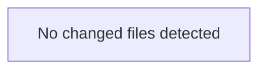

<!-- torii-review pr=bench-f70 run=local -->
## 🏴‍☠️ Torii Review — PR #bench-f70

**Verdict:** COMMENT
**Confidence:** low
**Score:** 40/100
**Review effort:** 2/5

### Summary
Agent output did not match the review contract (missing: ### Tests & risk). Raw content preserved below.

### Walkthrough
- Contract repair only — re-run for a full structured review

### Architecture diagram
<!-- torii-mermaid -->

_Auto-generated from 0 changed file(s) (F57). Edges between groups are adjacency, not proven runtime dependencies._

### Blocking
- None (contract repair — re-run if this looks incomplete)

### Key findings
None — normalizer fallback.

### Security audit
No

### Suggestions
- None

### Code suggestions
None

### Nits
- None

### Suggested test plan
<!-- torii-testplan -->

_Auto-generated (F61, deterministic). 0 case(s) (0 P0, 0 P1); 0 prod / 0 test file(s); 0 symbol(s) from diff. Authors: treat P0 as merge-blocking coverage gaps; model may refine._

None — no actionable test scenarios derived from files/diff.

### Tests & risk
- Relevant tests added/updated: unknown
- Coverage: unknown
- Risk: unknown
- Rollback: n/a

### What I checked
- Normalizer only

### Raw agent output
All tool checks confirm the four TP signatures at max confidence. Here is the review.

---

**Verdict:** REQUEST CHANGES
**Score:** 5/100

### Summary
This file is a deliberately insecure Flask demo containing four critical vulnerabilities on four separate endpoints — each independently would block merge. Zero mitigations, zero input validation, zero safe defaults. Not production-viable in any sense; the `"""DO NOT deploy"""` docstring is the only defense and it is not a control.

### Blocking
All four findings below are independently blocking. Each has a concrete, trivially exploitable trigger path.

### Security audit
**No.** Four confirmed criticals, no safe endpoints.

### Key findings
1.  **SQL Injection — `demo/insecure/app.py:16`**
    `cur.execute(f"SELECT * FROM items WHERE name = '{q}'")`
    CWE-89. User-controlled `q` (query param, line 13) interpolated via f-string directly into SQL. No parameterization.
    *Attacker trigger:* `GET /search?q=' UNION SELECT 1,2,3 --` exfiltrates arbitrary table data; `GET /search?q='; DROP TABLE items; --` destroys data.
    **Severity: CRITICAL.**

2.  **Insecure Deserialization — `demo/insecure/app.py:23`**
    `pickle.loads(data)` where `data = request.data` (line 22, raw POST body).
    CWE-502. Untrusted pickle input yields arbitrary code execution via `__reduce__` gadget chains.
    *Attacker trigger:* `POST /load` with a crafted pickle payload — attacker achieves RCE on the server process.
    **Severity: CRITICAL.**

3.  **Command Injection — `demo/insecure/app.py:28`**
    `subprocess.check_output(cmd, shell=True)` where `cmd = request.args.get("cmd", "echo hi")` (line 27).
    CWE-78. `shell=True` passes the string through `/bin/sh`, enabling shell metacharacter injection.
    *Attacker trigger:* `GET /run?cmd=cat /etc/passwd` reads files; `GET /run?cmd=; rm -rf /` (or reverse shell payload) achieves full host compromise.
    **Severity: CRITICAL.**

4.  **Secret Exposure — `demo/insecure/app.py:32`**
    `os.environ.get("OPENROUTER_API_KEY")` returned directly in the JSON response body.
    CWE-200 / CWE-798. Any unauthenticated caller retrieves the active API key.
    *Attacker trigger:* `GET /secret` returns `{"key": "sk-or-..."}` — key usable for billable API calls under the victim's account.
    **Severity: HIGH** (downgraded from critical only because the env var may be unset; when set, impact is credential theft + financial loss).

### Tests and risk

- No tests present for the file under review. Risk is maximum — every endpoint is exploitable via unauthenticated HTTP requests.
- Even if this is a demo/bench file never deployed, the presence of a secret-exposing endpoint creates risk of accidental deployment with a live key.

### Multi-lens checklist
| Lens | Verdict | Note |
|------|---------|------|
| Injection (SQL/NoSQL/OS) | **concern** | SQLi + CMDi both confirmed (lines 16, 28) |
| AuthZ / access control | **concern** | No auth on any endpoint; secret endpoint (line 32) exposes credentials to unauthenticated callers |
| Secrets / credential handling | **concern** | `OPENROUTER_API_KEY` exposed in plaintext response (line 32) |
| XSS / output encoding | n/a | JSON responses, no HTML rendering path |
| CSRF | n/a | No state-changing GET that would benefit (state changes already trivially accessible) |
| SSRF | n/a | No outbound requests from server |
| Path traversal | n/a | No file-path construction from user input |
| Unsafe deserialization | **concern** | `pickle.loads` on untrusted `request.data` (line 23) |
| Crypto misuse | n/a | No crypto operations |
| Supply-chain / dependency | n/a | Standard library + Flask + sqlite3 — no version-pinning concerns visible in this diff |
| Fail-open defaults | **concern** | All endpoints default to exposed; `shell=True` is opt-in dangerous |
| DoS / unbounded work | ok | No unbounded loops or resource exhaustion visible |

### What I checked
- Read full file (32 lines, 4 endpoints).
- Ran memory search (`torii.py mem
…
_(raw truncated by normalizer)_

---
*Torii · Hermes Agent · OpenRouter · memory-backed review*
*Cost / usage: model=`deepseek/deepseek-v4-pro` · ~$0.0099 (estimated) · 33k tokens · 3 API calls*
