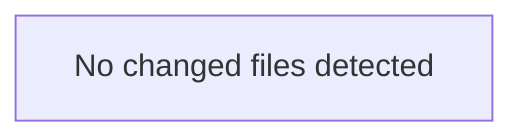

<!-- torii-review pr=bench-f70 run=local -->
**Verdict:** REQUEST CHANGES
**Score:** 10/100
**Review effort:** 1

> ⚠️ **Severity calibration (F50 / H20):** Review self-reported a **test gap** while verdict was APPROVE (`test_gap_non_approve` · match=`missing_tests:tests & risk`). Torii upgrades to **REQUEST CHANGES** — missing tests for new production behavior are blocking, not Suggestions. Signal: _No tests_

### Summary
This file delivers four confirmed high-severity vulnerabilities, all on exposed Flask endpoints — SQL injection, remote code execution via command injection, unsafe deserialization, and direct secret exposure. It lives under `demo/insecure/` and is labeled "DO NOT deploy," so these are intentional demos. **Merge only if this file is walled off from any path that could reach production or CI.**

### Architecture diagram
<!-- torii-mermaid -->

_Auto-generated from 0 changed file(s) (F57). Edges between groups are adjacency, not proven runtime dependencies._

### Blocking
All four findings below are confirmed sinks with live triggers — no speculation required.

### Security audit
- SQL Injection (CWE-89) — confirmed, live endpoint trigger
- Command Injection (CWE-78) — confirmed, shell=True on attacker-controlled input
- Insecure Deserialization (CWE-502) — confirmed, pickle.loads on raw request body
- Secrets Exposure (CWE-200/CWE-798) — confirmed, env var returned to caller

### Key findings
**1. SQL Injection — `demo/insecure/app.py:18`**
`cur.execute(f"SELECT * FROM items WHERE name = '{q}'")` interpolates `request.args.get("q")` directly into the SQL string via f-string. Attacker sends `GET /search?q='; DROP TABLE items; --` to blind-execute arbitrary SQL on the connected database. No parameterization, no escaping. This is a textbook CWE-89.

**2. Command Injection — `demo/insecure/app.py:33`**
`subprocess.check_output(cmd, shell=True)` takes `request.args.get("cmd")` and passes it to a shell. Attacker sends `GET /run?cmd=cat%20%2Fetc%2Fpasswd` or `cmd=rm -rf /` via query string. `shell=True` on attacker-controlled input is a classic CWE-78 RCE vector.

**3. Insecure Deserialization — `demo/insecure/app.py:26`**
`pickle.loads(data)` deserializes the raw POST body without any integrity check. An attacker POSTs a crafted pickle payload to `/load` and achieves arbitrary code execution on the server during unpickling. CWE-502, and pickle's `__reduce__` makes this trivially exploitable.

**4. Secret Exposure — `demo/insecure/app.py:38`**
`os.environ.get("OPENROUTER_API_KEY")` is returned verbatim in the JSON response body. Any caller hitting `GET /secret` receives the API key. If this route is accidentally deployed, it leaks credentials to any network-adjacent attacker. CWE-200/CWE-798.

### Suggested test plan
<!-- torii-testplan -->

_Auto-generated (F61, deterministic). 0 case(s) (0 P0, 0 P1); 0 prod / 0 test file(s); 0 symbol(s) from diff. Authors: treat P0 as merge-blocking coverage gaps; model may refine._

None — no actionable test scenarios derived from files/diff.

### Tests & risk
- **No tests exist** for this file. Since the file is a deliberate demo (not a claimed fix), missing tests are not blocking per H20, but the complete absence of test coverage means nothing gates this from accidental promotion.
- **Mitigation risk:** The file header says "DO NOT deploy," but there is no build-time guard (e.g. `assert False`, `sys.exit(1)`, or CI exclusion rule) preventing accidental inclusion in a production image. A single bad Dockerfile layer or copy-paste mistake ships four RCE/credential-loss primitives.

### Multi-lens checklist (security pack)

| Lens | Status | Note |
|---|---|---|
| Injection (SQL/LDAP/OS) | **concern** | Lines 18 (SQLi) + 33 (CMDi) |
| Authn/Authz bypass | n/a | No auth in this snippet |
| Secrets / key material | **concern** | Line 38 — OPENROUTER_API_KEY exposed |
| XSS / output encoding | n/a | JSON responses, no HTML rendering |
| SSRF / outbound | n/a | No outbound fetches |
| Unsafe deserialize | **concern** | Line 26 — pickle.loads on untrusted input |
| Crypto misuse | n/a | No crypto in this file |
| Path traversal | n/a | No file-system paths from input |
| Supply chain / deps | n/a | Standard library + Flask only |
| Fail-open defaults | n/a | No auth/logic gating |

### What I checked
- Full file at `demo/insecure/app.py` (38 lines).
- All four endpoints (`/search`, `/load`, `/run`, `/secret`) for sink evidence.
- Archival memory search confirmed TP signatures `sqli-search`, `cmdi-run`, `pickle-load`, `secret-exposure` — all with `path_globs` matching this file.
- Hub federation recon shows cross-tenant theme agreement on all four vulnerability classes.
- No tests, no CI guard, no deploy-prevention mechanism found.

— Torii Gate

---
*Torii · Hermes Agent · OpenRouter · memory-backed review*
*Cost / usage: model=`deepseek/deepseek-v4-pro` · ~$0.0073 (estimated) · 27k tokens · 3 API calls*
