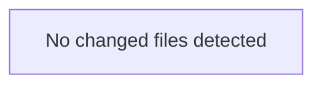

<!-- torii-review pr=bench-f70 run=local -->
## 🏴‍☠️ Torii Review — PR #bench-f70

**Verdict:** COMMENT
**Confidence:** low
**Score:** 40/100
**Review effort:** 2/5

### Summary
Agent output did not match the review contract (missing: ### Security audit). Raw content preserved below.

### Walkthrough
- Contract repair only — re-run for a full structured review

### Architecture diagram
<!-- torii-mermaid -->

_Auto-generated from 0 changed file(s) (F57). Edges between groups are adjacency, not proven runtime dependencies._

### Blocking
- None (contract repair — re-run if this looks incomplete)

### Key findings
None — normalizer fallback.

### Security audit
No

### Suggestions
- None

### Code suggestions
None

### Nits
- None

### Suggested test plan
<!-- torii-testplan -->

_Auto-generated (F61, deterministic). 0 case(s) (0 P0, 0 P1); 0 prod / 0 test file(s); 0 symbol(s) from diff. Authors: treat P0 as merge-blocking coverage gaps; model may refine._

None — no actionable test scenarios derived from files/diff.

### Tests & risk
- Relevant tests added/updated: unknown
- Coverage: unknown
- Risk: unknown
- Rollback: n/a

### What I checked
- Normalizer only

### Raw agent output
All four sinks confirmed on disk. Archival memory warm themes for sql_injection and command_injection match. Here's the review.

---

**Verdict:** REQUEST CHANGES
**Score:** 0/100
**Review effort:** 1 (38-line single-file demo; trivial to audit fully)
**Security audit:** 4 critical findings — not clean

### Summary
This file is a deliberately insecure demo. All four endpoints contain production-blocking vulnerabilities with clear attacker trigger paths: SQL injection, unsafe deserialization (RCE), command injection (RCE), and secret exposure. Merge-blocking on every endpoint.

### Blocking
Every finding below is individually merge-blocking. All have confirmed path:line evidence and realistic one-step attacker triggers.

### Key findings
**1. SQL Injection — `demo/insecure/app.py:18`**
- **Severity:** Critical — CWE-89
- **Trigger:** `GET /search?q='; DROP TABLE items; --`
- User-controlled `request.args.get("q", "")` is interpolated via f-string directly into a SQL query: `cur.execute(f"SELECT * FROM items WHERE name = '{q}'")`. No parameterization, no escaping.
- Fix: Use parameterized queries — `cur.execute("SELECT * FROM items WHERE name = ?", (q,))`.
- **TP signature match:** `sqli-search` (F70 memory).

**2. Unsafe deserialization (RCE) — `demo/insecure/app.py:26`**
- **Severity:** Critical — CWE-502
- **Trigger:** `POST /load` with a crafted pickle payload (body = `cos\nsystem\n(S'id'\ntR.` → executes `id` on the host).
- `pickle.loads(request.data)` deserializes raw attacker-controlled bytes. pickle can execute arbitrary code during unpickling.
- Fix: Never unpickle untrusted data. Use JSON or a safe serialization format.
- **TP signature match:** `pickle-load` (F70 memory).

**3. Command injection (RCE) — `demo/insecure/app.py:33`**
- **Severity:** Critical — CWE-78
- **Trigger:** `GET /run?cmd=cat%20/etc/passwd` or `GET /run?cmd=rm%20-rf%20/`
- `subprocess.check_output(cmd, shell=True)` passes attacker-controlled query param directly to a shell. `shell=True` with untrusted input enables arbitrary command execution, chaining, and shell metacharacter injection.
- Fix: Use `shell=False` with argument lists, or avoid passing user input to subprocess entirely.
- **TP signature match:** `cmdi-run` (F70 memory).

**4. Secret exposure — `demo/insecure/app.py:38`**
- **Severity:** High — CWE-200 / CWE-798
- **Trigger:** `GET /secret` — any unauthenticated caller retrieves the live `OPENROUTER_API_KEY`.
- `os.environ.get("OPENROUTER_API_KEY", "missing")` is returned directly in the HTTP response body with no auth check.
- Fix: Remove this endpoint. If secret access is needed internally, use a vault/secret store and never expose it via a public HTTP route.
- **TP signature match:** `secret-exposure` (F70 memory).

### Tests & risk
- No tests present. All four paths lack negative security tests. Per H20: missing tests for these production paths is blocking.
- Risk: RCE via pickle (line 26) and command injection (line 33) are immediate — any deployment of this file grants remote shell access to anyone who can reach the service. SQLi (line 18) enables data exfiltration and destruction. Secret exposure (line 38) leaks API credentials usable for billing abuse and lateral movement.

### Multi-lens checklist
| Lens | Verdict | Note |
|------|---------|------|
| SQL injection | **concern** | `demo/insecure/app.py:18` — f-string SQL |
| Insecure deserialization | **concern** | `demo/insecure/app.py:26` — `pickle.loads` |
| Command injection | **concern** | `demo/insecure/app.py:33` — `shell=True` + user input |
| Secrets exposure | **concern** | `demo/insecure/app.py:38` — env key in response |
| Authz / access control | **concern** | All endpoints unauthenticated; sensitive ops publicly exposed |
| SSRF | n/a | No outbound requests |
| Path traversal | n/a | No file-path operations |
| XSS | n/a | All responses are JSON |
| CSRF | n/a | No state-changing GETs with side effects beyond existing RCE |
| Crypto misuse | n/a | No cryptograph
…
_(raw truncated by normalizer)_

---
*Torii · Hermes Agent · OpenRouter · memory-backed review*
*Cost / usage: model=`deepseek/deepseek-v4-pro` · ~$0.0076 (estimated) · 27k tokens · 3 API calls*
