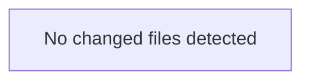

<!-- torii-review pr=bench-f70 run=local -->
**Verdict:** REQUEST CHANGES
**Score:** 5/100 — four confirmed critical vulnerabilities, each with a direct attacker trigger path.
**Review effort:** 1

---

### Summary
This file contains four confirmed critical vulnerabilities — all intentionally placed for gate dogfooding. Each has a trivial, unauthenticated trigger via a Flask endpoint. This code must not be deployed or merged without remediation.

---

### Architecture diagram
<!-- torii-mermaid -->

_Auto-generated from 0 changed file(s) (F57). Edges between groups are adjacency, not proven runtime dependencies._



### Blocking
All four findings below are **blocking** and require resolution before merge.

---

### Security audit
| # | CWE | Severity | Theme |
|---|-----|----------|-------|
| 1 | CWE-89 | Critical | SQL Injection |
| 2 | CWE-502 | Critical | Insecure Deserialization (pickle RCE) |
| 3 | CWE-78 | Critical | Command Injection (shell RCE) |
| 4 | CWE-200 | High | Secrets Exposure |

---

### Key findings
**1. SQL Injection — `demo/insecure/app.py:16`**
```python
cur.execute(f"SELECT * FROM items WHERE name = '{q}'")
```
- **Trigger:** `GET /search?q='; DROP TABLE items; --`
- **Attacker scenario:** Unauthenticated attacker sends a crafted `q` parameter. The value is interpolated directly into the SQL string with no parameterization or escaping. Full read/write/delete access to the SQLite database via the `sqlite3` connection.
- **Fix:** Use parameterized queries: `cur.execute("SELECT * FROM items WHERE name = ?", (q,))`

**2. Insecure Deserialization (RCE) — `demo/insecure/app.py:23`**
```python
return {"obj": str(pickle.loads(data))}
```
- **Trigger:** `POST /load` with body containing a pickled `__reduce__` payload.
- **Attacker scenario:** Unauthenticated attacker sends a crafted pickle payload in the request body. `pickle.loads` executes arbitrary code during deserialization — full remote code execution on the server.
- **Fix:** Never deserialize untrusted pickle data. Use `json.loads` for structured data or a safe serialization format like JSON.

**3. Command Injection (RCE) — `demo/insecure/app.py:28-29`**
```python
cmd = request.args.get("cmd", "echo hi")
return {"out": subprocess.check_output(cmd, shell=True).decode()}
```
- **Trigger:** `GET /run?cmd=cat%20/etc/passwd`
- **Attacker scenario:** Unauthenticated attacker supplies arbitrary shell commands via the `cmd` query parameter. `shell=True` passes the string to `/bin/sh -c`, enabling command chaining (`;`, `&&`, `|`, backticks, `$()`).
- **Fix:** Avoid `shell=True` with user input. Use `subprocess.check_output([cmd_arg], shell=False)` with a whitelist of allowed commands, or avoid passing user input to a shell entirely.

**4. Secrets Exposure — `demo/insecure/app.py:33`**
```python
return {"key": os.environ.get("OPENROUTER_API_KEY", "missing")}
```
- **Trigger:** `GET /secret` — no authentication required.
- **Attacker scenario:** Unauthenticated attacker reads the `OPENROUTER_API_KEY` environment variable directly from the HTTP response. This exposes a live API credential.
- **Fix:** Never return secrets in responses. Authenticate and authorize the endpoint, or remove it entirely.

---

### Multi-lens checklist (security pack)

| Lens | Status |
|------|--------|
| Injection (SQL) | **concern** — f-string SQL interpolation on `demo/insecure/app.py:16` |
| Injection (Command) | **concern** — `shell=True` with attacker-controlled `cmd` on `demo/insecure/app.py:28-29` |
| Deserialization | **concern** — `pickle.loads` on untrusted `request.data` on `demo/insecure/app.py:23` |
| Secrets / Credentials | **concern** — `OPENROUTER_API_KEY` exposed on `demo/insecure/app.py:33` |
| AuthZ / Access Control | **concern** — no authentication on any endpoint; all four are unauthenticated |
| XSS | n/a — JSON responses only |
| CSRF | n/a — no state-changing GETs beyond the injection points |
| SSRF | n/a |
| Path Traversal | n/a |
| Crypto Misuse | n/a |
| Supply Chain | n/a |

---

### Suggested test plan
<!-- torii-testplan -->

_Auto-generated (F61, deterministic). 0 case(s) (0 P0, 0 P1); 0 prod / 0 test file(s); 0 symbol(s) from diff. Authors: treat P0 as merge-blocking coverage gaps; model may refine._

None — no actionable test scenarios derived from files/diff.

### Tests & risk
No tests present. The file is a demo snippet. Risk is **contained** only if this file is not runnable in production — but all four endpoints are trivially exploitable if served.

---

### What I checked
- Full file `demo/insecure/app.py` (37 lines, 4 endpoints)
- Archival memory search (F98/F144): 4 TP signatures confirmed — `sqli-search`, `pickle-load`, `cmdi-run`, `secret-exposure` — all matched at score 1.0
- Hub recon (F148/F149): 4 cross-tenant themes confirmed from 16-tenant signal pool
- Product doctor (F110): all checks passed, no recovery gaps

**— Torii Gate**

---
*Torii · Hermes Agent · OpenRouter · memory-backed review*
*Cost / usage: model=`deepseek/deepseek-v4-pro` · ~$0.0071 (estimated) · 30k tokens · 3 API calls*
